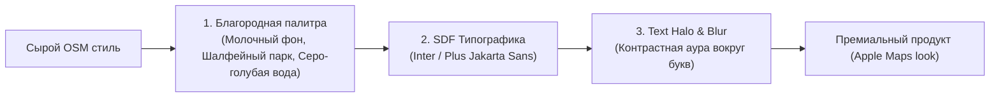

# Палитры, типографика, Text Halo и адаптивные фильтры по зумам

> [!info] Навигация
> Родительский раздел: [[Web GIS MOC]]

## Что это такое и какую боль решает

Даже при правильной настройке слоев карта может выглядеть любительской, если подобраны кислотные цвета, дефолтный системный шрифт Times New Roman и отсутствуют картографические обводки текста.

В этом руководстве собраны профессиональные приемы графического и типографического оформления векторных карт.



---

## 1. Благородная цветовая палитра (Color Palette)

Дешевые карты используют чистые спектральные цвета: ядовито-зеленый для травы, едкий синий для воды и чистый белый для фона. Дорогие карты строятся на **сложных приглушенных полутонах**:

| Элемент карты | Плохой выбор (Антипаттерн) | Премиальный выбор (Good Practice) | Пример HEX |
| :--- | :--- | :--- | :--- |
| **Суша (Background)** | Чисто белый (`#FFFFFF`) или ядовитый беж | Теплый молочный или светлый серо-песочный | `#F4F3F0` или `#F8F9FA` |
| **Вода (Water)** | Ярко-синий (`#0000FF` / `#0088FF`) | Мягкий серо-голубой или припыленный лазурный | `#CAD2D3` или `#A0C8F0` |
| **Парки и леса (Green)**| Ярко-салатовый (`#00FF00`) | Оливковый, шалфейный или пастельный зеленый | `#D8E8C8` или `#D5E4C3` |
| **Второстепенные дороги**| Черный или темно-серый | Полупрозрачный белый или светлый графит | `#FFFFFF` с `opacity: 0.8` |
| **Контуры зданий** | Контрастный темный контур | Цвет суши, затемненный всего на $3-5\%$ | `#E9E7E2` |

---

## 2. Типографика и Signed Distance Field (SDF)

В WebGL невозможно просто использовать стандартный TTF/WOFF2 веб-шрифт через CSS `@font-face`. Движок MapLibre рендерит текст на трехмерной плоскости холста, вращая и наклоняя его в перспективе.

### Как работают SDF-шрифты:
1. Шрифты заранее компилируются в бинарные файлы глифов (`.pbf`) по диапазонам 256 символов (например, `0-255.pbf`, `256-511.pbf`).
2. Каждый символ хранится не как растровая картинка, а как **карта расстояний до границы контура буквы (Signed Distance Field)**.
3. Это позволяет пиксельному шейдеру GPU отрисовывать буквы абсолютно резкими под любым углом наклона камеры, при любом зуме и на экранах с любым DPI без перерендеринга текстур.

### Рекомендуемые гротески для карт:
* **Inter:** Признанный мировой стандарт для современных UI-интерфейсов.
* **Plus Jakarta Sans:** Придает карте легкий, современный геометрический акцент.
* **Roboto / Open Sans:** Классические, хорошо читаемые на малых кеглях гарнитуры.

---

## 3. Магия Text Halo (Картографическое гало)

Если разместить черную надпись с названием улицы прямо поверх белых и желтых линий перекрестка, текст станет нечитаемым из-за визуального шума.

Решение: **Text Halo (ореол вокруг букв)**. Это не просто CSS-тень (`text-shadow`), а равномерная математическая обводка контура буквы цветом подложки:

```json
{
  "id": "road-label",
  "type": "symbol",
  "source": "openmaptiles",
  "source-layer": "transportation_name",
  "layout": {
    "text-field": "{name}",
    "text-font": ["Inter Medium"],
    "text-size": 12,
    "symbol-placement": "line" // Текст плавно изгибается вдоль геометрии дороги!
  },
  "paint": {
    "text-color": "#2c3e50",
    "text-halo-color": "#ffffff", // Цвет гало совпадает с цветом дороги или фона
    "text-halo-width": 2.0,       // Ширина ореола в пикселях
    "text-halo-blur": 1.0         // Легкое размытие края для мягкости восприятия
  }
}
```

> [!important] Правило контраста Halo
> Для темной темы (Dark mode): `text-color` делается светло-серым (`#E0E0E0`), а `text-halo-color` — глубоким темным цветом фона суши (`#191A1A`) с шириной 1.5–2px.

---

## 4. Плавное исчезновение слоев (Zoom Cross-fading)

Резкое включение или выключение слоя при переходе между зумами (например, мгновенное появление контуров домов на зуме 14.0) раздражает зрение (эффект мерцания / "поппинг").

Используйте плавную интерполяцию непрозрачности (`fill-opacity` или `line-opacity`):

```json
"fill-opacity": [
  "interpolate",
  ["linear"],
  ["zoom"],
  13.5, 0.0, // На зуме 13.5 слой полностью невидим
  14.2, 1.0  // К зуму 14.2 дома плавно проявляются на 100%
]
```
