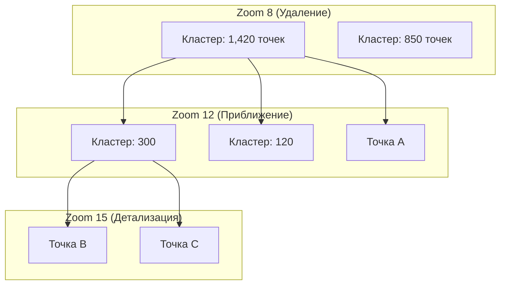

# Кластеризация больших объемов точек (Supercluster, K-D trees)

> [!info] Навигация
> Родительский раздел: [[Web GIS MOC]]

## Что это такое и какую боль решает

Если выгрузить на карту $50\,000$ точек банкоматов или электросамокатов, возникнут две проблемы:
1. **Визуальная каша (Visual Overload):** Маркеры накладываются друг на друга в сплошное пятно. Пользователь не может различить отдельные объекты.
2. **Падение FPS:** Отрисовка десятков тысяч отдельных маркеров перегружает процессор и видеокарту.

**Кластеризация** решает эту проблему: близко расположенные точки на малых зумах объединяются в единые агрегированные круги с числом элементов внутри (кластеры). По мере приближения зума кластеры распадаются на более мелкие группы, пока не превратятся в индивидуальные маркеры.



---

## Библиотека Supercluster: Как это работает изнутри

Библиотека **Supercluster** (создана автором Leaflet Владимиром Агафонкиным) — это быстрейший в мире алгоритм иерархической кластеризации на JavaScript:

1. **Предварительное индексирование (K-D Tree):** При загрузке массива точек Supercluster строит для каждого уровня зума (от `minZoom` до `maxZoom`) сбалансированное пространственное **k-мерное дерево (k-d tree)**.
2. **Пиксельный радиус (`radius`):** Кластеризация работает не в метрах, а в **экранных пикселях** (обычно 40–60 px). Точки объединяются, если при текущем зуме расстояние между ними на экране меньше заданного радиуса.
3. **Мгновенный запрос видимых кластеров:** При движении камеры метод `index.getClusters(bbox, zoom)` за доли миллисекунды извлекает из дерева только те кластеры и точки, которые попадают в текущий BBox экрана.

---

## Вариант 1: Встроенная кластеризация в MapLibre GL JS

В MapLibre библиотека Supercluster уже **встроена прямо в ядро** и работает внутри фоновых воркеров:

```typescript
// 1. Добавляем GeoJSON источник с включенной кластеризацией:
map.addSource('earthquakes', {
  type: 'geojson',
  data: 'https://maplibre.org/maplibre-gl-js/test/data/earthquakes.geojson',
  cluster: true,
  clusterMaxZoom: 14, // Максимальный зум кластеризации (выше 14 зума точки распадутся)
  clusterRadius: 50,  // Радиус кластера в пикселях
  // Агрегация кастомных бизнес-метрик внутри кластера:
  clusterProperties: {
    max_magnitude: ['max', ['get', 'mag']]
  }
});

// 2. Слой кругов кластеров с адаптивным размером и цветом:
map.addLayer({
  id: 'clusters',
  type: 'circle',
  source: 'earthquakes',
  filter: ['has', 'point_count'], // Только кластеры
  paint: {
    'circle-color': [
      'step',
      ['get', 'point_count'],
      '#51bbd6', 100,  // До 100 точек — голубой
      '#f1f075', 750,  // До 750 точек — желтый
      '#f28cb1'        // Более 750 — розовый
    ],
    'circle-radius': [
      'step',
      ['get', 'point_count'],
      20, 100,
      30, 750,
      40
    ]
  }
});

// 3. Слой цифр внутри кругов:
map.addLayer({
  id: 'cluster-count',
  type: 'symbol',
  source: 'earthquakes',
  filter: ['has', 'point_count'],
  layout: {
    'text-field': '{point_count_abbreviated}',
    'text-font': ['Inter Bold'],
    'text-size': 12
  }
});

// 4. Слой индивидуальных некластеризованных точек:
map.addLayer({
  id: 'unclustered-point',
  type: 'circle',
  source: 'earthquakes',
  filter: ['!', ['has', 'point_count']],
  paint: {
    'circle-color': '#11b4da',
    'circle-radius': 6
  }
});
```

---

## Зум в кластер по клику (Zoom to Cluster)

Классический паттерн взаимодействия: когда пользователь кликает на кластер, карта должна плавно приблизиться ровно до того зума, на котором данный кластер распадается:

```typescript
map.on('click', 'clusters', (e) => {
  const features = map.queryRenderedFeatures(e.point, { layers: ['clusters'] });
  const clusterId = features[0].properties.cluster_id;
  const source = map.getSource('earthquakes') as maplibregl.GeoJSONSource;

  // Запрашиваем следующий уровень раскрытия:
  source.getClusterExpansionZoom(clusterId, (err, zoom) => {
    if (err) return;

    const coordinates = (features[0].geometry as GeoJSON.Point).coordinates as [number, number];
    map.easeTo({
      center: coordinates,
      zoom: zoom,
      duration: 500
    });
  });
});
```

---

## Ограничение: Точки с абсолютно одинаковыми координатами

Если 10 квартир находятся в одном и том же подъезде дома, у них будут идентичные координаты `[lat, lng]`.
* **Проблема:** Даже на максимальном зуме 22 они никогда не распадутся, так как расстояние между ними всегда равно нулю.
* **Решение (Spiderfier):** Использование алгоритма «Паутинки» (Spiderfier) — при клике на финальный нераспавшийся кластер точки программно раскладываются по кругу вокруг центральной координаты на несколько экранных пикселей.
