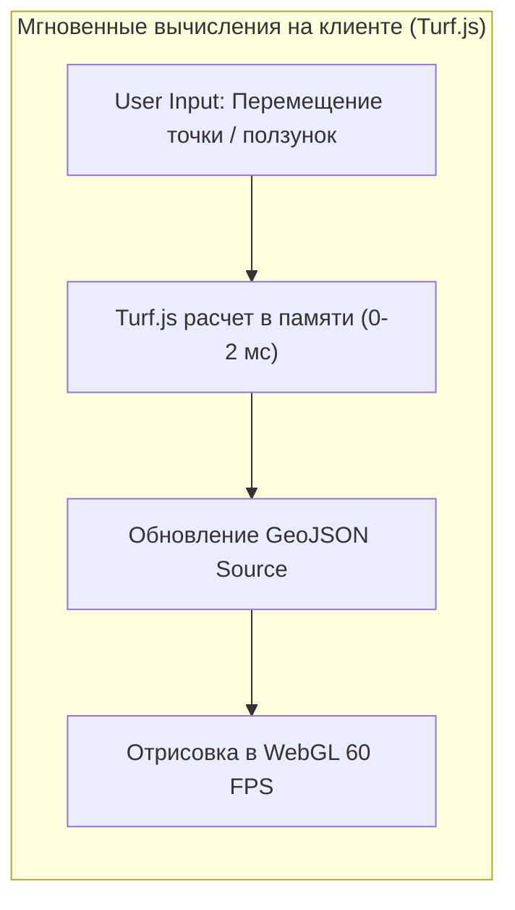

# Клиентские гео-вычисления с Turf.js (буферы, пересечения, расстояния)

> [!info] Навигация
> Родительский раздел: [[Web GIS MOC]]

## Что это такое и какую боль решает

Традиционно любые пространственные вычисления — *"находится ли адрес в зоне доставки"*, *"каково расстояние между двумя точками с учетом кривизны Земли"*, *"пересекаются ли два полигона"* — делегировались бэкенду с базой данных PostGIS (`ST_Contains`, `ST_Distance`, `ST_Buffer`).

Однако каждый сетевой запрос на бэкенд вносит сетевую задержку ($100-500$ мс). Если пользователю нужно в реальном времени видеть, как меняется радиус доставки при перетаскивании ползунка, или интерактивно отсекать полигоны при движении мыши, обращение к серверу делает интерфейс «ватным» и неотзывчивым.

**Turf.js** — это полнофункциональная библиотека пространственного анализа на чистом JavaScript / TypeScript, работающая со стандартными объектами **GeoJSON**. Она переносит функционал PostGIS прямо в браузер.



---

## Ключевые модули и практические сценарии

### 1. Точные геодезические расстояния (`turf/distance`)
Расчет кратчайшего расстояния между двумя точками на эллипсоиде WGS84 по формуле гаверсинусов:

```typescript
import distance from '@turf/distance';
import { point } from '@turf/helpers';

const warehouse = point([37.6173, 55.7558]); // [lon, lat]
const client = point([37.7123, 55.7958]);

// Точное расстояние в километрах с учетом кривизны Земли
const d = distance(warehouse, client, { units: 'kilometers' });
console.log(`Дистанция: ${d.toFixed(2)} км`);
```

---

### 2. Проверка вхождения точки в полигон (`turf/boolean-point-in-polygon`)
Базовая задача гео-фенсинга (Geofencing): проверка, входит ли текущее положение курьера или пользователя в зону бесплатной доставки:

```typescript
import booleanPointInPolygon from '@turf/boolean-point-in-polygon';
import { point, polygon } from '@turf/helpers';

const courierPos = point([37.62, 55.75]);
const deliveryZone = polygon([[
  [37.60, 55.74],
  [37.65, 55.74],
  [37.65, 55.78],
  [37.60, 55.78],
  [37.60, 55.74]
]]);

const isInside = booleanPointInPolygon(courierPos, deliveryZone);
if (isInside) {
  console.log('Доставка доступна!');
}
```

---

### 3. Построение буферных зон (`turf/buffer`)
Построение многоугольника вокруг точки или линии на заданном физическом расстоянии:
* Зона покрытия сотовой вышки радиусом 2.5 км.
* Охранная зона газопровода шириной 50 метров по обе стороны от трубы.

```typescript
import buffer from '@turf/buffer';
import { lineString } from '@turf/helpers';

const pipeline = lineString([[37.5, 55.7], [37.6, 55.8], [37.7, 55.9]]);
// Генерирует полигон с 64 шагами скругления углов
const safetyZone = buffer(pipeline, 50, { units: 'meters', steps: 64 });

map.getSource('buffer-source').setData(safetyZone);
```

---

### 4. Пересечение и вычитание полигонов (`intersect` и `difference`)
Вычисление зоны пересечения двух зон покрытия или «вырезание дыры» в полигоне (булевы операции Мартини-Брюггемана над геометрией).

---

## Архитектурные нюансы и производительность Turf.js

1. **Импортируйте модули точечно (Tree-shaking):**
   - ❌ `import * as turf from '@turf/turf';` — затянет в бандл более 600 КБ кода со всеми алгоритмами (включая сплайны, TIN-сетки и расчеты триангуляции Делоне).
   - ✅ `import distance from '@turf/distance';` — затянет только 3 КБ изолированного кода.
2. **Тяжелые полигоны и Web Workers:**
   - Если полигон зоны доставки содержит 50 000 вершин (детализированная граница береговой линии), алгоритм `booleanPointInPolygon` на каждый `mousemove` вызовет микро-фризы.
   - *Решение:* Выносите сложные вычисления в отдельный Web Worker через библиотеку `Comlink` или используйте предварительное пространственное индексирование через **RBush**.
3. **Единицы измерения:**
   - Всегда явно передавайте параметр `{ units: 'kilometers' }` или `{ units: 'meters' }`, так как дефолтом в части методов исторически являются мили или радианы.
