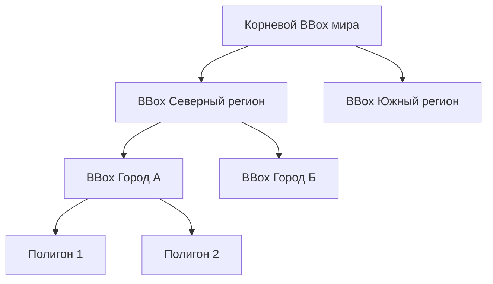

# Пространственные индексы (RBush, Flatbush, R-Tree)

> [!info] Навигация
> Родительский раздел: [[Web GIS MOC]]

## Что это такое и какую боль решает

Представьте типичную задачу: у вас в памяти браузера находится массив из $100\,000$ объектов (точки заказов, полигоны земельных участков, отрезки дорог).

Пользователь двигает курсор мыши (`mousemove`), и вам нужно подсветить объект под курсором (Hit-testing / Hover), либо отфильтровать только те объекты, которые видны в текущем BBox экрана.

### Наивный подход: Линейный перебор $O(N)$
```typescript
// ❌ СМЕРТЬ ДЛЯ 60 FPS:
window.addEventListener('mousemove', (e) => {
  const [x, y] = getGeoCoords(e);
  // Перебор 100 000 полигонов 60 раз в секунду:
  const hovered = allPolygons.find(poly => turf.booleanPointInPolygon([x, y], poly));
});
```
Линейный перебор занимает сотни миллисекунд. Интерфейс намертво зависает.

**Пространственный индекс (Spatial Index)** решает эту проблему: он организует геометрии в иерархическое дерево ограничивающих прямоугольников (Bounding Boxes). Время поиска сокращается с $O(N)$ до **$O(\log N)$** — с сотен миллисекунд до **$0.05$ миллисекунды**!



---

## 1. RBush — Динамическое 2D R-Tree

**RBush** (создан Владимиром Агафонкиным) — популярная библиотека R-дерева для JavaScript с поддержкой массовой загрузки (bulk loading) по алгоритму OMT (Overlap Minimizing Top-down).

### Ключевые свойства:
* **Динамичность:** Позволяет добавлять (`insert`) и удалять (`remove`) элементы на лету.
* **Поиск пересечений:** `tree.search(bbox)` возвращает массив объектов, чей BBox пересекается с заданным окном.

```typescript
import RBush from 'rbush';

interface SpatialItem {
  minX: number;
  minY: number;
  maxX: number;
  maxY: number;
  id: string;
  data: any;
}

const tree = new RBush<SpatialItem>();

// Быстрая массовая загрузка 50 000 элементов:
const items: SpatialItem[] = rawData.map(d => ({
  minX: d.lon,
  minY: d.lat,
  maxX: d.lon,
  maxY: d.lat,
  id: d.id,
  data: d
}));

tree.load(items); // Строит сбалансированное дерево за ~15-30 мс

// Мгновенный поиск (за 0.05 мс) объектов в области экрана:
const visibleItems = tree.search({
  minX: 37.5,
  minY: 55.7,
  maxX: 37.7,
  maxY: 55.9
});
```

---

## 2. Flatbush — Сверхбыстрый статический индекс на типизированных массивах

Если ваш набор данных **статичен** (вы загрузили 100 000 участков один раз и не добавляете новые каждую секунду), RBush тратит лишнюю память на хранение сотен тысяч JavaScript-объектов узлов дерева.

**Flatbush** пакует R-дерево в непрерывный бинарный буфер **`ArrayBuffer`** (структура кривой Гильберта):
* **В 5 раз меньше памяти:** Никаких объектов в куче V8, данные лежат в плоских `Float64Array` и `Uint32Array`.
* **Zero Garbage Collection:** Сборщик мусора браузера не тратит ресурсы на очистку дерева.
* **Передача между потоками:** Бинарный индекс Flatbush можно мгновенно передать из Web Worker в главный поток без сериализации JSON.

```typescript
import Flatbush from 'flatbush';

// 1. Создаем индекс на 100 000 элементов
const index = new Flatbush(100000);

// 2. Заполняем BBox каждого элемента
for (const p of points) {
  index.add(p.minX, p.minY, p.maxX, p.maxY);
}

// 3. Выполняем финализацию дерева
index.finish();

// 4. Поиск индексов видимых элементов:
const matchingIndices = index.search(minX, minY, maxX, maxY);
```

---

## Поиск K ближайших соседей (k-NN)

Частый сценарий: *"Найти 5 ближайших пунктов выдачи заказов к точке клика пользователя"*.
Вместо расчета расстояния до всех пунктов мира используется плагин **`rbush-knn`**, который обходит R-дерево по алгоритму ветвей и границ (Branch and Bound), мгновенно отсекая заведомо далекие поддеревья.
