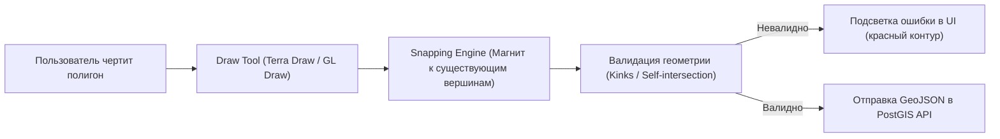

# Редактирование геометрии пользователем (Draw tools, snapping, валидация)

> [!info] Навигация
> Родительский раздел: [[Web GIS MOC]]

## Что это такое и какую боль решает

Карта во фронтенде часто перестает быть чисто презентационной: бизнесу требуется, чтобы пользователи могли **сами рисовать и редактировать геометрию**:
* Логист очерчивает полигон зоны доставки с повышенным тарифом.
* Агроном размечает границы посевных полей.
* Кадастровый инженер уточняет координаты участка с привязкой к соседним межевым знакам.

Если просто слушать события кликов мыши и складывать точки в массив, вы мгновенно столкнетесь с проблемами:
1. **Самопересечения полигонов ("бабочки" / "восьмерки"):** База данных PostGIS отвергнет такой полигон как невалидный (`ST_IsValid = false`).
2. **Отсутствие прилипания (Snapping):** Между двумя смежными участками образуются щели (Slivers) или наложения (Overlaps) в пару миллиметров.
3. **Редактирование существующих вершин:** Перетаскивание точек, добавление промежуточных вершин на ребрах, удаление.



---

## Современные инструменты черчения

### 1. Terra Draw — Независимый движок нового поколения
Исторически использовался плагин `@mapbox/mapbox-gl-draw`, однако он тесно завязан только на стек Mapbox/MapLibre и слабо развивается.

Современный фаворит — библиотека **Terra Draw**:
* **Агностик движка:** Работает одинаково гладко с **MapLibre GL**, **Leaflet**, **OpenLayers** и **Google Maps**.
* Поддерживает режимы: Точка, Ломаная линия, Полигон, Прямоугольник, Круг, Произвольное рисование от руки (Freehand), Режим выделения и масштабирования.
* Встроенная поддержка прилипания к точкам (Snapping).

```typescript
import { TerraDraw, TerraDrawMapLibreGLAdapter, TerraDrawPolygonMode } from 'terra-draw';

const draw = new TerraDraw({
  adapter: new TerraDrawMapLibreGLAdapter({ map }),
  modes: [
    new TerraDrawPolygonMode({
      snapping: {
        toCoordinate: true, // Прилипание к существующим вершинам
        tolerance: 15       // Радиус примагничивания в пикселях
      }
    })
  ]
});

draw.start();
draw.setMode('polygon');

// Слушаем завершение рисования:
draw.on('finish', (id) => {
  const snapshot = draw.getSnapshot();
  const createdFeature = snapshot.find(f => f.id === id);
  console.log('Нарисован полигон:', createdFeature);
});
```

---

## Валидация геометрии перед отправкой на бэкенд

Никогда не доверяйте координатам, нарисованным пользователем, без проверки на клиенте:

### 1. Проверка на самопересечение («эффект галстука-бабочки»)
Если ребра одного и того же полигона пересекают друг друга, геометрия считается невалидной (Self-intersecting polygon). Для поиска пересечений используется модуль `@turf/kinks`:

```typescript
import kinks from '@turf/kinks';
import { polygon } from '@turf/helpers';

export function validatePolygon(poly: GeoJSON.Feature<GeoJSON.Polygon>): { isValid: boolean; errors: string[] } {
  const errors: string[] = [];

  // 1. Проверка на самопересечения (kinks)
  const selfIntersections = kinks(poly);
  if (selfIntersections.features.length > 0) {
    errors.push(`Полигон пересекает сам себя в ${selfIntersections.features.length} местах!`);
  }

  // 2. Проверка минимального количества вершин (минимум 3 уникальные + 1 замыкающая)
  const coords = poly.geometry.coordinates[0];
  if (coords.length < 4) {
    errors.push('Полигон должен содержать не менее трех вершин');
  }

  // 3. Проверка замкнутости кольца
  const first = coords[0];
  const last = coords[coords.length - 1];
  if (first[0] !== last[0] || first[1] !== last[1]) {
    errors.push('Контур полигона не замкнут');
  }

  return {
    isValid: errors.length === 0,
    errors
  };
}
```

---

## Архитектурные нюансы UX черчения

* **Отключение навигации карты:** При рисовании полигона от руки (Freehand) или перетаскивании вершины обязательно временно блокируйте перетаскивание самой карты:
  ```typescript
  map.dragPan.disable();
  // По завершении редактирования:
  map.dragPan.enable();
  ```
* **Мобильный тач-интерфейс:** Палец пользователя закрывает собой точку касания. Качественные редакторы отображают виртуальное перекрестье с увеличенной лупой (Magnifier) над пальцем или добавляют экранные кнопки подтверждения шага.
