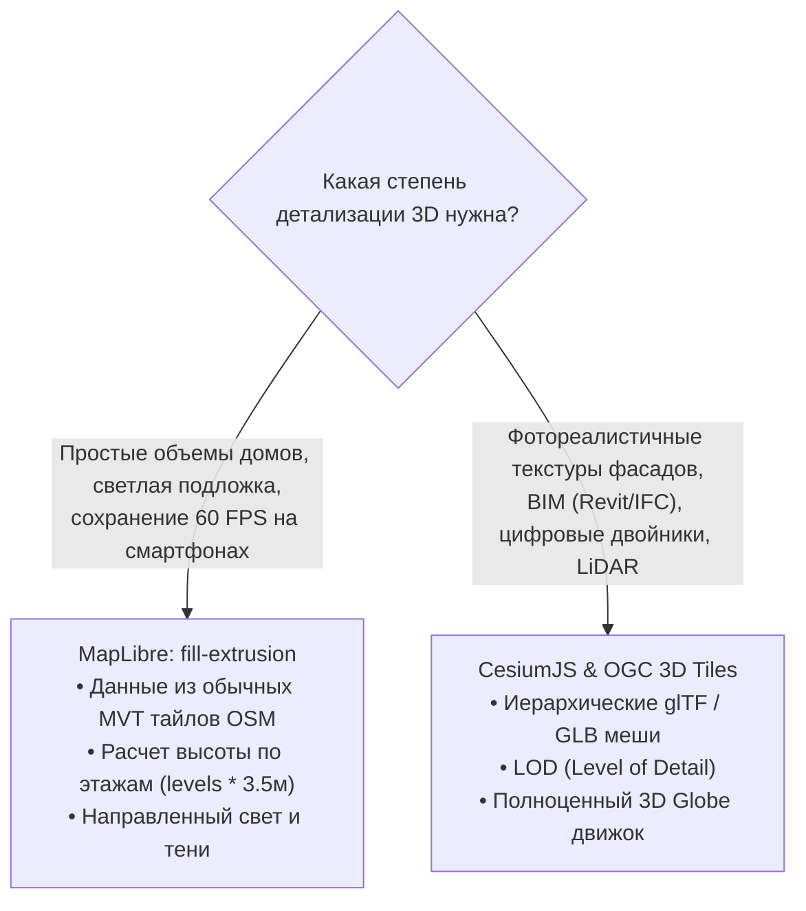

# 3D-здания и экструзия (Fill-extrusion, 3D Tiles, CesiumJS)

> [!info] Навигация
> Родительский раздел: [[Web GIS MOC]]

## Что это такое и какую боль решает

Отображение зданий в трехмерном пространстве кардинально повышает узнаваемость города: человек мгновенно ориентируется по знакомым высоткам и силуэтам небоскребов.

В веб-картографии есть два кардинально разных уровня работы с 3D-городами:
1. **Легковесная процедурная экструзия (Fill-extrusion):** Выдавливание плоских 2D-контуров домов вверх на заданную высоту.
2. **Тяжелые фотореалистичные 3D-меши (OGC 3D Tiles & CesiumJS):** Загрузка детальных текстурированных архитектурных моделей, BIM-данных и облаков точек лазерного сканирования (LiDAR).



---

## 1. Процедурная экструзия зданий в MapLibre GL JS

Векторные тайлы OSM (схема OpenMapTiles) содержат слой `building`. Каждое здание имеет либо тег `render_height` (высота в метрах), либо `render_min_height` (для висячих арок и мостов), либо количество этажей `levels`.

Слой типа **`fill-extrusion`** берет 2D-полигон контура дома и генерирует на лету боковые грани 3D-призмы прямо в вертексном шейдере WebGL:

```json
{
  "id": "3d-buildings",
  "type": "fill-extrusion",
  "source": "openmaptiles",
  "source-layer": "building",
  "minzoom": 15, // Экструзия включается только на зуме 15+, чтобы не перегружать GPU
  "paint": {
    "fill-extrusion-color": [
      "interpolate",
      ["linear"],
      ["get", "render_height"],
      0, "#e9e7e2",
      50, "#d1d5db",
      150, "#9ca3af" // Высотные небоскребы слегка темнее для контраста
    ],
    "fill-extrusion-height": [
      "coalesce",
      ["get", "render_height"],
      ["*", ["get", "levels"], 3.5], // Если нет точной высоты, берем этажи * 3.5 метра
      10                             // Дефолтная высота по умолчанию = 10 метров
    ],
    "fill-extrusion-base": [
      "coalesce",
      ["get", "render_min_height"],
      0
    ],
    "fill-extrusion-opacity": 0.9
  }
}
```

### Настройка виртуального солнца (Global Light):
Чтобы 3D-здания не выглядели плоскими силуэтами, настраивается глобальное освещение карты:
```typescript
map.setLight({
  anchor: 'viewport',
  color: '#ffffff',
  intensity: 0.4,
  position: [1.5, 90, 45] // [радиус, азимут, угол возвышения солнца]
});
```

---

## 2. OGC 3D Tiles и CesiumJS — Индустриальный Digital Twin

Когда требуется показать не просто условные коробки домов, а архитектурную модель нового жилого комплекса со стеклянными фасадами или цифровую копию завода с внутренними трубами:

* **Стандарт OGC 3D Tiles:** Иерархическая пространственная структура данных (Octree / KD-деревья), где каждая нода содержит 3D-модели в оптимизированном бинарном формате **glTF (GLB)**.
* **LOD (Level of Detail):** Издалека показывается упрощенная низкополигональная модель здания без окон, при приближении камеры стримятся детальные полигоны и 4K-текстуры.
* **CesiumJS:** Специализированный браузерный движок виртуального глобуса на WebGL, созданный для аэрокосмической отрасли, умных городов (Smart Cities) и геопространственного 3D-моделирования.

---

## Что выбрать: MapLibre или CesiumJS?

| Сценарий | MapLibre `fill-extrusion` | CesiumJS `3D Tiles` |
| :--- | :--- | :--- |
| **Основная цель** | Стильная городская карта | Фотограмметрия и Digital Twin |
| **Источник данных** | Обычные тайлы OpenStreetMap | 3D сканирование, дроны, CAD/BIM |
| **Размер бандла** | Включено в базовый MapLibre | $\approx 1.5 - 3.0$ МБ бандл Cesium |
| **Производительность** | Легко тянет на мобильных | Требует дискретный GPU / мощный ПК |
| **Навигация** | Классический скролл и drag карты | Свободный 6-осевой полет 3D камеры |
