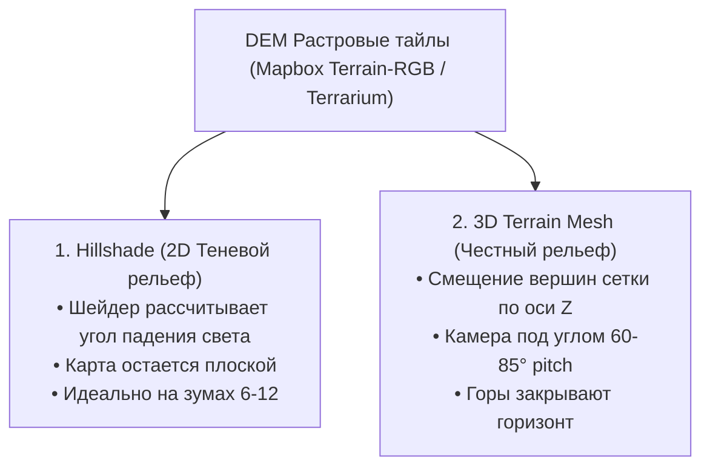

# 3D-рельеф (Terrain-RGB, DEM-тайлы, Hillshade)

> [!info] Навигация
> Родительский раздел: [[Web GIS MOC]]

## Что это такое и какую боль решает

Плоские карты создают обманчивое впечатление: горы Альп или Кавказа выглядят такими же плоскими, как равнины Нидерландов. Это критично для туристических приложений, сервисов для лыжников, велосипедистов и градостроителей.

Существует два принципиально разных подхода к отображению рельефа:
1. **Hillshade (Теневой рельеф):** Оптическая иллюзия объема на плоской 2D-карте с помощью полупрозрачных теней от виртуального солнца.
2. **True 3D Terrain (Честный 3D-меш):** Физическое выдавливание вершин полигональной сетки холста WebGL вверх по оси $Z$ на основе высот местности.



---

## Подход 1: 2D Hillshade (Теневая отмывка)

Шейдер слоя `hillshade` вычисляет нормали поверхности для каждого пикселя высотной матрицы и рассчитывает освещенность от виртуального источника света (по умолчанию солнце светит с северо-запада, азимут $315^\circ$):

```json
{
  "id": "hills",
  "type": "hillshade",
  "source": "dem-source",
  "paint": {
    "hillshade-illumination-direction": 315, // Азимут солнца (градусы)
    "hillshade-exaggeration": 0.5,           // Коэффициент преувеличения теней
    "hillshade-shadow-color": "#2c3e50",     // Цвет теней (лучше синеватый, чем черный)
    "hillshade-highlight-color": "#ffffff"   // Цвет освещенных склонов
  }
}
```

* **Преимущество:** Очень дешево для GPU. Карта выглядит рельефной и живописной даже при вертикальном взгляде строго сверху вниз.

---

## Подход 2: Настоящий 3D Terrain в MapLibre GL JS

Начиная с версии MapLibre GL JS v2+, движок поддерживает честный 3D-ландшафт.
Каждый плоский квадратный тайл превращается в регулярную сетку треугольников ($64 \times 64$ или $128 \times 128$ вершин), и вертексный шейдер сдвигает каждую вершину на высоту, считанную из Terrain-RGB тайла.

```typescript
// 1. Добавляем растровый высотный источник DEM
map.addSource('terrain-dem', {
  type: 'raster-dem',
  url: 'https://demotiles.maplibre.org/terrain-tiles/tiles.json',
  tileSize: 256
});

// 2. Включаем 3D деформацию рельефа
map.setTerrain({
  source: 'terrain-dem',
  exaggeration: 1.5 // Множитель высоты (делает холмы более выразительными)
});

// 3. Добавляем атмосферную дымку (Sky/Fog) для реалистичного горизонта
map.setSky({
  'sky-color': '#87ceeb',
  'sky-horizon-blend': 0.5,
  'horizon-color': '#ffffff',
  'fog-color': '#e6f2ff',
  'fog-ground-blend': 0.8
});

// 4. Наклоняем камеру к горизонту для драматичного эффекта
map.easeTo({
  pitch: 75,
  bearing: 40,
  duration: 1500
});
```

---

## Подводные камни и производительность 3D-рельефа

1. **Z-Fighting (Мерцание текстур):**
   - Когда плоские полигоны (например, дороги или контуры озер) лежат на той же высоте, что и деформированный рельеф, шейдеру не хватает точности буфера глубины (Depth Buffer), и текстуры начинают рябить.
   - *Решение:* MapLibre использует специальный проход рендеринга (Drape pass), натягивая векторные слои на 3D-рельеф как единую текстуру.
2. **Линейка масштаба (Scale bar):**
   - На плоской карте масштаб в центре экрана фиксирован. В перспективе 3D наклонной камеры масштаб у ближнего края экрана (Forefront) в 10 раз крупнее, чем у линии горизонта (Background). Любые линейки масштаба становятся приближенными.
3. **Источники бесплатных Terrain-RGB тайлов:**
   - Сервис **AWS Open Data (Terrain Tiles)** раздает высотные тайлы со всего мира бесплатно.
   - Свободный проект **MapLibre Demo Tiles** предоставляет тестовую высотную пирамиду для экспериментов.
