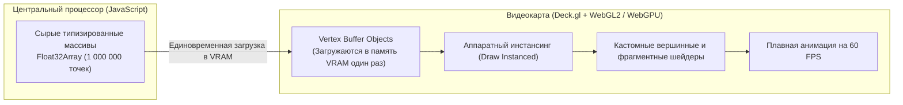

# Deck.gl и Luma.gl — визуализация миллионов точек через GPU

> [!info] Навигация
> Родительский раздел: [[Web GIS MOC]]

## Что это такое и какую боль решает

Когда в проекте возникает задача отобразить **от $100\,000$ до $1\,000\,000+$ динамических объектов** (перемещения миллионов поездок Uber, глобальные авиарейсы, данные датчиков интернета вещей за год, плотность населения стран), стандартные движки сдаются:
* **Leaflet:** Падает на $\approx 2\,000$ объектов (переполнение DOM-дерева).
* **MapLibre GL JS:** Начинает терять кадры на $\approx 50\,000-100\,000$ объектах (накладные расходы на парсинг GeoJSON и пересчет буферов вершин).

**Deck.gl** (созданный инженерной командой Uber и развиваемый фондом OpenJS / Vis.gl) решает эту задачу фундаментально иначе: он превращает видеокарту клиента в вычислительный кластер с помощью **WebGL2 / WebGPU** и библиотеки **Luma.gl**.



---

## Архитектурный секрет: GPU Instancing и Binary Attributes

Как Deck.gl умудряется рендерить миллион точек без просадки частоты кадров?

1. **Аппаратный инстансинг (Hardware Instancing):** Геометрия одного маркера или 3D-столбика (например, круг из 12 треугольников) загружается в память GPU ровно **один раз**. Затем видеокарте отправляется одна-единственная инструкция: *"нарисуй эту геометрию $1\,000\,000$ раз со смещениями из буфера позиций"*.
2. **Прямые бинарные массивы (Zero-copy):** Deck.gl умеет принимать данные не как тяжелые объекты `{ lat, lng, value }`, а как плоские типизированные массивы `Float32Array`. В этом случае JavaScript вообще не тратит время на итерации — данные копируются из сетевого сокета прямо в память видеопамяти.
3. **64-битная точность с плавающей точкой (fp64 math):** Стандартный WebGL оперирует 32-битными числами, чего недостаточно для точного отображения географических координат (погрешность на масштабе улицы может достигать нескольких метров). Команда Deck.gl разработала программную эмуляцию 64-битных вычислений прямо в GLSL-шейдерах.

---

## Связка Deck.gl с MapLibre (Overlay Architecture)

Deck.gl не рисует подложку с улицами и домами сам — он монтируется поверх MapLibre через слой `MapboxOverlay`:

```typescript
import { Deck } from '@deck.gl/core';
import { ScatterplotLayer } from '@deck.gl/layers';
import { HexagonLayer } from '@deck.gl/aggregation-layers';
import { MapboxOverlay } from '@deck.gl/mapbox';
import maplibregl from 'maplibre-gl';

// 1. Инициализация базовой карты MapLibre
const map = new maplibregl.Map({
  container: 'map',
  style: 'https://demotiles.maplibre.org/style.json',
  center: [-122.4, 37.78],
  zoom: 11,
  pitch: 45 // 3D наклон камеры
});

// 2. Создание слоя агрегации Uber H3 Hexagons для 500 000 точек
const hexagonLayer = new HexagonLayer({
  id: 'hex-density',
  data: 'https://raw.githubusercontent.com/visgl/deck.gl-data/master/examples/3d-heatmap/heatmap-data.csv',
  getPosition: d => [Number(d.lng), Number(d.lat)],
  radius: 200,          // Радиус гексагона в метрах
  elevationScale: 50,   // Высота 3D столбика в зависимости от плотности точек
  extruded: true,       // Объемные 3D гексагоны
  pickable: true        // Поддержка кликов и тултипов на GPU
});

// 3. Монтирование оверлея в карту (синхронизация матриц проекции на каждый кадр)
const deckOverlay = new MapboxOverlay({
  layers: [hexagonLayer]
});

map.addControl(deckOverlay as unknown as maplibregl.IControl);
```

---

## Ключевые аналитические слои Deck.gl

| Слой | Назначение | Пример использования |
| :--- | :--- | :--- |
| **`HexagonLayer`** | Агрегация точек в пространственные гексагоны с 3D-высотой | Плотность ДТП или заказов такси по районам |
| **`ArcLayer`** | Трехмерные дуги, соединяющие точки "откуда -> куда" | Авиаперелеты, грузоперевозки, финансовые транзакции |
| **`TripsLayer`** | Анимированные треки движения во времени | Визуализация маршрутов курьеров за рабочий день |
| **`GeoJsonLayer`** | Рендеринг тяжелых GeoJSON через шейдеры | Кадастровые границы целого региона |

> [!important] Границы применимости
> Не используйте Deck.gl ради отображения 200 маркеров магазинов на лендинге. Подключение Deck.gl увеличивает итоговый размер бандла на $\approx 300-400$ КБ gzipped и требует значительного потребления батареи на мобильных устройствах из-за постоянной работы WebGL2 контекста.
