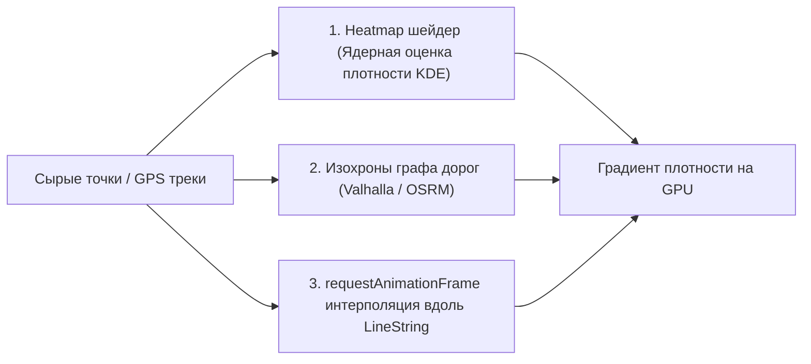

# Анимация треков, изохроны и тепловые карты (Heatmaps)

> [!info] Навигация
> Родительский раздел: [[Web GIS MOC]]

## Что это такое и какую боль решает

Статические точки на карте показывают только снимок текущего состояния. Для передачи динамики реального мира фронтенд-разработчику требуются продвинутые визуальные слои:
1. **Тепловые карты (Heatmaps):** Отображение плотности распределения тысяч событий (очаги преступности, концентрация заказов такси, популярные туристические локации).
2. **Изохроны (Isochrones):** Полигоны равной временной или километровой доступности (*"куда можно дойти пешком за 15 минут"*).
3. **Анимация треков:** Плавное перемещение курьера, самолета или автобуса вдоль ломаной линии пути без рывков.



---

## 1. Тепловые карты (Heatmaps) в MapLibre GL JS

Слой типа **`heatmap`** использует математический алгоритм **ядерной оценки плотности (Kernel Density Estimation — KDE)**. Во фрагментном шейдере вокруг каждой точки строится радиальное гауссово распределение, интенсивности суммируются в едином буфере и раскрашиваются по цветовому градиенту.

### Ключевой паттерн: Плавный переход от Heatmap к отдельным точкам
На низких зумах (весь город) мы видим сплошное тепловое пятно. При приближении к улице тепловая карта должна плавно растаять, уступив место отдельным кликабельным маркерам:

```json
{
  "id": "taxi-heatmap",
  "type": "heatmap",
  "source": "taxi-pickups",
  "maxzoom": 15,
  "paint": {
    // Вес точки (например, стоимость заказа):
    "heatmap-weight": ["interpolate", ["linear"], ["get", "price"], 0, 0, 5000, 1],
    // Радиус пятна в пикселях:
    "heatmap-radius": ["interpolate", ["linear"], ["zoom"], 0, 2, 12, 20],
    // Цветовой градиент от синего к красному:
    "heatmap-color": [
      "interpolate",
      ["linear"],
      ["heatmap-density"],
      0, "rgba(33,102,172,0)",
      0.2, "rgb(103,169,207)",
      0.5, "rgb(253,219,199)",
      0.8, "rgb(239,138,98)",
      1, "rgb(178,24,43)"
    ],
    // Плавное угасание тепловой карты на зумах 13-15:
    "heatmap-opacity": ["interpolate", ["linear"], ["zoom"], 13, 1.0, 15, 0.0]
  }
}
```

---

## 2. Изохроны (Isochrones)

Изохрона — это полигон, показывающий границу территории, которой можно достичь из заданной точки за фиксированное время (5, 10, 15 минут) с учетом реального графа дорог, светофоров и пробок.

* **Откуда брать данные:** Геосервисы маршрутизации (**Valhalla**, **OpenRouteService**, **Mapbox Isochrone API**).
* **Стилизация на фронтенде:** Изохроны накладываются несколькими слоями с убывающей прозрачностью (концентрические полигоны с мягкой границей):

```typescript
// Запрос изохроны пешей доступности 5, 10 и 15 минут:
const url = `https://api.openrouteservice.org/v2/isochrones/foot-walking?api_key=${KEY}&locations=${lon},${lat}&range=300,600,900`;
const response = await fetch(url);
const isochronesGeoJson = await response.json();

map.getSource('isochrones-source').setData(isochronesGeoJson);
```

---

## 3. 60 FPS Анимация движения вдоль линии пути

Если с бэкенда приходит GPS-трек курьера раз в 10 секунд, обновление координат маркера рывками выглядит непрофессионально. Требуется интерполяция положения вдоль ломаной линии:

```typescript
import along from '@turf/along';
import length from '@turf/length';
import { lineString } from '@turf/helpers';

export function animateMarkerAlongRoute(
  map: maplibregl.Map,
  marker: maplibregl.Marker,
  routeCoordinates: [number, number][],
  durationMs: number
) {
  const line = lineString(routeCoordinates);
  const totalDistance = length(line, { units: 'kilometers' });
  let startTime: number | null = null;

  function step(timestamp: number) {
    if (!startTime) startTime = timestamp;
    const progress = Math.min((timestamp - startTime) / durationMs, 1.0);

    // Вычисляем пройденное расстояние вдоль линии
    const currentDistance = totalDistance * progress;
    const currentPoint = along(line, currentDistance, { units: 'kilometers' });
    const coords = currentPoint.geometry.coordinates as [number, number];

    marker.setLngLat(coords);

    if (progress < 1.0) {
      requestAnimationFrame(step); // Плавная интерполяция на каждый кадр
    }
  }

  requestAnimationFrame(step);
}
```

> [!tip] Вращение маркера по курсу (Bearing)
> Дополните анимацию расчетом угла азимута между текущей и следующей точкой пути через `@turf/bearing` и передавайте угол в `marker.setRotation(bearing)`. Автомобиль или самолет будет автоматически поворачивать нос по направлению движения.
