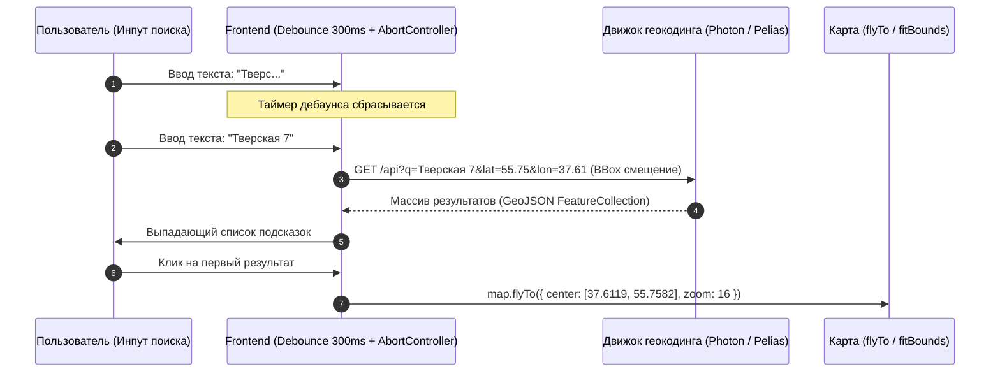

# Геокодинг и автокомплит адресов (Nominatim, Photon, Pelias)

> [!info] Навигация
> Родительский раздел: [[Web GIS MOC]]

## Что это такое и какую боль решает

**Геокодинг (Прямой геокодинг, Forward Geocoding)** — это преобразование текстовой строки адреса (*"Москва, Тверская 7"*) в географические координаты `[37.6119, 55.7582]`.

Для пользователя поиск адреса — ключевая точка входа в любой картографический продукт (заказ такси, доставка пиццы, поиск недвижимости). Если поиск работает медленно, не прощает опечаток или стоит как чугунный мост (в Google Places API каждый автокомплит-запрос стоит денег при каждом нажатии клавиши), бизнес несет огромные издержки.



---

## Сравнение движков геокодинга

### 1. Nominatim — Официальный поисковик OpenStreetMap
* **Стек:** PostgreSQL + PL/pgSQL + C.
* **Плюсы:** 100% покрытие всех объектов OSM со всеми тегами.
* **Минусы:** Медленный для «живого» автокомплита на каждый ввод буквы; очень строгая политика использования публичного сервера (публичный `nominatim.openstreetmap.org` запрещает более 1 запроса в секунду и требует обязательный кастомный заголовок `User-Agent`). Не прощает опечатки.

### 2. Photon — Быстрый автокомплит на Elasticsearch
* **Разработчик:** Komoot (популярный сервис для хайкинга и велоспорта).
* **Стек:** Java + Elasticsearch.
* **Суть:** Photon берет данные из Nominatim, но индексирует их в поисковом движке Elasticsearch.
* **Главный плюс:** Мгновенный отклик ($< 20$ мс), идеален для автокомплита букв на лету (Search-as-you-type), отлично справляется с опечатками и ранжирует подсказки ближе к текущему центру экрана пользователя.

### 3. Pelias — Модульный геокодер корпоративного уровня
* **Разработчик:** Изначально создан Mapzen, сейчас развивается сообществом.
* **Стек:** Node.js + Elasticsearch.
* **Суть:** Умеет объединять в единый поисковый индекс несколько открытых источников: OSM, OpenAddresses (официальные государственные реестры адресов), Who's On First (база районов и городов) и GeoNames.

---

## Архитектура клиентского автокомплита на фронтенде

При реализации поля ввода поиска адресов фронтендер обязан предусмотреть три вещи:
1. **Debounce (300 мс):** Не спамить сервер запросами на каждый символ.
2. **Отмена предыдущего запроса (`AbortController`):** Если пользователь быстро стер и напечатал другое слово, ответ на старый запрос может прийти позже нового (Race Condition) и сломать выдачу подсказок.
3. **Географическое смещение (Proximity / Bias):** Поиск по запросу *"Ленина 5"* должен в первую очередь искать улицу в текущем городе пользователя, а не за 3000 км в другом регионе.

```typescript
import { useState, useEffect, useRef } from 'react';

export function useAddressAutocomplete(mapCenter: [number, number]) {
  const [query, setQuery] = useState('');
  const [suggestions, setSuggestions] = useState<any[]>([]);
  const abortControllerRef = useRef<AbortController | null>(null);

  useEffect(() => {
    if (query.trim().length < 3) {
      setSuggestions([]);
      return;
    }

    // 1. Отменяем предыдущий запрос в полете
    if (abortControllerRef.current) {
      abortControllerRef.current.abort();
    }
    abortControllerRef.current = new AbortController();

    // 2. Дебаунс 300мс
    const timer = setTimeout(async () => {
      try {
        const [lon, lat] = mapCenter;
        // Публичный бесплатный сервер Photon от Komoot с гео-смещением вокруг координат карты:
        const url = `https://photon.komoot.io/api/?q=${encodeURIComponent(query)}&lat=${lat}&lon=${lon}&limit=5`;
        
        const res = await fetch(url, { signal: abortControllerRef.current?.signal });
        const data = await res.json();
        setSuggestions(data.features || []);
      } catch (err: any) {
        if (err.name !== 'AbortError') {
          console.error('Ошибка геокодинга:', err);
        }
      }
    }, 300);

    return () => clearTimeout(timer);
  }, [query, mapCenter]);

  return { query, setQuery, suggestions };
}
```

---

## Форматирование карточки адреса (Karlsruhe Schema)

В ответе геокодера возвращается сырой GeoJSON с разрозненными свойствами. Функция форматирования должна собирать строку по международным правилам:

```typescript
export function formatAddress(feature: any): string {
  const p = feature.properties;
  const parts = [
    p.name,
    p.street ? `${p.street} ${p.housenumber || ''}` : null,
    p.city || p.town || p.district,
    p.state,
    p.country
  ].filter(Boolean);

  return parts.join(', ');
}
```
