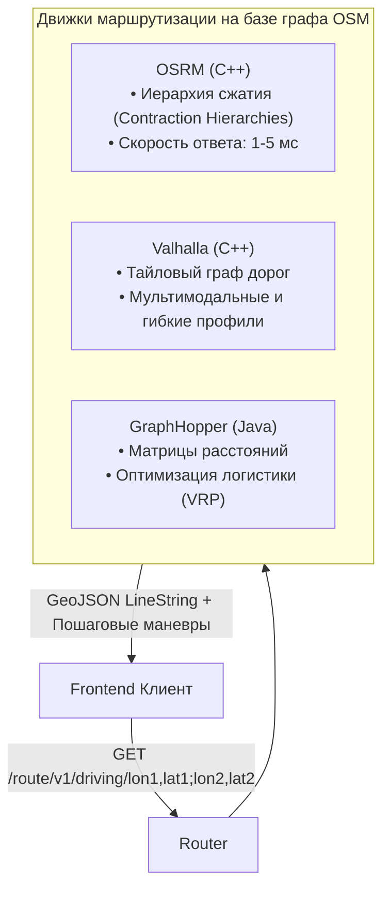

# Маршрутизация и графы дорог (OSRM, Valhalla, GraphHopper)

> [!info] Навигация
> Родительский раздел: [[Web GIS MOC]]

## Что это такое и какую боль решает

Провести прямую линию между складом и клиентом просто. Но реальный транспорт перемещается по **графу дорожной сети** с учетом:
* Одностороннего движения и запретов левых поворотов.
* Скоростных ограничений и светофоров.
* Профилей перемещения (пешеход срезает через парк, грузовик не пройдет под низким мостом, велосипед избегает скоростных шоссе).

Движки маршрутизации (Routing Engines) рассчитывают оптимальный путь по дорожному графу и возвращают на фронтенд геометрию пути, пошаговые навигационные инструкции (Turn-by-turn maneuvers) и суммарное время поездки.



---

## 1. OSRM (Open Source Routing Machine) — Сверхскорость

Разработан в Технологическом институте Карлсруэ, спонсируется Mapbox. Написан на высокооптимизированном C++.

* **Алгоритм Contraction Hierarchies (CH):** Граф дорог заранее сжимается и индексируется. В момент запроса поиск пути между городами на расстоянии 1000 км занимает буквально **2–5 миллисекунд**!
* **Минусы CH:** Нельзя на лету менять веса ребер (например, динамически объехать внезапное перекрытие улицы) без перестройки графа. Для динамических весов используется режим MLD (Multi-Level Dijkstra), который работает чуть медленнее.

---

## 2. Valhalla — Модульность и мультимодальность

Создан компанией Mapzen, в настоящее время развивается консорциумом Linux Foundation.
* **Тайловый граф:** Дорожный граф нарезан на небольшие иерархические кусочки (тайлы), аналогично картографическим тайлам. Движок не требует гигантской оперативной памяти для старта — он подгружает участки графа с диска по мере прокладывания маршрута.
* **Кастомизация на лету:** В тело каждого HTTP-запроса можно передать персональные штрафы: *"избегать платных дорог"*, *"избегать крутых подъемов на велосипеде"*, *"учесть габариты грузовика 3.8м"*.

---

## Как фронтенд отрисовывает маршрут

Серверы маршрутизации часто отдают геометрию не как тяжелый GeoJSON (который весит десятки килобайт), а в виде компактной строки **Encoded Polyline** (алгоритм сжатия ломаных линий Google):

```typescript
import polyline from '@mapbox/polyline';

async function fetchAndDrawRoute(
  map: maplibregl.Map,
  start: [number, number],
  end: [number, number]
) {
  // Запрос к публичному демонстрационному серверу OSRM:
  const url = `https://router.project-osrm.org/route/v1/driving/${start[0]},${start[1]};${end[0]},${end[1]}?overview=full&geometries=polyline6`;
  
  const response = await fetch(url);
  const data = await response.json();
  const route = data.routes[0];

  // 1. Декодируем полилайн в массив координат [[lat, lon], ...]
  // Внимание: polyline декодирует координаты как [lat, lon], поэтому переворачиваем в [lon, lat]!
  const decodedCoords = polyline.decode(route.geometry, 6).map(([lat, lon]) => [lon, lat]);

  const geojson: GeoJSON.Feature<GeoJSON.LineString> = {
    type: 'Feature',
    properties: {
      distanceMeters: route.distance,
      durationSeconds: route.duration
    },
    geometry: {
      type: 'LineString',
      coordinates: decodedCoords
    }
  };

  // 2. Отображаем линию маршрута на карте
  if (!map.getSource('route')) {
    map.addSource('route', { type: 'geojson', data: geojson });
    
    // Слой обводки линии (casing) для контраста
    map.addLayer({
      id: 'route-casing',
      type: 'line',
      source: 'route',
      paint: {
        'line-color': '#2563eb',
        'line-width': 8,
        'line-opacity': 0.4
      }
    });

    // Основная линия маршрута
    map.addLayer({
      id: 'route-line',
      type: 'line',
      source: 'route',
      paint: {
        'line-color': '#3b82f6',
        'line-width': 4
      }
    });
  } else {
    (map.getSource('route') as maplibregl.GeoJSONSource).setData(geojson);
  }

  // 3. Плавно подгоняем границы карты под размер маршрута (fitBounds)
  const bounds = decodedCoords.reduce(
    (b, c) => b.extend(c as [number, number]),
    new maplibregl.LngLatBounds(decodedCoords[0], decodedCoords[0])
  );
  map.fitBounds(bounds, { padding: 80, duration: 1000 });
}
```
