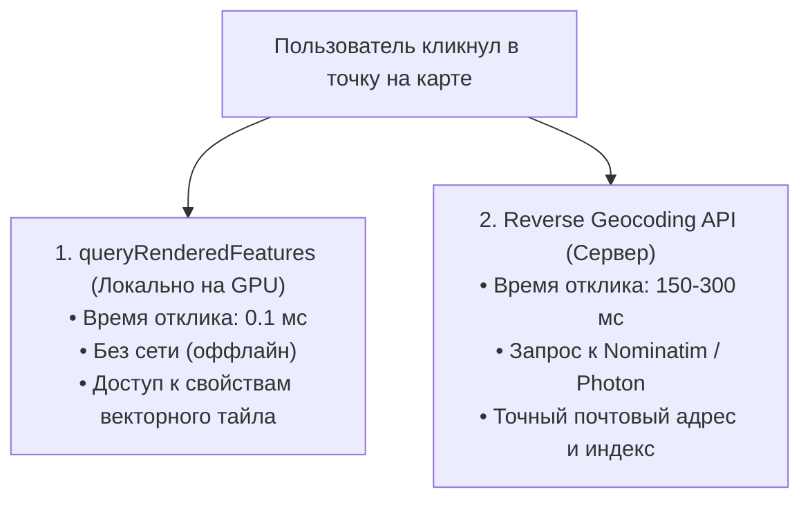

# Обратное геокодирование и определение полигона под курсором

> [!info] Навигация
> Родительский раздел: [[Web GIS MOC]]

## Что это такое и какую боль решает

Когда пользователь кликает в произвольное место на карте, приложению нужно решить одну из двух задач:
1. **Обратное геокодирование (Reverse Geocoding):** Превратить координаты клика `[37.61, 55.75]` в читаемый адрес дома для оформления заказа: *"ул. Моховая, д. 1"*.
2. **Локальный Hit-Testing (Определение объекта под курсором):** Мгновенно узнать, по какому именно дому, полигону кадастра или участку кликнул пользователь, подсветить его и открыть карточку с данными **без единого сетевого запроса**.



---

## 1. Мгновенный Hit-Testing: `map.queryRenderedFeatures`

В MapLibre векторные тайлы уже содержат распарсенную геометрию и атрибуты объектов прямо в памяти браузера. Вызов метода `queryRenderedFeatures` выполняет пространственный поиск по экранным координатам пикселя:

```typescript
map.on('click', (e) => {
  // Запрашиваем объекты в точке клика (только из слоя домов):
  const features = map.queryRenderedFeatures(e.point, {
    layers: ['building-layer']
  });

  if (!features.length) return;

  const clickedBuilding = features[0];
  console.log('ID здания:', clickedBuilding.id);
  console.log('Атрибуты OSM:', clickedBuilding.properties);
  // { "building:levels": "9", "addr:street": "Арбат", "addr:housenumber": "10" }

  new maplibregl.Popup()
    .setLngLat(e.lngLat)
    .setHTML(`<b>${clickedBuilding.properties.name || 'Здание'}</b><br/>Этажей: ${clickedBuilding.properties['building:levels'] || 'н/д'}`)
    .addTo(map);
});
```

---

## 2. Интерактивный Hover без лагов: `setFeatureState`

Как изменить цвет полигона при наведении мыши (`hover`), не перерисовывая весь GeoJSON слой?

### Фатальный антипаттерн:
```typescript
// ❌ АНТИПАТТЕРН: Перезапись всего GeoJSON на каждый mousemove
geojsonData.features[0].properties.color = '#ff0000';
source.setData(geojsonData); // Пересоздает буферы вершин, фризит экран!
```

### Профессиональный подход: Механизм Feature State
MapLibre позволяет передавать динамическое состояние напрямую в память GPU по уникальному целочисленному `id` объекта:

```typescript
let hoveredFeatureId: number | null = null;

map.on('mousemove', 'parcels-layer', (e) => {
  if (e.features && e.features.length > 0) {
    map.getCanvas().style.cursor = 'pointer';

    if (hoveredFeatureId !== null) {
      map.setFeatureState(
        { source: 'parcels-source', id: hoveredFeatureId },
        { hover: false }
      );
    }

    hoveredFeatureId = e.features[0].id as number;
    map.setFeatureState(
      { source: 'parcels-source', id: hoveredFeatureId },
      { hover: true }
    );
  }
});

map.on('mouseleave', 'parcels-layer', () => {
  map.getCanvas().style.cursor = '';
  if (hoveredFeatureId !== null) {
    map.setFeatureState(
      { source: 'parcels-source', id: hoveredFeatureId },
      { hover: false }
    );
  }
  hoveredFeatureId = null;
});
```

В стиле слоя цвет настраивается через выражение `feature-state`:
```json
"paint": {
  "fill-color": [
    "case",
    ["boolean", ["feature-state", "hover"], false],
    "#3b82f6", // Цвет при наведении (синий)
    "#e2e8f0"  // Дефолтный цвет (серый)
  ],
  "fill-opacity": [
    "case",
    ["boolean", ["feature-state", "hover"], false],
    0.8,
    0.4
  ]
}
```

---

## 3. Обратное геокодирование через HTTP API

Если данных в тайлах недостаточно (нужен официальный почтовый индекс, район или точный адрес), делается фоновый сетевой запрос:

```typescript
async function reverseGeocode(lon: number, lat: number): Promise<string> {
  const url = `https://nominatim.openstreetmap.org/reverse?lat=${lat}&lon=${lon}&format=json`;
  const res = await fetch(url, {
    headers: { 'User-Agent': 'MyCoolApp/1.0 (contact@mycompany.com)' }
  });
  const data = await res.json();
  return data.display_name; // Полный адрес строкой
}
```
