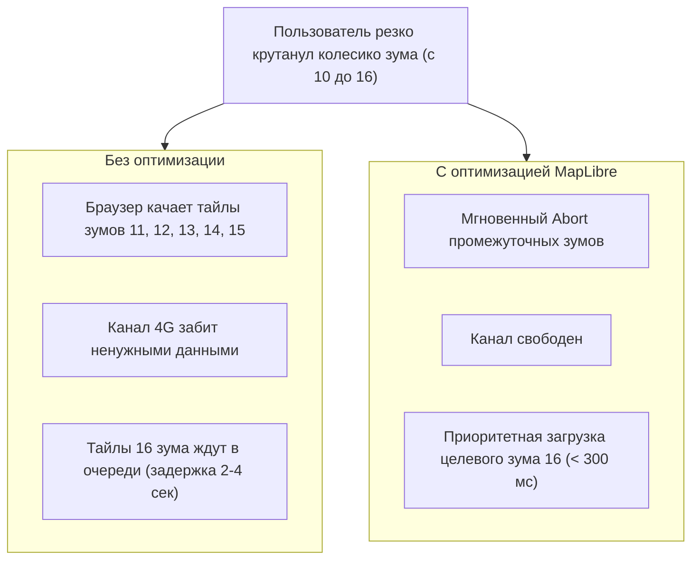

# Оптимизация сетевых запросов тайлов и префетчинг

> [!info] Навигация
> Родительский раздел: [[Web GIS MOC]]

## Что это такое и какую боль решает

При динамичной навигации по карте пользователь совершает резкие зумы и быстрые перетаскивания (флики). За пару секунд генерируется от $50$ до $150$ сетевых запросов за тайлами.

Если сеть настроена неоптимально:
* Полоса пропускания забивается тайлами промежуточных зумов, которые пользователю уже не нужны.
* На экране появляются "серые дыры" и шахматные проплешины вместо гладкого отображения карты.
* Исчерпываются лимиты параллельных соединений браузера.

Грамотная оптимизация сетевого слоя гарантирует мгновенную загрузку карты даже на нестабильном 3G/4G мобильном интернете.



---

## 1. Отмена неактуальных запросов (Request Abortion)

Когда камера пролетает через промежуточные масштабы, эти тайлы устаревают в ту же секунду.
Современный движок MapLibre использует встроенный **`AbortController`** для всех запросов тайлов:
* Как только тайл выходит за пределы экрана или становится невидимым из-за смены зума, сетевой запрос мгновенно прерывается (вкладка Network покажет статус `(canceled)`).
* Это освобождает сокеты браузера для загрузки целевых тайлов.

> [!warning] Антипаттерн: Отключение отмены запросов
> Если вы реализуете кастомный `transformRequest` или собственный прокси-сервер, убедитесь, что вы не оборачиваете запросы в неотменяемые промисы. Потеря сигнала `abort` парализует сеть при быстром скролле.

---

## 2. Смерть Domain Sharding в эпоху HTTP/2 и HTTP/3

В старых руководствах по Leaflet и Google Maps рекомендовалось использовать поддомены:
`https://{s}.tile.osm.org/{z}/{x}/{y}.png` с шаблоном `{s} = a, b, c`.

### Почему в 2026 году это вредный антипаттерн?
* **В эпоху HTTP/1.1 (2010 год):** Браузер имел жесткий лимит — не более 6 одновременных TCP-соединений к одному домену. Разделение на поддомены `a.tile`, `b.tile`, `c.tile` позволяло качать 18 картинок параллельно.
* **В эпоху HTTP/2 и HTTP/3 (QUIC):** Все запросы мультиплексируются **через единое TCP/UDP-соединение**.
  Использование разных поддоменов заставляет браузер выполнять лишние DNS-резолвы, устанавливать 3 раздельных TLS-хэндшейка и разрушает общее окно управления перегрузкой (TCP Congestion Window).

> [!tip] Правило для HTTP/2+
> Раздавайте все тайлы, шрифты и спрайты с **одного единственного хоста** (например, `tiles.mycompany.com`).

---

## 3. Настройка CDN-кэширования: Заголовок `immutable`

Векторные тайлы для конкретного зума и координат неизменны в рамках версии датасета:

```http
HTTP/1.1 200 OK
Content-Type: application/x-protobuf
Content-Encoding: gzip
Cache-Control: public, max-age=31536000, immutable
ETag: "v2-14-9650-5040"
Access-Control-Allow-Origin: *
```

* Директива **`immutable`** сообщает браузеру: *"Этот файл никогда не изменится на сервере"*.
* Браузер больше не будет отправлять условные запросы `If-None-Match` (304 Not Modified) при повторных заходах пользователя на сайт, читая тайл из локального дискового кэша за 0 мс.

---

## 4. Кастомный перехватчик `transformRequest`

MapLibre предоставляет мощный хук `transformRequest`, позволяющий модифицировать каждый исходящий сетевой запрос: добавлять токены авторизации, перенаправлять запросы на локальные зеркала или собирать телеметрию скорости:

```typescript
const map = new maplibregl.Map({
  container: 'map',
  style: styleUrl,
  transformRequest: (url, resourceType) => {
    // Добавляем Bearer токен только к защищенным слоям нашей компании:
    if (url.startsWith('https://api.mycompany.com/secure-tiles/')) {
      return {
        url,
        headers: { 'Authorization': `Bearer ${userAuthToken}` }
      };
    }

    // Для шрифтов и тайлов используем стандартные заголовки
    return { url };
  }
});
```
