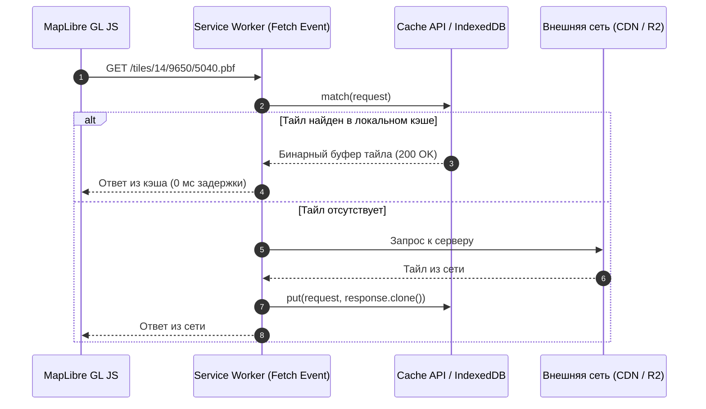

# Оффлайн-карты (Service Worker, Cache API, IndexedDB)

> [!info] Навигация
> Родительский раздел: [[Web GIS MOC]]

## Что это такое и какую боль решает

Приложения для полевых сотрудников (инженеры на буровых, курьеры в подвальных помещениях, туристы в горах) должны гарантированно работать **при полном отсутствии интернет-соединения**.

В стандартном веб-приложении при разрыве соединения карта превращается в пустое поле с серыми квадратами, потому что браузер не может загрузить очередные тайлы.

Полноценный оффлайн-режим на фронтенде решает три задачи:
1. **Фоновое кэширование просмотренных тайлов:** То, что пользователь уже видел, должно открываться из кэша мгновенно без повторного скачивания.
2. **Предварительное скачивание региона (Pre-caching / Offline Pack):** Пользователь нажимает *"Скачать карту города (45 МБ)"*, и приложение скачивает нужный BBox тайловой пирамиды.
3. **Бесшовный перехват запросов (Service Worker):** Движок карты (MapLibre или Leaflet) даже не подозревает, что интернета нет — запросы перехватываются сервис-воркером и отдаются из локального хранилища.



---

## Где хранить тайлы: Cache API против IndexedDB

| Хранилище | Плюсы | Минусы | Вердикт |
| :--- | :--- | :--- | :--- |
| **Cache API** | Нативная поддержка объектов `Request` и `Response`, доступен прямо из Service Worker, высокая скорость. | Сложнее делать кастомные выборки по BBox или очищать конкретный "скачанный регион". | **Идеален для стратегии Cache-First** и автоматического кэширования трафика. |
| **IndexedDB** | Возможность хранить метаданные, имена регионов, дату истечения срока годности, структуру папок. | Требует ручной сериализации в `Blob` / `ArrayBuffer`, чуть медленнее на миллионах мелких записей. | **Идеален для менеджера скачанных оффлайн-паков**. |

---

## Архитектура Service Worker для перехвата тайлов

Шаблон сервис-воркера со стратегией **Cache First, falling back to Network**:

```javascript
// sw.js — Service Worker
const CACHE_NAME = 'map-tiles-v1';
const TILE_HOSTS = ['tiles.mycompany.com', 'demotiles.maplibre.org'];

self.addEventListener('fetch', (event) => {
  const url = new URL(event.request.url);

  // Перехватываем только запросы за векторными или растровыми тайлами:
  const isTileRequest = TILE_HOSTS.includes(url.hostname) && 
    (url.pathname.endsWith('.pbf') || url.pathname.endsWith('.png') || url.pathname.endsWith('.pmtiles'));

  if (!isTileRequest) return;

  event.respondWith(
    caches.open(CACHE_NAME).then(async (cache) => {
      // 1. Проверяем локальный кэш
      const cachedResponse = await cache.match(event.request);
      if (cachedResponse) {
        return cachedResponse;
      }

      // 2. Если в кэше нет — идем в сеть и сохраняем копию
      try {
        const networkResponse = await fetch(event.request);
        if (networkResponse.status === 200) {
          cache.put(event.request, networkResponse.clone());
        }
        return networkResponse;
      } catch (error) {
        // Оффлайн и тайла нет в кэше: возвращаем пустой прозрачный тайл 204 No Content
        return new Response(null, { status: 204, statusText: 'Tile Unavailable Offline' });
      }
    })
  );
});
```

---

## Предварительное скачивание области (Offline Download Manager)

Как рассчитать и скачать все тайлы для заданного региона:

```typescript
import { latLonToTile } from './geo-math';

export async function downloadRegionTiles(
  bbox: [minLon: number, minLat: number, maxLon: number, maxLat: number],
  minZoom: number,
  maxZoom: number,
  onProgress: (percent: number) => void
) {
  const cache = await caches.open('offline-regions');
  const urls: string[] = [];

  // 1. Рассчитываем координаты всех тайлов в пирамиде для заданного BBox:
  for (let z = minZoom; z <= maxZoom; z++) {
    const minTile = latLonToTile(bbox[3], bbox[0], z); // maxLat, minLon (северо-запад)
    const maxTile = latLonToTile(bbox[1], bbox[2], z); // minLat, maxLon (юго-восток)

    for (let x = minTile.x; x <= maxTile.x; x++) {
      for (let y = minTile.y; y <= maxTile.y; y++) {
        urls.push(`https://tiles.mycompany.com/${z}/${x}/${y}.pbf`);
      }
    }
  }

  console.log(`Всего тайлов для загрузки: ${urls.length}`);

  // 2. Параллельная загрузка с ограничением concurrency (максимум 6 одновременных запросов)
  let loaded = 0;
  const poolLimit = 6;
  const queue = [...urls];

  const workers = Array(poolLimit).fill(null).map(async () => {
    while (queue.length > 0) {
      const url = queue.shift()!;
      try {
        const res = await fetch(url);
        if (res.ok) {
          await cache.put(url, res);
        }
      } catch (e) {
        console.warn(`Не удалось скачать тайл ${url}`);
      }
      loaded++;
      onProgress(Math.round((loaded / urls.length) * 100));
    }
  });

  await Promise.all(workers);
}
```

> [!warning] Ограничения квот хранилища браузера (Storage Quotas)
> Браузер выделяет под Cache API / IndexedDB ограниченный объем диска (обычно от нескольких гигабайт до $20-60\%$ свободного места). Обязательно запрашивайте постоянное хранилище через `navigator.storage.persist()`, иначе в условиях нехватки диска Safari или Android могут внезапно удалить закэшированную карту без ведома пользователя.
