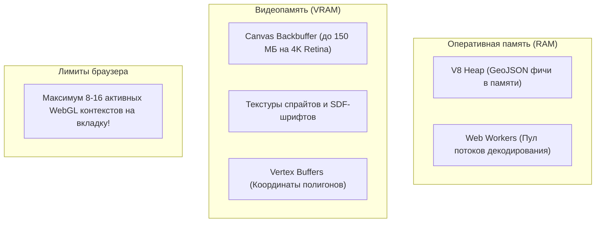

# Профилирование WebGL (утечки контекста, Canvas Memory Leak)

> [!info] Навигация
> Родительский раздел: [[Web GIS MOC]]

## Что это такое и какую боль решает

Картографические WebGL-приложения работают не так, как обычные сайты на HTML/CSS. Здесь задействованы три изолированных пространства памяти:
1. **Куча JavaScript (V8 Heap):** Память объектов, массивов GeoJSON и инстансов карты.
2. **Память процесса GPU (VRAM):** Текстуры шрифтов (глифов), буферы вершин геометрии дорог и зданий (VBO), буферы глубины и трафарета.
3. **Пул WebGL-контекстов браузера:** Жесткий лимит на количество параллельно открытых аппаратных холстов.

Непонимание этих пространств приводит к двум катастрофическим багам:
* **"Черный/белый экран":** При переходах по страницам SPA карта внезапно перестает рендериться с предупреждением `Too many active WebGL contexts. Oldest context will be lost`.
* **Out of Memory (OOM) краш вкладки:** Мобильный браузер Safari или Chrome аварийно перезагружает страницу из-за исчерпания памяти устройства.



---

## 1. Фатальная утечка контекстов: `webglcontextlost`

### В чем природа лимита?
Движки браузеров (Chromium, WebKit) выделяют фиксированное количество слотов под WebGL-контексты (в Chrome — **16**, на мобильных устройствах — часто всего **8**).
Когда приложение создает 17-й контекст без явного уничтожения предыдущих, браузер принудительно убивает самый старый контекст, освобождая ресурсы.

### Почему это происходит в SPA (React / Vue / Angular)?
Пользователь заходит на страницу с картой, уходит в каталог, снова возвращается на карту. Компонент карты пересоздается, вызывая `new maplibregl.Map()`.
Если в хуке размонтирования компонента не вызван **`map.remove()`**, старый скрытый `<canvas>` продолжает удерживать WebGL-контекст. Через 10 переходов карта ломается.

```typescript
// ✅ ОБЯЗАТЕЛЬНЫЙ ЧЕКЛИСТ ПРИ РАЗМОНТИРОВАНИИ:
function cleanupMap(mapInstance: maplibregl.Map | null) {
  if (!mapInstance) return;

  // 1. Снимаем все внешние слушатели
  mapInstance.off('click', onMapClick);
  
  // 2. Уничтожаем все кастомные HTML-маркеры (иначе они повиснут в DOM)
  markersList.forEach(m => m.remove());
  markersList = [];

  // 3. Вызываем полный демонтаж движка
  mapInstance.remove(); 
  // Что делает remove() внутри:
  // - Вызывает gl.getExtension('WEBGL_lose_context')?.loseContext()
  // - Освобождает VBO и шейдерные программы в GPU
  // - Завершает работу фонового пула Web Workers
  // - Удаляет canvas элемент из DOM
}
```

---

## 2. Вес Canvas Backbuffer на Retina-экранах

Многие разработчики не осознают, сколько видеопамяти потребляет обычный тег `<canvas>` на весь экран:

Формула размера экранного буфера кадра:
$$\text{Memory} = \text{Width} \times \text{Height} \times \text{DPI}^2 \times 4 \text{ байта (RGBA)}$$

* Для экрана MacBook Pro ($3024 \times 1964$ пикселей, Retina `devicePixelRatio = 2`):
  Буфер рендеринга составляет $3024 \times 1964 \times 4 \approx \mathbf{24 \text{ МБ}}$.
* Для внешнего 4K монитора с масштабированием 2x:
  $\approx \mathbf{66 \text{ МБ}}$ только на один фронтальный буфер (а с учетом двойной буферизации и depth-буфера — более **$130 \text{ МБ}$ VRAM**!).

### Оптимизация для мобильных устройств:
Если на бюджетных Android-смартфонах наблюдаются лаги при 3D-наклоне, можно принудительно ограничить `pixelRatio`:

```typescript
// Ограничиваем DPI максимум двойкой, даже если экран 3x Retina:
const pixelRatio = Math.min(window.devicePixelRatio, 2.0);

// Переопределение в MapLibre через кастомный canvas:
// Либо через опцию maxTileCacheSize
```

---

## Инструменты диагностики и отладки

1. **Chrome Task Manager (`Shift + Esc`):** Показывает раздельное потребление памяти: "Вкладка браузера" (JS Heap) и "GPU Process" (видеопамять). Если при переходах GPU Process непрерывно растет — у вас утекают WebGL-контексты.
2. **`chrome://gpu`:** Страница статуса аппаратного ускорения и список аварийных падений графического драйвера.
3. **Spector.js:** Расширение для Chrome от команды Babylon.js. Позволяет "заморозить" один кадр карты и посмотреть все вызовы `drawElements`, текстуры и шейдеры, отправленные на видеокарту.
