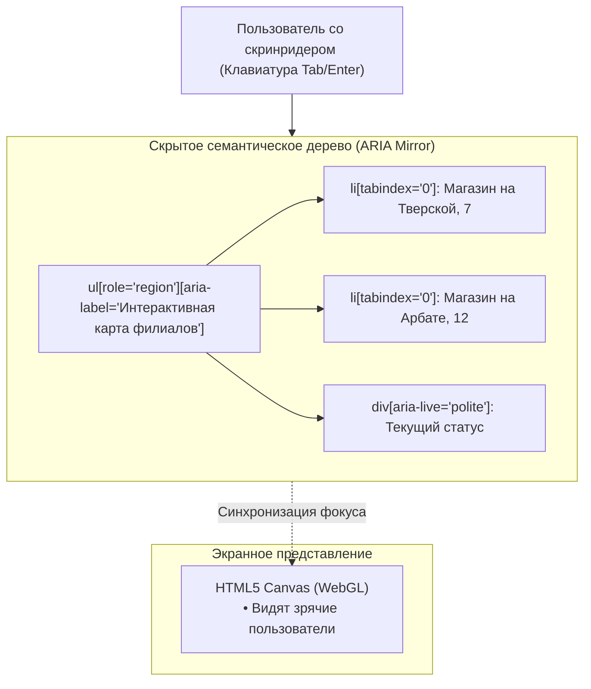

# Доступность (A11y) интерактивных карт

> [!info] Навигация
> Родительский раздел: [[Web GIS MOC]]

## Суровая реальность Web GIS и A11y

Для скринридеров (программ чтения экрана незрячими пользователями: NVDA, JAWS, VoiceOver) современная WebGL-карта — это **абсолютно черный ящик**.

Элемент `<canvas>` не имеет семантических дочерних узлов. Внутри него нет заголовков, кнопок или ссылок — только массив цветных пикселей. Если пользователь с ограниченными возможностями перемещается по странице с помощью клавиши `Tab`, фокус просто проскакивает мимо карты, либо застревает в ней без каких-либо голосовых подсказок.

В эпоху законодательных требований доступности (**European Accessibility Act 2025**, **WCAG 2.1 AA**, **Section 508**) недоступная карта в интернет-магазине или сервисе доставки — это повод для судебных исков и штрафов.



---

## 4 столпа доступности веб-карт

### 1. Золотой стандарт: Дублирование в виде списка/таблицы (Table Toggle)
Никакая экранная навигация не заменит незрячему пользователю структурированную таблицу.
* **Лучшая практика индустрии:** Разместите перед картой доступную кнопку:
  `<button aria-controls="map-view store-list-view">Показать список списком</button>`.
* При переключении карта скрывается (`display: none` или `aria-hidden="true"`), а на экран выводится семантическая таблица `<table>` с адресами, телефонами и режимом работы.

---

### 2. Скрытое DOM-зеркало (Off-screen Accessible Tree)
Если пользователь взаимодействует именно с картой, поверх холста разворачивается невидимое семантическое дерево:

```html
<div class="map-wrapper" role="region" aria-label="Карта пунктов выдачи заказов">
  <!-- Визуальный холст, скрытый от скринридеров -->
  <div id="map" aria-hidden="true"></div>

  <!-- Семантическое зеркало для скринридеров -->
  <div class="sr-only" role="list" aria-label="Список меток на карте">
    <button 
      role="listitem" 
      tabindex="0"
      aria-label="Пункт выдачи ул. Тверская 7, открыто до 22:00"
      onclick="focusMarker('point-1')">
      Пункт выдачи: Тверская 7
    </button>
    <button 
      role="listitem" 
      tabindex="0"
      aria-label="Пункт выдачи ул. Арбат 12, открыто до 20:00"
      onclick="focusMarker('point-2')">
      Пункт выдачи: Арбат 12
    </button>
  </div>

  <!-- ARIA Live Region для озвучивания событий -->
  <div id="map-announcer" class="sr-only" aria-live="polite" aria-atomic="true"></div>
</div>
```

---

### 3. Управление с клавиатуры (Keyboard Navigation)
Карта обязана поддерживать управление стрелками без мыши:
* **Стрелки (Влево/Вправо/Вверх/Вниз):** Панорамирование карты.
* **Клавиши `+` и `-`:** Плавное приближение и отдаление зума.
* **Клавиша `Escape`:** Закрытие открытого информационного попапа и возврат фокуса на маркер.

В MapLibre поддержка клавиатуры включается опцией:
```typescript
const map = new maplibregl.Map({
  container: 'map',
  keyboard: true // Включает стрелочную навигацию при фокусе на канвасе
});
```

---

### 4. Цветовой контраст и дальтонизм (Color Accessibility)
* **Минимальный контраст текста подписей:** Коэффициент контрастности названия улицы по отношению к фону дороги должен быть не менее **4.5:1** (согласно WCAG AA). Именно поэтому **Text Halo** с толщиной 2px обязателен!
* **Дальтонизм (Дейтеранопия / Протанопия):** Не используйте только красный и зеленый цвета для обозначения статусов *"Свободен"* / *"Занят"*. Обязательно дополняйте цвет иконками разной формы (например, зеленый круг и красный треугольник).
