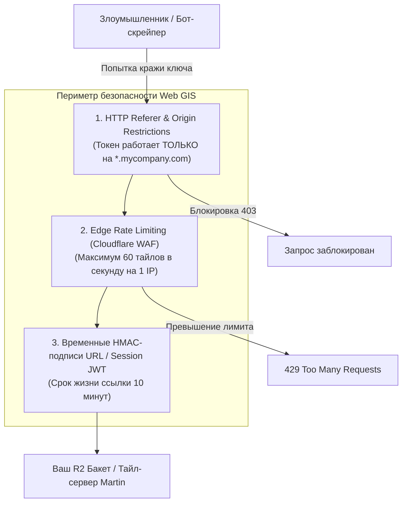

# Чеклист безопасности (API-ключи, Rate Limiting, Referrer Restrictions)

> [!info] Навигация
> Родительский раздел: [[Web GIS MOC]]

## Что это такое и какую боль решает

В веб-картографии фронтенд неизбежно общается с платными или ресурсоемкими сервисами: скачивает миллионы тайлов, запрашивает координаты в геокодере, строит маршруты.

Если допустить стандартные ошибки новичка:
1. **Слив API-ключа:** Ваш токен Mapbox или Google Maps парсится ботами из JS-бандла за 5 минут, вставляется на сторонний пиратский сайт, и к концу месяца вам приходит счет на $\$10\,000$.
2. **Линейный слив трафика (Egress Draining):** Злоумышленник пишет скрипт, который за ночь скачивает всю вашу нарезку тайлов из S3, создавая гигантские счета за трафик.
3. **DDoS собственного бэкенда геокодинга:** Автокомплит без rate-limiting роняет внутренний сервер Nominatim/Photon.



---

## 1. Защита коммерческих API-ключей (Referrer Restrictions)

Если вы используете платного провайдера (Mapbox, MapTiler, Google Maps):
* **Никогда не оставляйте токен со статусом `Unrestricted`:** В личном кабинете провайдера включите ограничение по **HTTP Referer / URL Restrictions**.
* Укажите точные домены, на которых разрешено выполнение запросов:
  - `https://mycompany.com/*`
  - `https://*.mycompany.com/*`
* **Разделяйте токены по средам:**
  - Отдельный токен для `localhost:3000` (с жестким лимитом 1000 вызовов в день для тестирования).
  - Отдельный токен для Production-домена.

---

## 2. Защита собственных тайлов на Cloudflare R2 / S3

Если вы хостите `planet.pmtiles` на Cloudflare R2, злоумышленники могут подключить ваш URL тайлов к своему сайту (Hotlinking), воруя ваши лимиты запросов.

### Решение 1: Проверка заголовка Referer на уровне Cloudflare WAF
В панели Cloudflare создайте правило **WAF Custom Rules**:
```text
(http.request.uri.path contains ".pmtiles" and not http.referer contains "mycompany.com") 
-> Action: Block (403 Forbidden)
```

### Решение 2: Временные подписанные ссылки (Signed URLs)
Фронтенд не обращается к R2 напрямую. Бэкенд генерирует кратковременную преподписанную ссылку (Presigned URL) с HMAC-токеном, действительную 15 минут для авторизованного пользователя.

---

## 3. Rate Limiting геокодинга и маршрутизации

Поисковые и маршрутные движки (OSRM, Photon, Nominatim) выполняют тяжелые вычисления на сервере.
* **Настройка на уровне Nginx / Cloudflare:**
  - Лимит на поисковый автокомплит: не более **5–10 запросов в секунду** с одного IP.
  - При превышении отдавать `429 Too Many Requests` с заголовком `Retry-After: 2`.
* **Защита от скачивания геометрий (Scraping):** Ограничение максимальной длины маршрута и запрет массовых матричных запросов (`/table` в OSRM) без авторизации.

---

## Итоговый Production Checklist безопасности

| № | Проверка | Статус |
| :--- | :--- | :--- |
| 1 | Все внешние API-ключи ограничены по `HTTP Referer` домена | ⬜ Проверено |
| 2 | Токены для локальной разработки (`localhost`) изолированы от Production | ⬜ Проверено |
| 3 | Бакет S3/R2 с тайлами закрыт от прямого листинга файлов (`ListBucket` отключен) | ⬜ Проверено |
| 4 | Настроены строгие правила CORS: разрешены только доверенные домены компании | ⬜ Проверено |
| 5 | На эндпоинтах геокодинга и маршрутизации настроен WAF Rate Limiting | ⬜ Проверено |
| 6 | В `style.json` пути к кастомным тайлам не содержат секретных мастер-ключей базы данных | ⬜ Проверено |
| 7 | Включен мониторинг всплесков трафика (Alerting при превышении бюджета) | ⬜ Проверено |
