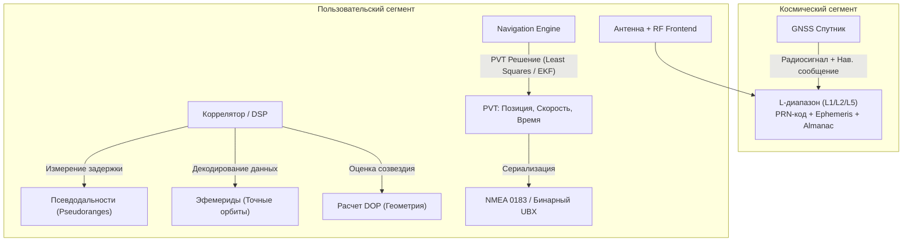
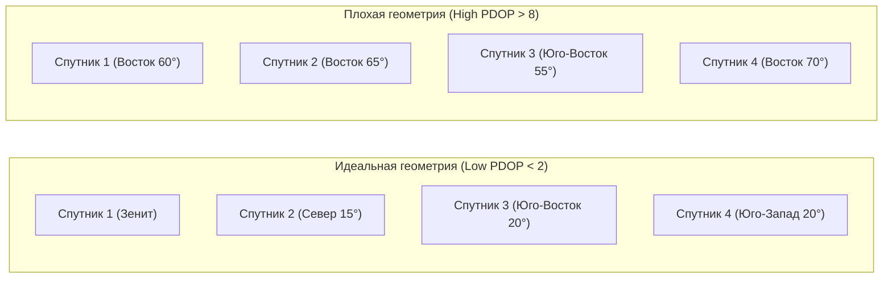

# Глоссарий терминов GNSS (PRN, Ephemeris, Almanac, DOP, NMEA)

> [!info] Навигация
> Родительский раздел: [[GPS & Tracking MOC]]

## Введение

Спутниковая навигация и обработка пространственно-временных данных оперируют строгим набором физических, математических и радиотехнических понятий. Понимание этих терминов критично как для низкоуровневой работы с чипсетами и NMEA/RTCM-потоками, так и для фильтрации сырых измерений во фронтенде и мобильных приложениях.

---

## Фундаментальные понятия GNSS

### GNSS (Global Navigation Satellite System)
Обобщенное название глобальных спутниковых систем определения местоположения, скорости и времени (PNT — *Positioning, Navigation, and Timing*). Включает в себя американскую **GPS**, российскую **ГЛОНАСС**, европейскую **Galileo** и китайскую **BeiDou**, а также региональные дополнения (**QZSS**, **NavIC/IRNSS**).

### PRN (Pseudo-Random Noise / Псевдослучайный шум)
Двоичная псевдослучайная последовательность (в GPS используются коды Голда), уникальная для каждого спутника группировки.
- В технологии CDMA (множественный доступ с кодовым разделением каналов) все спутники GPS вещают на одной несущей частоте (например, $L_1 = 1575.42\text{ МГц}$).
- Приемник выделяет сигнал конкретного космического аппарата благодаря автокорреляционным свойствам PRN-кода: взаимная корреляция между различными PRN стремится к нулю, а автокорреляция дает резкий пик только при точном фазовом совпадении.
- **Номер PRN** (от 1 до 32 для GPS) служит де-факто логическим идентификатором спутника в навигационных протоколах.

### Эфемериды (Ephemeris)
Сверхточный набор кеплеровских элементов орбиты и параметров дрейфа часов, передаваемый каждым спутником индивидуально для самого себя.
- **Срок жизни:** 2–4 часа. При устаревании эфемерид ошибка расчета координат лавинообразно растет (на десятки и сотни метров).
- **Точность:** позволяет вычислить положение спутника в пространстве с погрешностью менее 1 метра.
- **Скорость передачи:** транслируется спутником на сверхнизкой скорости $50\text{ бит/с}$, поэтому полный «холодный» прием эфемерид по радиоканалу занимает от 18 до 36 секунд на спутник.

### Альманах (Almanac)
Упрощенная, приблизительная модель орбит всех спутников созвездия.
- **Срок жизни:** от нескольких недель до месяцев.
- **Назначение:** позволяет приемнику после включения быстро понять, какие спутники сейчас находятся над горизонтом (Line-of-Sight), рассчитать ожидаемый доплеровский сдвиг частоты и сфокусировать корреляторы, ускоряя захват сигнала (Time To First Fix, TTFF).
- Полная передача альманаха со спутника занимает 12.5 минут (разбита на 25 страниц навигационного суперкадра).

---

## Сравнительная таблица: Эфемериды vs Альманах

| Параметр | Эфемериды (Ephemeris) | Альманах (Almanac) |
| :--- | :--- | :--- |
| **Охват данных** | Только текущий передающий спутник | Вся спутниковая группировка |
| **Точность орбиты** | Высокая ($\sim 0.5 - 1.5\text{ м}$) | Приблизительная ($\sim 1 - 5\text{ км}$) |
| **Период валидности** | 2–4 часа | До 30–90 дней |
| **Критичность для Fix**| **Критична.** Без эфемерид расчет позиции невозможен | Вспомогательная (ускоряет поиск частоты и PRN) |
| **Время скачивания** | $\approx 30$ секунд по радиоканалу | $\approx 12.5$ минут по радиоканалу (в A-GPS — миллисекунды) |

---

## Псевдодальность и геометрия

### Псевдодальность (Pseudorange, $\rho$)
Оценка расстояния от фазового центра антенны спутника до антенны приемника, вычисляемая по задержке распространения радиосигнала:
$$\rho = c \cdot (t_{\text{rx}} - t_{\text{tx}})$$
где $c$ — скорость света в вакууме, $t_{\text{rx}}$ — момент приема сигнала по часам приемника, $t_{\text{tx}}$ — момент передачи сигнала по бортовым часам спутника. Называется *псевдодальностью*, так как часы приемника не синхронизированы с системным временем GNSS и содержат неизвестное смещение $\delta t_{\text{rx}}$, создающее ошибку в тысячи километров без соответствующей математической компенсации.

### DOP (Dilution of Precision / Снижение точности)
Безразмерный коэффициент, отражающий геометрическую конфигурацию видимых спутников на небесной полусфере. 
- Если спутники сгруппированы в одной точке неба, геометрические лучи пересекаются под острыми углами, и малейшая погрешность псевдодальности приводит к огромной неопределенности позиции (высокий DOP, плохая точность).
- Если спутники равномерно распределены по азимутам и элевациям (один в зените, остальные близко к горизонту), пересечение сфер образует компактную фигуру погрешности (низкий DOP, идеальная точность).
- **HDOP** (Horizontal DOP) — горизонтальная погрешность (широта, долгота).
- **VDOP** (Vertical DOP) — вертикальная погрешность (высота).
- **PDOP** (Position DOP) — 3D пространственная погрешность.
- **GDOP** (Geometric DOP) — суммарная погрешность, включающая время ($PDOP^2 + TDOP^2$).

---

## Форматы, стандарты и сервисы

### NMEA 0183
Текстовый ASCII-протокол передачи навигационных сообщений от приемника к хост-контроллеру (PC, смартфон, MCU), разработанный Национальной ассоциацией морской электроники (National Marine Electronics Association). Каждая строка начинается с символа `$` и завершается контрольной суммой по XOR (например, `$GPGGA`, `$GNRMC`).

### RTCM (Radio Technical Commission for Maritime Services)
Международный бинарный стандарт передачи дифференциальных поправок для систем DGPS и RTK. В современных высокоточных системах повсеместно используется формат **RTCM 3.x** (сообщения 1004, 1005, 1074–1084 MSM), передаваемый по IP-сетям через протокол NTRIP.

### TTFF (Time To First Fix)
Время от момента подачи питания на GNSS-модуль до выдачи первой достоверной трехмерной координаты (Navigation Fix).
- **Cold Start (Холодный старт):** часы сброшены, альманах и эфемериды отсутствуют ($> 30–60\text{ с}$).
- **Warm Start (Теплый старт):** время и альманах актуальны, эфемериды устарели ($15–30\text{ с}$).
- **Hot Start (Горячий старт):** все эфемериды и время актуальны ($< 1–2\text{ с}$).

> [!tip] Практика во Frontend и мобильной разработке
> При получении данных геолокации в мобильных SDK или Web API значение `accuracy` (в метрах) напрямую коррелирует с произведением ошибки псевдодальности (User Equivalent Range Error, UERE) и коэффициента `HDOP`:
> $$\sigma_{\text{horizontal}} = \text{HDOP} \cdot \sigma_{\text{UERE}}$$
> Если в сырых данных чипсета HDOP $> 4$, координату следует помечать как ненадежную и отфильтровывать до передачи в алгоритмы трекинга или бизнес-логику расчета пройденного пути.
