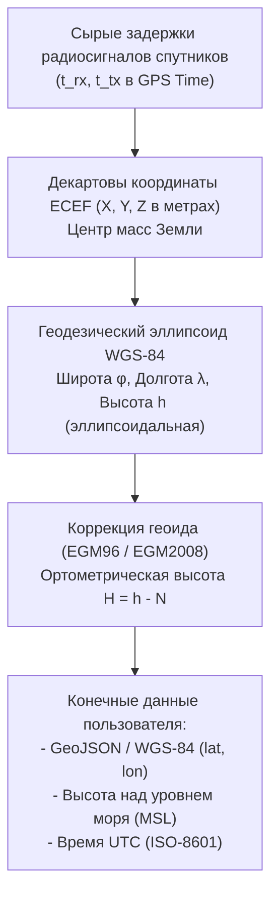
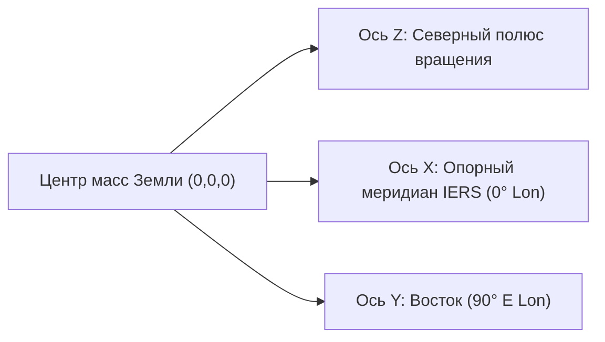
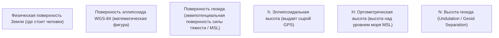

# Системы координат времени и пространства (GPS Time, UTC, ECEF, WGS-84, Geoid)

> [!info] Навигация
> Родительский раздел: [[GPS & Tracking MOC]]

## Введение

Для расчета трехмерного положения объекта на земной поверхности GNSS-приемник выполняет непрерывную трансформацию между различными системами отсчета:
1. **Во времени:** переход между атомным непрерывным временем спутников (GPS Time) и астрономическим гражданским временем с високосными секундами (UTC).
2. **В пространстве:** переход от орбитальной прямоугольной системы координат, вращающейся вместе с Землей (**ECEF**), к геодезическому эллипсоиду (**WGS-84**) и далее к физической поверхности уровня моря (**Геоид**).

---

## 1. Системы времени: GPS Time против UTC

### Что такое GPS Time (GPST)
Время системы GPS — непрерывная атомная шкала времени, отсчитываемая от **00:00:00 UTC 6 января 1980 года**.
- В GPST **полностью отсутствуют високосные секунды (Leap Seconds)**, которые периодически добавляются к шкале UTC Международной службой вращения Земли (IERS) для компенсации неравномерности замедления суточного вращения планеты.
- Поскольку секунды в GPST непрерывны, вычисление разницы времени $(\Delta t = t_2 - t_1)$ не содержит разрывов функции при наступлении полуночи в дни добавления секунды координации.

### Разница между GPS Time, TAI и UTC
Международное атомное время (TAI) было синхронизировано с UTC на 1 января 1958 года. На момент старта GPS (1980 год) TAI уже опережало UTC на 19 секунд:
$$\text{GPS Time} = \text{TAI} - 19\text{ с}$$
Связь между GPS Time и UTC выражается формулой:
$$\text{GPS Time} = \text{UTC} + \Delta t_{\text{LS}}$$
где $\Delta t_{\text{LS}}$ — текущее накопившееся количество високосных секунд. По состоянию на 2026 год $\Delta t_{\text{LS}} = 18\text{ секунд}$.

> [!important] Скачки Leap Second в телеметрии
> Когда спутники транслируют навигационное сообщение, они передают текущую дельту $\Delta t_{\text{LS}}$. Если старый или автономный IoT-трекер не обновляет навигационное сообщение и не знает о високосных секундах, его временная метка сместится ровно на целое число секунд относительно серверного NTP/UTC времени, что приведет к рассинхронизации событий в высоконагруженных real-time шинах.

### Проблема переполнения недели (GPS Week Number Rollover)
В исходном формате навигационного сообщения GPS номер недели передавался 10-битным числом (от 0 до 1023 недель $\approx 19.6$ лет):
- **Первое переполнение:** полночь с 21 на 22 августа 1999 года.
- **Второе переполнение:** полночь с 6 на 7 апреля 2019 года.
- **Третье переполнение:** ноябрь 2038 года.
Устройства со старыми версиями прошивок при наступлении Rollover откатывали внутренний календарь на 19.6 лет назад, что приводило к сбою TLS-сертификатов при установке WebSocket/HTTPS-соединений.

---

## 2. Пространственная система ECEF (Earth-Centered, Earth-Fixed)

Математическое ядро любого навигационного процессора (Navigation Engine) рассчитывает позицию спутников и приемника в прямоугольной правой декартовой системе координат **ECEF**:
- **Начало координат $(0, 0, 0)$:** центр масс Земли (включая гидросферу и атмосферу).
- **Ось $Z$:** направлена вдоль оси вращения Земли к Северному полюсу (IERS Reference Pole).
- **Ось $X$:** лежит в плоскости экватора и проходит через опорный нулевой меридиан (IERS Reference Meridian, проходящий в $\approx 102$ м восточнее Гринвичской обсерватории).
- **Ось $Y$:** дополняет систему до правой тройки ($90^\circ$ восточной долготы в плоскости экватора).

Координаты выражаются строго в метрах: $(X, Y, Z)$.

---

## 3. Геодезический эллипсоид WGS-84 (EPSG:4326)

Координаты ECEF $(X, Y, Z)$ неудобны для навигации человека и веб-карт, где требуются привычные широта, долгота и высота над землей. Для этого ECEF проецируется на референц-эллипсоид **WGS-84**:

### Параметры эллипсоида WGS-84
- **Большая полуось ($a$):** $6\,378\,137.0\text{ м}$ (экваториальный радиус).
- **Сжатие ($f$):** $1 / 298.257223563$.
- **Малая полуось ($b$):** $b = a(1 - f) \approx 6\,356\,752.3142\text{ м}$ (полярный радиус).
- **Квадрат первого эксцентриситета ($e^2$):**
  $$e^2 = \frac{a^2 - b^2}{a^2} = 2f - f^2 \approx 0.00669437999014$$

### Преобразование из геодезических координат $(\phi, \lambda, h)$ в ECEF $(X, Y, Z)$

$$X = (N(\phi) + h) \cos \phi \cos \lambda$$
$$Y = (N(\phi) + h) \cos \phi \sin \lambda$$
$$Z = \left(N(\phi)(1 - e^2) + h\right) \sin \phi$$

где $N(\phi)$ — радиус кривизны первого вертикала:
$$N(\phi) = \frac{a}{\sqrt{1 - e^2 \sin^2 \phi}}$$

### Обратное преобразование (ECEF в Lat/Lon/Alt)
Обратная задача $(X, Y, Z) \to (\phi, \lambda, h)$ является нелинейной. Долгота находится тривиально:
$$\lambda = \text{atan2}(Y, X)$$
Широта $\phi$ и высота $h$ рассчитываются либо итерационным методом Ньютона-Рафсона (сходится за 2–3 итерации до миллиметровой точности), либо замкнутым алгоритмом Боуринга (Bowring's algorithm).

---

## 4. Высота: Эллипсоидная ($h$), Ортометрическая ($H$) и Геоид ($N$)

Один из главных источников путаницы в картографических и трекинговых сервисах — отображение высоты.

### Формула связности высот

$$h = H + N \quad \Longleftrightarrow \quad H = h - N$$

- **$h$ (Эллипсоидальная высота):** геометрическое расстояние от точки до поверхности референц-эллипсоида WGS-84 по нормали. Именно это число напрямую вычисляет математический алгоритм трилатерации GNSS.
- **$H$ (Ортометрическая высота):** реальная высота над средним уровнем моря (MSL — *Mean Sea Level*), определяемая гравитационным полем Земли. Вода течет под воздействием гравитации, поэтому для гидрологии и строительства критична именно ортометрическая высота.
- **$N$ (Высота геоида / Geoid Undulation):** превышение геоида над эллипсоидом WGS-84. Значение $N$ колеблется от $-106\text{ м}$ (на юге Индии) до $+85\text{ м}$ (в северной Атлантике).

> [!warning] Ошибка высоты в NMEA-сообщениях
> В предложении `$GPGGA` поле 9 содержит ортометрическую высоту $H$ (над уровнем моря), а поле 11 — превышение геоида над эллипсоидом $N$. Если дешевый чипсет не имеет встроенной сетки модели геоида (например, таблицы EGM96 или EGM2008), он записывает в поле высоты сырое значение эллипсоида $h$ либо оставляет $N=0$. В результате в Санкт-Петербурге или Москве погрешность высоты на карте может составить от 15 до 30 метров даже при идеальном спутниковом приеме!

---

## Сравнительная таблица систем координат

| Характеристика | ECEF | WGS-84 (EPSG:4326) | Web Mercator (EPSG:3857) |
| :--- | :--- | :--- | :--- |
| **Тип** | Прямоугольная 3D декартова | Геодезическая криволинейная | Плоская проекция (конформная) |
| **Единицы** | Метры $(X, Y, Z)$ | Градусы $(\text{lat } \phi, \text{lon } \lambda)$, высота в метрах | Метры на плоскости $(X, Y)$ |
| **Область применения** | Расчет трилатерации в чипе, EKF, спутниковая баллистика | Хранение геометрии (PostGIS, GeoJSON), GPS-сенсоры | Веб-карты (MapLibre, Mapbox, Leaflet, Google Maps) |
| **Особенности** | Линейные уравнения расстояний | Нелинейная тригонометрия | Искажение площадей к полюсам |
