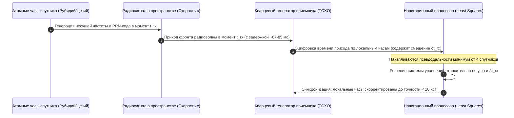
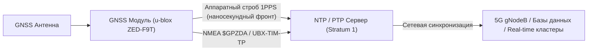

# Атомные часы спутников, рассинхронизация приемника и расчет 4-й неизвестной

> [!info] Навигация
> Родительский раздел: [[GPS & Tracking MOC]]

## Введение

Все измерения в GNSS опираются на измерение времени пролета электромагнитной волны. Поэтому спутниковая навигация является в первую очередь **системой высокоточного распределения и сличения времени**, и лишь во вторую очередь — системой определения координат.

Понимание того, как устраняется расхождение между дешевым кварцевым генератором приемника и квантовыми стандартами частоты на орбите, объясняет, почему GPS-приемники служат мировым эталоном времени (Time Servers / NTP Stratum 1).

---

## 1. Бортовые атомные часы космического аппарата

На каждом навигационном спутнике размещается от 2 до 4 резервированных атомных стандартов частоты:
- **Рубидиевые атомные часы (RAFS — Rubidium Atomic Frequency Standard):** компактные, стабильные на коротких интервалах времени.
- **Цезиевые пучковые часы (CSAC):** эталон секунды СИ, практически не подвержены долговременному дрейфу.
- **Пассивные водородные мазеры (PHM):** устанавливаются на спутниках Galileo, обеспечивают рекордную кратковременную стабильность с уходом частоты менее $1 \times 10^{-14}$ за сутки.

### Модель ухода часов спутника
Несмотря на квантовую природу, бортовые часы имеют остаточный дрейф. Наземный сегмент управления (Control Segment) непрерывно измеряет отклонение часов каждого спутника относительно системного времени шкалы GNSS и передает в навигационном сообщении (эфемеридах) три полиномиальных коэффициента коррекции:
- $a_{f0}$ — постоянное фазовое смещение часов спутника (bias, в секундах);
- $a_{f1}$ — линейный дрейф частоты (drift, в секундах в секунду);
- $a_{f2}$ — ускорение дрейфа частоты (drift rate / aging, в $\text{с}/\text{с}^2$).

Истинное системное время спутника $t_{\text{sat}}$ вычисляется чипсетом по квадратичной формуле:
$$t_{\text{sat}} = t_{\text{code}} - \Delta t_{\text{sat}}$$
$$\Delta t_{\text{sat}} = a_{f0} + a_{f1}(t - t_{oc}) + a_{f2}(t - t_{oc})^2 + \Delta t_r$$
где $t_{oc}$ — опорная эпоха параметров часов из эфемериды, а $\Delta t_r$ — поправка на общую теорию относительности из-за эксцентриситета орбиты.

---

## 2. Кварцевые часы приемника (TCXO vs OCXO)

В пользовательских устройствах (смартфоны, трекеры, навигаторы) для снижения стоимости ($0.20–$2.00) и энергопотребления применяются кварцевые генераторы с температурной компенсацией (**TCXO** — *Temperature-Compensated Crystal Oscillator*).

### Проблема кварцевого резонатора:
- Кварц чувствителен к температуре, вибрации и старению кристалла.
- Нестабильность дешевого кварца составляет порядка $1–5\text{ ppm}$ (миллионных долей), что эквивалентно уходу на $1–5$ микросекунд в секунду.
- Уход на $1\text{ мкс}$ за одну секунду при умножении на скорость света дает ошибку расстояния:
$$\Delta r = 3 \times 10^8\text{ м/с} \times 10^{-6}\text{ с} = 300\text{ метров!}$$

> [!important] Ключевой инженерный вывод
> Приемник **никогда не пытается механически или аппаратно удерживать фазовую точность кварца на уровне атомных часов**. 
> Вместо этого навигационный алгоритм объявляет расхождение часов приемника $\delta t_{\text{rx}}$ **полноправной математической неизвестной** наряду с координатами $X, Y, Z$ и рассчитывает ее численно на каждом такте измерений.

---

## 3. Математика расчета 4-й неизвестной

Рассмотрим, почему смещение $\delta t_{\text{rx}}$ одинаково входит во все уравнения псевдодальностей.

Пусть приемник опрашивает корреляторы и фиксирует время прихода сигналов от 4 спутников в один и тот же момент по своим внутренним несовершенным часам:
$$t_{\text{local}} = t_{\text{true}} + \delta t_{\text{rx}}$$

Разница времен распространения для спутника $i$:
$$\Delta t_i = t_{\text{local}} - t_{\text{sat}, i} = (t_{\text{true}} + \delta t_{\text{rx}}) - t_{\text{sat}, i} = \frac{r_i}{c} + \delta t_{\text{rx}}$$

Умножая на скорость света $c$:
$$\rho_i = c \cdot \Delta t_i = r_i + c \cdot \delta t_{\text{rx}}$$

Заменим $b_{\text{rx}} = c \cdot \delta t_{\text{rx}}$ (эквивалентное расстояние смещения часов приемника в метрах):
$$\rho_i = \sqrt{(x_i - x)^2 + (y_i - y)^2 + (z_i - z)^2} + b_{\text{rx}}$$

Вектор состояния системы:
$$\mathbf{X} = \begin{bmatrix} x \\ y \\ z \\ b_{\text{rx}} \end{bmatrix}$$

В процессе работы фильтра Калмана (EKF) или метода наименьших квадратов матрица частных производных (матрица Якоби $\mathbf{H}$) в 4-м столбце содержит строгие единицы:
$$\frac{\partial \rho_i}{\partial b_{\text{rx}}} = 1 \quad (\forall i \in [1, m])$$

При успешном решении системы уравнений приемник находит не только точку $(x, y, z)$, но и мгновенное значение $b_{\text{rx}}$. Деля его на скорость света, получаем точнейшую погрешность кварца:
$$\delta t_{\text{rx}} = \frac{b_{\text{rx}}}{c}$$

---

## 4. GPS как эталон времени: Импульс 1PPS (Pulse-Per-Second)

Как только чипсет находит решение $b_{\text{rx}}$, он выравнивает внутреннюю фазу системных таймеров с атомным временем GNSS с точностью **до единиц наносекунд** ($< 10\text{ нс}$).

Большинство профессиональных и промышленных модулей (например, u-blox NEO-M8T / ZED-F9T) имеют аппаратный цифровой вывод **1PPS** (Pulse Per Second):
- Ровно один раз в секунду, строго синхронно с фронтом секунды шкалы времени UTC/GPS, на ножке чипа формируется прямоугольный импульс с крутизной фронта $< 1\text{ нс}$.
- Вывод 1PPS подключается к серверам точного времени (NTP-серверы Stratum 1, PTP / IEEE 1588).
- Это основа синхронизации вышек сотовой связи 5G (для работы технологии TDD — временного разделения каналов), базовых станций RTK и финансового высокочастотного трейдинга (HFT), где биржевые транзакции требуют юридической фиксации времени с точностью до микросекунд.

> [!tip] Влияние на фронтенд и WebSockets
> В real-time телеметрии транспорта сервер часто получает от устройства две временные метки:
> 1. `gps_time` — время, рассчитанное спутниковым чипсетом из атомных часов;
> 2. `device_time` — системное время операционной системы трекера (Linux/RTOS).
> Если у трекера разряжена батарейка RTC или сломан NTP, `device_time` может показывать 1970 год, в то время как `gps_time` всегда гарантирует абсолютную наносекундную точность фиксации гео-события.
