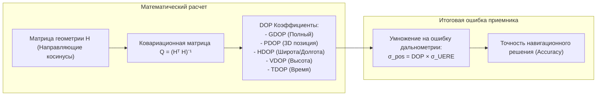

# Геометрия созвездия и разбор DOP (HDOP, VDOP, PDOP, GDOP)

> [!info] Навигация
> Родительский раздел: [[GPS & Tracking MOC]]

## Введение

Даже если аппаратура приемника измеряет псевдодальности с абсолютной точностью, итоговая погрешность вычисления координат может быть как отличной (единицы дециметров), так и катастрофической (сотни метров). Причина кроется во взаимном расположении спутников на небесном своде — геометрическом факторе **DOP (Dilution of Precision — снижение/размытие точности)**.



---

## 1. Геометрическая интуиция

Представьте себе определение точки пересечением двух окружностей (2D трилатерация):

1. **Идеальная геометрия ($90^\circ$):**
   - Лучи от двух опорных станций направлены под углом $90^\circ$ друг к другу.
   - Погрешность измерения дальности $\pm \Delta r$ формирует область неопределенности в виде идеального квадрата минимальной площади.
   - Коэффициент размытия точности минимален ($DOP \approx 1$).

2. **Вырожденная геометрия (острый угол $< 15^\circ$):**
   - Обе опорные станции находятся практически на одной прямой линии.
   - Окружности касаются под острым углом, и малейшая погрешность $\pm \Delta r$ растягивает фигуру неопределенности в длинный вытянутый эллипс.
   - Погрешность вдоль линии лучей может превысить инструментальную ошибку в 10–20 раз ($DOP > 15$).

```
        Идеальная геометрия (90°)               Плохая геометрия (острый угол)
                Спутник 1                                 Спутник 1   Спутник 2
                    |                                          \       /
                    |                                           \     /
                    v                                            v   v
       Спутник 2 -> [X]                                           [ XXXXX ]
              (Компактный круг)                             (Вытянутый эллипс ошибки)
```

---

## 2. Математический вывод матрицы DOP

Вспомним систему линеаризованных уравнений навигации:
$$\Delta \boldsymbol{\rho} = \mathbf{H} \Delta \mathbf{x} + \mathbf{v}$$
где $\mathbf{H}$ — матрица направляющих косинусов размерности $m \times 4$ (для $m$ спутников):
$$\mathbf{H} = \begin{bmatrix}
-\cos \theta_1 \sin \alpha_1 & -\cos \theta_1 \cos \alpha_1 & -\sin \theta_1 & 1 \\
-\cos \theta_2 \sin \alpha_2 & -\cos \theta_2 \cos \alpha_2 & -\sin \theta_2 & 1 \\
\vdots & \vdots & \vdots & \vdots \\
-\cos \theta_m \sin \alpha_m & -\cos \theta_m \cos \alpha_m & -\sin \theta_m & 1
\end{bmatrix}$$
где $\theta_i$ — угол возвышения (elevation) $i$-го спутника, $\alpha_i$ — его азимут (azimuth).

Ковариационная матрица погрешности вектора состояния $\mathbf{Q}_{\mathbf{x}}$ рассчитывается по формуле метода наименьших квадратов:
$$\mathbf{Q} = (\mathbf{H}^T \mathbf{H})^{-1}$$

Матрица $\mathbf{Q}$ имеет размерность $4 \times 4$ в локальной топоцентрической системе координат **ENU** (East, North, Up — Восток, Север, Вверх):
$$\mathbf{Q} = \begin{bmatrix}
q_{EE} & q_{EN} & q_{EU} & q_{Et} \\
q_{NE} & q_{NN} & q_{NU} & q_{Nt} \\
q_{UE} & q_{UN} & q_{UU} & q_{Ut} \\
q_{tE} & q_{tN} & q_{tU} & q_{tt}
\end{bmatrix}$$

---

## 3. Разновидности факторов размытия (DOP)

Все параметры DOP извлекаются напрямую из диагональных элементов матрицы $\mathbf{Q}$:

### 1. GDOP (Geometric Dilution of Precision)
Геометрическое снижение точности во всех 4 измерениях (3D пространство + время):
$$\text{GDOP} = \sqrt{\text{trace}(\mathbf{Q})} = \sqrt{q_{EE} + q_{NN} + q_{UU} + q_{tt}}$$

### 2. PDOP (Position Dilution of Precision)
Снижение точности трехмерного позиционирования в пространстве (3D Fix):
$$\text{PDOP} = \sqrt{q_{EE} + q_{NN} + q_{UU}}$$
$$\text{GDOP}^2 = \text{PDOP}^2 + \text{TDOP}^2$$

### 3. HDOP (Horizontal Dilution of Precision)
Снижение точности в горизонтальной плоскости (широта и долгота / 2D план):
$$\text{HDOP} = \sqrt{q_{EE} + q_{NN}}$$

### 4. VDOP (Vertical Dilution of Precision)
Снижение точности по высоте (ось Up):
$$\text{VDOP} = \sqrt{q_{UU}}$$
$$\text{PDOP}^2 = \text{HDOP}^2 + \text{VDOP}^2$$

### 5. TDOP (Time Dilution of Precision)
Снижение точности определения смещения системного времени:
$$\text{TDOP} = \sqrt{q_{tt}}$$

---

## 4. Почему VDOP всегда в 1.5–3 раза хуже HDOP?

Практически любой инженер замечал, что GPS-навигатор определяет высоту значительно хуже, чем координаты на плоскости:
$$\text{VDOP} \approx 1.5 - 3 \times \text{HDOP}$$

### Физическая причина:
Спутники могут находиться вокруг приемника по всему диапазону азимутов на $360^\circ$ (с севера, юга, запада, востока). Это обеспечивает сбалансированную симметричную геометрию в горизонтальной плоскости.

Однако по вертикали спутники **могут находиться только СВЕРХУ (в верхней небесной полусфере над горизонтом)**. Спутники под ногами (сквозь тело Земли) приемник принять не может, так как планета экранирует радиоволны. Из-за отсутствия «нижней опоры» вертикальный конус засечки раскрыт только в одну сторону, что математически удваивает погрешность по высоте ($VDOP > HDOP$).

---

## 5. Градация качества значений DOP

В навигационных протоколах (NMEA `$GPGSA`, UBX-NAV-DOP) значение DOP передается в виде числа с плавающей точкой:

| Значение DOP | Оценка качества | Что это означает на практике |
| :--- | :--- | :--- |
| **$< 1.0$** | **Идеальное (Ideal)** | Высочайшая точность. Спутники равномерно распределены по всей полусфере (один в зените, остальные низко над горизонтом по всем сторонам света). |
| **$1.0 - 2.0$** | **Отличное (Excellent)** | Стандартная работа качественного мультисистемного приемника на открытой местности. |
| **$2.0 - 5.0$** | **Хорошее (Good)** | Достаточно для автомобильной навигации и трекинга курьеров. |
| **$5.0 - 10.0$** | **Умеренное (Moderate)** | Плотная застройка или кроны деревьев. Погрешность начинает расти, возможны рывки трека на $10-20$ м. |
| **$10.0 - 20.0$** | **Плохое (Fair / Poor)** | Узкий городской каньон («колодец» двора). Виден только узкий сектор неба. Координаты плавают. |
| **$> 20.0$** | **Неприемлемое (Poor)** | Вырожденное решение. Измерения должны быть отброшены фильтром и не отображаться на фронтенде. |

> [!tip] Практический совет: Валидация точек во Frontend-пайплайне
> В телеметрии коммерческого транспорта (курьеры, такси, каршеринг) обязательно проверяйте поле `hdop`:
> ```typescript
> interface TelemetryPoint {
>   lat: number;
>   lng: number;
>   hdop: number;
>   speed: number;
> }
> 
> function isValidPoint(p: TelemetryPoint): boolean {
>   // Отсекаем точки с вырожденной геометрией созвездия
>   if (p.hdop <= 0 || p.hdop > 4.0) return false;
>   return true;
> }
> ```
> Точки с $HDOP > 4.0$ генерируют ложные пробеги и искажают расчет стоимости поездок.
