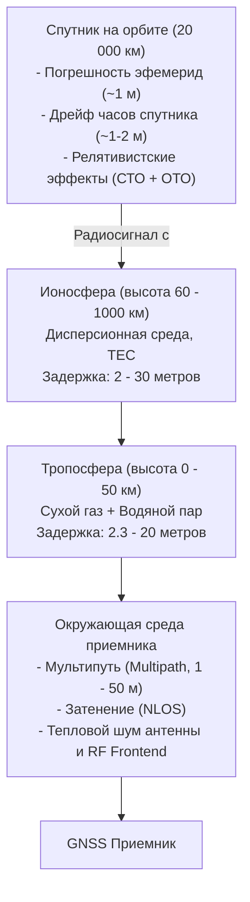
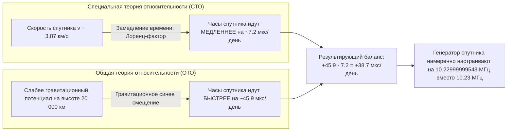

# Источники погрешностей (ионосфера, тропосфера, мультипуть, релятивизм)

> [!info] Навигация
> Родительский раздел: [[GPS & Tracking MOC]]

## Введение

Расстояние от навигационного спутника до приемника на Земле составляет от $19\,000$ до $25\,000\text{ километров}$. На этом пути радиосигнал проходит через космический вакуум, слои ионизированной плазмы, плотную нейтральную атмосферу и плотную застройку у поверхности Земли. 

Каждый физический эффект вносит свою задержку и искажение в форму сигнала, формируя так называемый суммарный бюджет погрешностей псевдодальности (**User Equivalent Range Error — UERE**).



---

## 1. Сводный бюджет погрешностей (UERE Budget)

| Источник погрешности | Физическая природа | Типичная погрешность (1σ) | Метод компенсации в приемнике |
| :--- | :--- | :--- | :--- |
| **Ионосферная задержка** | Преломление в плазме свободных электронов | **$2.0 - 15.0\text{ м}$** (до $50\text{ м}$ в бури) | Модель Клобучара / L1+L5 двухчастотная комбинация |
| **Тропосферная задержка** | Рефракция в плотных газах и водяном паре | **$2.3 - 2.6\text{ м}$** (в зените), до $20\text{ м}$ у горизонта | Модели Саастамойнена, Хопфилда, Ниелла |
| **Погрешность эфемерид** | Несовершенство баллистических прогнозов орбиты | **$0.5 - 1.5\text{ м}$** | Дифференциальные поправки SBAS / RTK / PPP |
| **Часы спутника** | Нелинейный уход атомных часов | **$1.0 - 1.5\text{ м}$** | Полином в навигационном кадре, RTK поправки |
| **Релятивизм** | СТО (скорость) + ОТО (гравитационный потенциал) | **$11.8\text{ км/день}$** (без коррекции) | Смещение частоты генератора до запуска спутника |
| **Многолучевость (Multipath)** | Отражения от зданий, земли, воды | **$0.5 - 5.0\text{ м}$** (в городе до $50\text{ м}$) | Choke Ring антенны, узкие корреляторы, частота L5 |
| **Шум приемника** | Тепловой шум антенны, квантование АЦП | **$0.2 - 0.5\text{ м}$** | Узкополосная фильтрация PLL/DLL, усреднение |

---

## 2. Ионосферная задержка (Ionosphere Delay)

Ионосфера — слой атмосферы на высотах от 60 до 1000 км, содержащий свободные электроны и ионы, образованные под действием солнечной радиации.

### Дисперсия и закон $1/f^2$
Ионосфера является **дисперсионной средой**: показатель преломления зависит от несущей частоты радиоволны. Фазовая скорость волны увеличивается, а групповая скорость (скорость распространения огибающей и PRN-кода) **замедляется**:
$$I = \frac{40.3 \cdot \text{TEC}}{f^2}$$
где:
- $\text{TEC}$ (Total Electron Content) — полное электронное содержание (количество электронов в столбе сечением $1\text{ м}^2$ вдоль луча визирования, $1\text{ TECU} = 10^{16}\text{ эл/м}^2$);
- $f$ — несущая частота сигнала в Гц.

### Ионосферно-свободная комбинация (Ionosphere-Free Linear Combination)
Поскольку задержка квадратично зависит от частоты, прием сигналов на двух частотах ($f_1$ и $f_2$) позволяет математически полностью исключить ионосферную погрешность первого порядка:
$$\rho_{\text{IF}} = \frac{f_1^2 \cdot \rho_1 - f_2^2 \cdot \rho_2}{f_1^2 - f_2^2}$$

Для одночастотных дешевых приемников (L1) космический сегмент GPS транслирует в навигационном сообщении эмпирическую **модель Клобучара** (Klobuchar Model), устраняющую приблизительно 50–60% ионосферной ошибки.

---

## 3. Тропосферная задержка (Troposphere Delay)

Тропосфера — нейтральная (неионизированная) нижняя часть атмосферы (0–50 км). 
В отличие от ионосферы, тропосфера **не обладает дисперсией** для радиоволн L-диапазона (частоты до 15 ГГц преломляются одинаково). Поэтому прием двух частот здесь бессилен.

Задержка раскладывается на две компоненты:
$$T = \Delta L_{\text{dry}} \cdot m_{\text{dry}}(E) + \Delta L_{\text{wet}} \cdot m_{\text{wet}}(E)$$
1. **Сухая гидростатическая компонента ($\approx 90\%$ ошибки):**
   - Вызвана сухими газами (азот, кислород, углекислый газ).
   - В зените составляет $\approx 2.3\text{ метра}$.
   - С высокой точностью ($< 1\%$) моделируется через приземное атмосферное давление (модель Саастамойнена).
2. **Влажная компонента ($\approx 10\%$ ошибки):**
   - Вызвана парциальным давлением дипольных молекул водяного пара.
   - В зените составляет $0.1 - 0.4\text{ метра}$, но крайне изменчива во времени и пространстве из-за турбулентности и облачности.
3. **Функция наклона $m(E)$ (Mapping Function):**
   - При уменьшении угла возвышения спутника над горизонтом ($E$) длина пути радиолуча сквозь слой атмосферы возрастает пропорционально $\approx 1/\sin(E)$.
   - Для спутника у горизонта ($E \approx 5^\circ$) тропосферная задержка возрастает в 10 раз и достигает **20–25 метров**!

> [!important] Угол отсечки возвышения (Elevation Mask)
> В прошивках всех качественных GNSS-трекеров устанавливается порог отсечки: **Elevation Mask $= 10^\circ - 15^\circ$**. Спутники, находящиеся ниже этого угла, полностью исключаются из навигационного решения, так как колоссальная тропосферная погрешность и шумы у горизонта ухудшают общую точность.

---

## 4. Релятивистские эффекты (Эйнштейн на практике)

Спутниковая навигация — одна из немногих областей современной инженерии, где специальная (СТО) и общая (ОТО) теория относительности Эйнштейна играют критическую роль:



### 1. Специальная теория относительности (кинематика)
Спутник движется со скоростью около $v \approx 3.87\text{ км/с}$ относительно наземного наблюдателя. По формуле релятивистского замедления времени часы на спутнике идут медленнее:
$$\frac{\Delta t'}{\Delta t} = \sqrt{1 - \frac{v^2}{c^2}} \approx 1 - \frac{v^2}{2c^2} \implies \text{отставание на } -7.2\text{ мкс в сутки}$$

### 2. Общая теория относительности (гравитация)
На высоте $20\,000\text{ км}$ гравитационный потенциал Земли слабее, чем на поверхности. В соответствии с ОТО, в слабом гравитационном поле время течет быстрее:
$$\frac{\Delta f}{f} = \frac{\Delta \Phi}{c^2} \implies \text{опережение на } +45.9\text{ мкс в сутки}$$

### 3. Суммарный эффект
$$+45.9\text{ мкс} - 7.2\text{ мкс} = +\mathbf{38.7}\text{ микросекунд в сутки}$$
Если не компенсировать эту разницу, накопленная ошибка за одни сутки составит:
$$\Delta r = 38.7 \times 10^{-6}\text{ с} \times 3 \times 10^8\text{ м/с} \approx \mathbf{11.6\text{ километров в день!}}$$

**Инженерное решение:**
Опорную частоту атомных стандартов спутников GPS перед выводом на орбиту калибруют со сдвигом вниз:
$$f_{\text{ground}} = 10.23\text{ МГц} \times \left(1 - 4.4647 \times 10^{-10}\right) = \mathbf{10.22999999543\text{ МГц}}$$
На орбите под действием релятивизма частота разгоняется ровно до эталонных $10.23\text{ МГц}$.

---

## 5. Многолучевость (Multipath) и NLOS (Non-Line-of-Sight)

В реальных городских условиях («urban canyons») радиоволна отражается от стеклянных фасадов небоскребов, асфальта и металлических конструкций.

```
       [Спутник GNSS]
           \         \
            \         \  (Прямой сигнал экранирован)
             \         \
   (Здание)   \         v  (Здание)
  |       |    \      |######|
  |       |     \     |######|
  |  Отра- v     \    |######|
  |  жение \      \   |######|
  |         \      \  |######|
  |          v      v |######|
           [ Приемник GPS ]
```

- **Multipath (Многолучевость):** Приемник получает и прямой, и отраженный сигнал. Отраженный сигнал имеет сдвиг по фазе и времени, деформируя корреляционный пик в приемнике (ошибка 1–10 м).
- **NLOS (Non-Line-of-Sight):** Прямой луч полностью перекрыт небоскребом, а приемник захватывает исключительно отраженный луч. Время распространения луча удлиняется на длину зигзага отражения, порождая мгновенные выбросы координаты на **30–100 метров** в сторону фасада здания.

> [!tip] Как современные системы борются с городским мультипутем
> 1. Использование второй частоты **L5 / E5a** с узким корреляционным окном ($30$ м против $300$ м).
> 2. Антенны с круговой правой поляризацией (RHCP) — при отражении волна меняет поляризацию на левую (LHCP) и подавляется антенной на 10–20 дБ.
> 3. Инерциальное комплексирование (**Dead Reckoning / IMU**) и фильтр Калмана.
