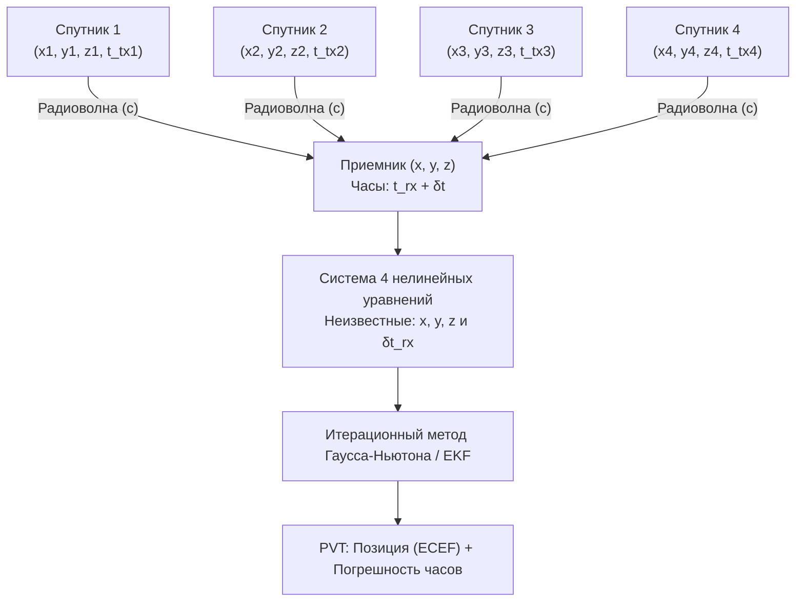

# Принцип трилатерации и измерение псевдодальностей (Pseudoranges)

> [!info] Навигация
> Родительский раздел: [[GPS & Tracking MOC]]

## Введение

Позиционирование в GNSS строится на методе **трилатерации** — геометрическом нахождении положения точки в пространстве по известным расстояниям от нее до нескольких опорных точек с известными координатами (спутников). 

Однако на практике расстояния измеряются не рулеткой, а через задержку времени прохождения радиоволны со скоростью света. Поскольку часы приемника не идеальны, измеренные величины называются **псевдодальностями** (Pseudoranges).

---

## 1. Геометрическая концепция трилатерации

В классической евклидовой геометрии:
1. Одно расстояние $R_1$ от спутника задает **сферу** радиуса $R_1$ с центром в спутнике.
2. Два расстояния $R_1, R_2$ от двух спутников дают пересечение двух сфер — **окружность**.
3. Три расстояния $R_1, R_2, R_3$ от трех спутников дают пересечение окружности с третьей сферой — **две точки в пространстве**.
   - Одна из точек находится на поверхности Земли (или вблизи нее).
   - Вторая точка уходит в далекий космос (на высоту десятков тысяч километров) и тривиально отбрасывается геометрическим фильтром.

Казалось бы, для 3D-позиционирования достаточно 3 спутников. **Но в реальности это не работает!**

---

## 2. Физика измерения псевдодальности

Радиосигнал распространяется в вакууме со скоростью света $c \approx 299\,792\,458\text{ м/с}$. За одну наносекунду ($1\text{ нс} = 10^{-9}\text{ с}$) радиоволна пролетает ровно:
$$\Delta s = c \cdot 10^{-9} \approx 0.2998\text{ метра} \approx 30\text{ см}$$

Если часы приемника (обычный кварцевый резонатор за $0.5$) ошибутся всего лишь на **1 миллисекунду** ($1\text{ мс} = 10^{-3}\text{ с}$), расчетная погрешность расстояния составит:
$$\Delta s = 299\,792\,458 \times 0.001 \approx 300\text{ километров!}$$

На спутниках установлены бортовые атомные часы (рубидиевые, цезиевые или водородные мазеры), синхронизированные с системным временем GNSS с наносекундной точностью. Но на стороне смартфона или автомобильного трекера невозможно установить атомный генератор из-за габаритов, энергопотребления и цены.

Поэтому время приема $t_{\text{rx}}$ на стороне чипсета содержит неизвестное системное смещение $\delta t_{\text{rx}}$:
$$t_{\text{rx}} = t_{\text{true}} + \delta t_{\text{rx}}$$

Следовательно, измеренная величина задержки дает не истинное расстояние $r$, а **псевдодальность** $\rho_i$:
$$\rho_i = c \cdot (t_{\text{rx}} - t_{\text{tx}, i}) = r_i + c \cdot \delta t_{\text{rx}} - c \cdot \delta t_{\text{sat}, i} + I_i + T_i + \epsilon_i$$

где:
- $r_i$ — истинное геометрическое расстояние между спутником $i$ и приемником;
- $c \cdot \delta t_{\text{rx}}$ — аппаратурное смещение часов приемника (одинаковое для всех принимаемых спутников!);
- $c \cdot \delta t_{\text{sat}, i}$ — смещение часов конкретного спутника (компенсируется коэффициентами из эфемерид);
- $I_i$ — задержка в ионосфере;
- $T_i$ — задержка в тропосфере;
- $\epsilon_i$ — аппаратный шум и многолучевость (мультипуть).

---

## 3. Математическая постановка задачи

Истинное геометрическое расстояние $r_i$ от спутника $i$ с координатами $(x_i, y_i, z_i)$ до приемника $(x, y, z)$ в системе ECEF выражается теоремой Пифагора:
$$r_i = \sqrt{(x_i - x)^2 + (y_i - y)^2 + (z_i - z)^2}$$

Подставляя это в уравнение псевдодальности (с учетом предварительно скомпенсированных часов спутника и атмосферных моделей), получаем систему уравнений:

$$\begin{cases}
\rho_1 = \sqrt{(x_1 - x)^2 + (y_1 - y)^2 + (z_1 - z)^2} + c \cdot \delta t_{\text{rx}} \\
\rho_2 = \sqrt{(x_2 - x)^2 + (y_2 - y)^2 + (z_2 - z)^2} + c \cdot \delta t_{\text{rx}} \\
\rho_3 = \sqrt{(x_3 - x)^2 + (y_3 - y)^2 + (z_3 - z)^2} + c \cdot \delta t_{\text{rx}} \\
\rho_4 = \sqrt{(x_4 - x)^2 + (y_4 - y)^2 + (z_4 - z)^2} + c \cdot \delta t_{\text{rx}}
\end{cases}$$

В этой системе **ровно 4 неизвестных параметра**:
1. $x$ — координата приемника по оси X;
2. $y$ — координата приемника по оси Y;
3. $z$ — координата приемника по оси Z;
4. $\delta t_{\text{rx}}$ — аппаратное смещение часов приемника относительно времени GNSS.

> [!important] Золотое правило GNSS
> Для вычисления трехмерной координаты (3D Fix) **всегда требуется минимум 4 спутника**. 
> При видимости 3 спутников возможно вычислить только 2D-координату (2D Fix), зафиксировав высоту $z$ по известному радиусу Земли или барометрическому альтиметру.

---

## 4. Численное решение (Линеаризация и Метод наименьших квадратов)

Система уравнений нелинейна из-за квадратных корней. Для ее решения навигационный процессор раскладывает уравнения в ряд Тейлора в окрестности начального приближения $\mathbf{x}_0 = (x_0, y_0, z_0, c \cdot \delta t_0)^T$:

$$f_i(x, y, z) \approx f_i(x_0, y_0, z_0) + \frac{\partial f_i}{\partial x}\Delta x + \frac{\partial f_i}{\partial y}\Delta y + \frac{\partial f_i}{\partial z}\Delta z + \Delta (c \cdot \delta t_{\text{rx}})$$

Частные производные представляют собой направляющие косинусы единичного вектора визирования от приемника к спутнику:
$$\frac{\partial f_i}{\partial x} = -\frac{x_i - x_0}{r_{i, 0}} \equiv -u_{x, i}, \quad \frac{\partial f_i}{\partial y} = -\frac{y_i - y_0}{r_{i, 0}} \equiv -u_{y, i}, \quad \frac{\partial f_i}{\partial z} = -\frac{z_i - z_0}{r_{i, 0}} \equiv -u_{z, i}$$

Собирая все уравнения в матричный вид:
$$\Delta \boldsymbol{\rho} = \mathbf{H} \Delta \mathbf{x} + \mathbf{v}$$

где:
- $\Delta \boldsymbol{\rho} = \begin{bmatrix} \rho_1 - \hat{\rho}_1 \\ \dots \\ \rho_m - \hat{\rho}_m \end{bmatrix}$ — вектор невязок (разница между измеренной псевдодальностью и расчетной);
- $\mathbf{H}$ — геодезическая матрица направляющих косинусов размером $m \times 4$ ($m \ge 4$):
$$\mathbf{H} = \begin{bmatrix}
-u_{x, 1} & -u_{y, 1} & -u_{z, 1} & 1 \\
-u_{x, 2} & -u_{y, 2} & -u_{z, 2} & 1 \\
\vdots & \vdots & \vdots & \vdots \\
-u_{x, m} & -u_{y, m} & -u_{z, m} & 1
\end{bmatrix}$$
- $\Delta \mathbf{x} = [\Delta x, \Delta y, \Delta z, \Delta (c \delta t)]^T$ — искомый вектор поправок.

### Взвешенный метод наименьших квадратов (WLS)
Когда спутников больше 4 ($m > 4$, типично 20–35 спутников), система переопределена. Оптимальное решение находится минимизацией взвешенной суммы квадратов невязок:
$$\Delta \mathbf{x} = (\mathbf{H}^T \mathbf{W} \mathbf{H})^{-1} \mathbf{H}^T \mathbf{W} \Delta \boldsymbol{\rho}$$

где $\mathbf{W}$ — весовая матрица (ковариация измерений). Спутники с высоким углом возвышения над горизонтом и высоким соотношением сигнал/шум ($C/N_0$) получают максимальный вес, а спутники у горизонта с низким сигналом подавляются.

Шаг $\Delta \mathbf{x}$ прибавляется к текущей оценке $\mathbf{x}_{k+1} = \mathbf{x}_k + \Delta \mathbf{x}$, и процесс повторяется до тех пор, пока $|\Delta \mathbf{x}| < 10^{-3}\text{ м}$ (обычно за 2–4 итерации).
