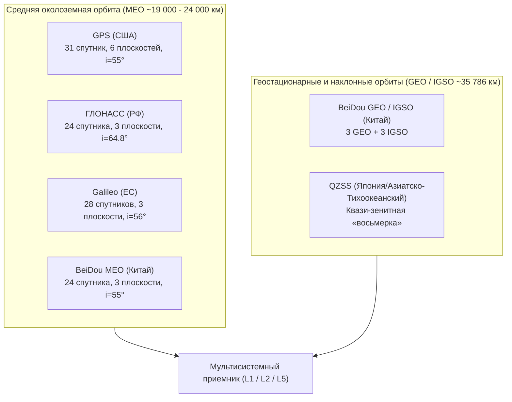

# Спутниковые группировки (GPS, GLONASS, Galileo, BeiDou, QZSS) — орбиты и частоты

> [!info] Навигация
> Родительский раздел: [[GPS & Tracking MOC]]

## Введение

Современный трекинг опирается не на один американский GPS, а на мультисистемные мультичастотные приемники (**Multi-GNSS Multi-Band**). Способность устройства одновременно отслеживать сигналы 30–50 спутников различных систем гарантирует стабильный `Fix` в условиях плотной городской застройки («городских каньонов») и густого леса.



---

## 1. Сравнительный анализ глобальных группировок

### GPS (NAVSTAR) — США
- **Оператор:** Космические силы США (US Space Force).
- **Высота орбиты:** $\approx 20\,180\text{ км}$.
- **Период обращения:** 11 часов 58 минут (половина звездных суток). Спутник проходит над одной и той же точкой Земли каждые звездные сутки на 4 минуты раньше по гражданскому времени.
- **Наклонение орбиты ($i$):** $55^\circ$.
- **Орбитальные плоскости:** 6 плоскостей, разнесенных по долготе восходящего узла на $60^\circ$, по 4–5 спутников в каждой.
- **Метод разделения каналов:** **CDMA** (Code Division Multiple Access). Все спутники вещают на одинаковых несущих частотах, разделяясь уникальными псевдослучайными кодами Голда (PRN 1–32).

### ГЛОНАСС — Россия
- **Оператор:** Роскосмос / ВКС РФ.
- **Высота орбиты:** $\approx 19\,100\text{ км}$ (ниже, чем у GPS).
- **Период обращения:** 11 часов 15 минут. Орбитальный резонанс подобран так, что подспутниковая траектория повторяется каждые 8 суток (17 витков).
- **Наклонение орбиты ($i$):** $64.8^\circ$.
  - За счет высокого наклонения ГЛОНАСС обеспечивает существенно лучшую видимость и геометрию (низкий DOP) в приполярных и северных широтах (выше $60^\circ$ с.ш. — Санкт-Петербург, Архангельск, Скандинавия, Сибирь), где спутники GPS опускаются близко к горизонту.
- **Орбитальные плоскости:** 3 плоскости, разнесенные на $120^\circ$, по 8 спутников в каждой.
- **Метод разделения каналов:** Исторически **FDMA** (Frequency Division Multiple Access). Каждый спутник вещает на индивидуальной литерной частоте $f_k = f_0 + k \cdot \Delta f$, где $k \in [-7, +6]$. В новых спутниках «Глонасс-К» и «К2» внедрены открытые CDMA-сигналы на частотах L1, L2, L3.

### Galileo — Европейский Союз
- **Оператор:** EUSPA (European Union Agency for the Space Programme) / ESA.
- **Высота орбиты:** $\approx 23\,222\text{ км}$ (самая высокая среди MEO).
- **Период обращения:** 14 часов 05 минут.
- **Наклонение орбиты ($i$):** $56^\circ$.
- **Орбитальные плоскости:** 3 плоскости, по 8 активных аппаратов плюс резервные.
- **Особенности:**
  - Гражданская система с самого начала (высочайшая точность часов на водородных мазерах Passive Hydrogen Maser, дрейф менее 1 нс в сутки).
  - Встроенный бесплатный сервис высокоточных дифференциальных поправок **Galileo HAS (High Accuracy Service)**, выдающий точность $< 20\text{ см}$ прямо со спутника в полосе E6B.
  - Поддержка обратного канала подтверждения бедствия в системе поиска и спасения COSPAS-SARSAT.

### BeiDou (BDS-3) — Китай
- **Оператор:** CNSA.
- **Архитектура:** Гибридная трехуровневая группировка (всего 30+ спутников):
  1. **24 спутника MEO:** высота $\approx 21\,528\text{ км}$, наклонение $55^\circ$ для глобального покрытия.
  2. **3 спутника IGSO (Наклонная геосинхронная орбита):** высота $35\,786\text{ км}$, наклонение $55^\circ$. Траектория образует фигуру «восьмерки» над Азиатско-Тихоокеанским регионом.
  3. **3 спутника GEO (Геостационарная орбита):** высота $35\,786\text{ км}$ над экватором ($80^\circ$E, $110.5^\circ$E, $140^\circ$E).
- **Преимущество:** Спутники GEO и IGSO висят непрерывно под высокими углами возвышения над Азией, благодаря чему в Китае, Юго-Восточной Азии и на Дальнем Востоке количество одновременно видимых спутников BeiDou может превышать 15–20 штук.

### QZSS (Quasi-Zenith Satellite System / «Митибики») — Япония
- **Региональная система:** 4 (в перспективе 7) спутника на асимметричных геосинхронных орбитах в форме «восьмерки».
- **Назначение:** Гарантировать, что как минимум один спутник всегда находится вблизи зенита ($> 80^\circ$) над Токио и японскими мегаполисами. В узких каньонах небоскребов боковые сигналы экранируются, но зенитный спутник QZSS виден всегда.
- Вещает сигналы, полностью совместимые с GPS L1C/A, L2C, L5, а также поправки сантиметрового уровня CLAS (Centimeter Level Augmentation Service).

---

## 2. Частотные диапазоны: L1, L2, L5

Все навигационные радиосигналы передаются в **L-диапазоне** (от 1 до 2 ГГц). Этот диапазон выбран благодаря прозрачности земной атмосферы, низкому затуханию в дожде и тумане и умеренным габаритам антенн приемников.

```
Частота (МГц)
1176.45 ─── [ L5 / E5a / B2a ] (Высокая кодовая скорость, защита от мультипути)
1207.14 ─── [ E5b / B2b ]
1227.60 ─── [ L2 / G2 ] (Геодезический диапазон, ионосферная калибровка)
1278.75 ─── [ E6 / B3 ] (Высокоточные коммерческие сервисы HAS/PPP)
1575.42 ─── [ L1 / E1 / B1C ] (Основной гражданский диапазон во всех смартфонах)
1602.00 ─── [ G1 (ГЛОНАСС FDMA) ]
```

### Сводная таблица частот и сигналов

| Система | Диапазон 1 (Civil Primary) | Диапазон 2 (Dual-Band Geo) | Диапазон 3 (Safety of Life / Modern) |
| :--- | :--- | :--- | :--- |
| **GPS** | **L1** ($1575.42\text{ МГц}$) — C/A, L1C | **L2** ($1227.60\text{ МГц}$) — L2C, P(Y) | **L5** ($1176.45\text{ МГц}$) — гражданский широкополосный |
| **ГЛОНАСС** | **G1** ($1598 - 1606\text{ МГц}$) — FDMA | **G2** ($1242 - 1249\text{ МГц}$) — FDMA | **G3** ($1202.025\text{ МГц}$) — CDMA |
| **Galileo** | **E1** ($1575.42\text{ МГц}$) — CBOC | **E6** ($1278.75\text{ МГц}$) — HAS PPP | **E5a** ($1176.45\text{ МГц}$), **E5b** ($1207.14\text{ МГц}$) |
| **BeiDou** | **B1I** ($1561.098\text{ МГц}$), **B1C** ($1575.42$) | **B3I** ($1268.52\text{ МГц}$) | **B2a** ($1176.45\text{ МГц}$), **B2b** ($1207.14$) |

---

## 3. Почему частота L5 / E5a — революция для мобильного трекинга?

До 2018 года все гражданские потребительские чипы (смартфоны, трекеры, автонавигаторы) работали исключительно на одной частоте **L1 ($1575.42\text{ МГц}$)**. Появление двухчастотных чипсетов (Broadcom BCM47755, Qualcomm Snapdragon 855+, MediaTek Dimensity, Apple A14+) перевернуло качество навигации.

1. **Кодовая скорость (Chipping Rate):**
   - Сигнал L1 C/A имеет скорость передачи кода Голда $1.023\text{ Мчип/с}$ (длина одного чипа $\approx 300\text{ метров}$).
   - Сигнал L5 / E5a передается на скорости **$10.23\text{ Мчип/с}$** — в 10 раз быстрее (длина одного чипа $\approx 29.3\text{ метра}$).
2. **Подавление переотражений (Multipath Rejection):**
   - Из-за узкого автокорреляционного пика радиосигнал L5 позволяет чипсету мгновенно отличить прямой луч от отраженного от стены соседнего здания (если задержка отражения $> 30$ м). В сигналах L1 отраженный луч накладывается на прямой, искажая форму импульса и сдвигая координату на 20–50 метров в сторону.
3. **Бескомпромиссная компенсация ионосферы:**
   - Задержка радиоволны в ионосфере обратно пропорциональна квадрату частоты ($I \propto 1/f^2$).
   - Прием двух разнесенных частот ($L_1 = 1575.42\text{ МГц}$ и $L_5 = 1176.45\text{ МГц}$) позволяет составить систему уравнений и вычислить задержку ионосферы с точностью до миллиметров, полностью устранив ошибку в 5–15 метров.

> [!important] Совместимость частот
> Частоты **GPS L1 = Galileo E1 = BeiDou B1C = QZSS L1 = $1575.42\text{ МГц}$**.
> Частоты **GPS L5 = Galileo E5a = BeiDou B2a = QZSS L5 = $1176.45\text{ МГц}$**.
> Это совпадение спроектировано международным комитетом: антенне смартфона требуется настроиться всего на две полосы пропускания, чтобы одновременно принимать сотни сигналов всех четырех глобальных созвездий!
