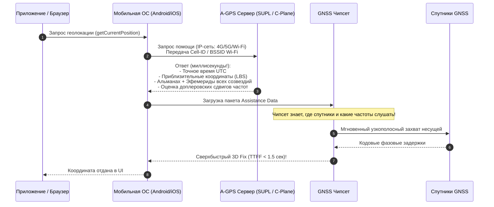
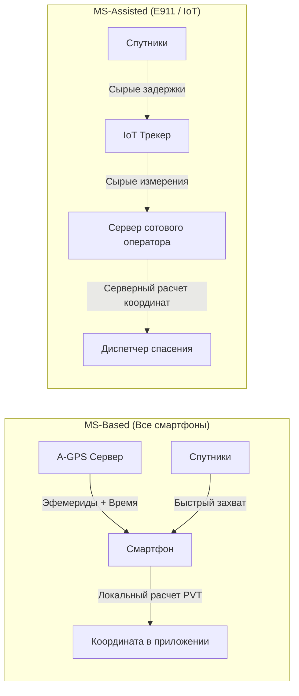
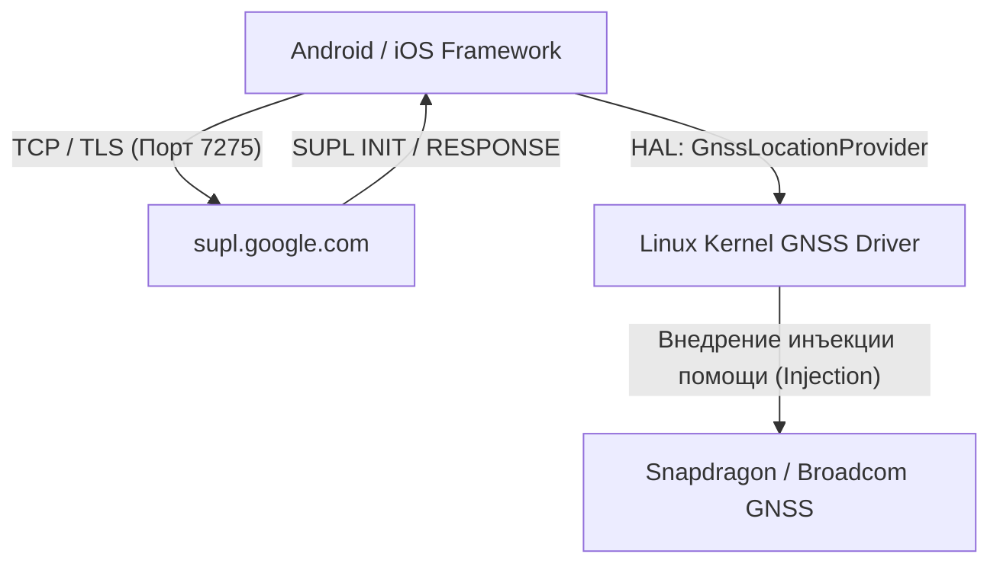

# A-GPS (Assisted GPS) — архитектура быстрого старта

> [!info] Навигация
> Родительский раздел: [[GPS & Tracking MOC]]

## Введение

Главная боль классического автономного GPS — катастрофически медленный **холодный старт (Time To First Fix, TTFF)**. Если включить навигатор после недели сна, ожидание первой координаты занимает от 45 секунд до нескольких минут. 

В смартфонах же синяя точка на карте в приложении такси или курьерской доставки появляется **через 1–2 секунды** после запуска. Эта магия обеспечивается технологией **A-GPS (Assisted GPS / Вспомогательный GPS)**.

---

## 1. Почему автономный GPS так долго стартует?

Навигационный радиосигнал со спутника передается на крошечной скорости — всего **$50\text{ бит/с}$**.

| Этап холодного старта | Что делает автономный чипсет | Длительность |
| :--- | :--- | :--- |
| **Поиск частоты (Doppler Search)** | Приемник не знает своего положения и времени. Он вынужден сканировать все 32 PRN по сетке частот $\pm 5\text{ кГц}$ с шагом в десятки герц вслепую. | $5 - 15\text{ с}$ |
| **Синхронизация по времени** | Чтение меток навигационного кадра (HOW — Handover Word). | $6\text{ с}$ |
| **Прием эфемерид** | Каждый спутник передает свои эфемериды в кадрах 1, 2 и 3. Полный субкадр длится 30 секунд. Если в середине субкадра произойдет сбой приема (шагнул под дерево), цикл начинается заново! | **$30 - 60\text{ с}$** |
| **Прием альманаха** | Занимает 25 страниц субкадров 4 и 5. | **$12.5\text{ минут}$** |

---

## 2. Архитектура и типы A-GPS

A-GPS переносит загрузку медленных тяжелых навигационных данных со спутникового радиоканала ($50\text{ бит/с}$) на высокоскоростной наземный сотовый интернет (4G/5G/Wi-Fi со скоростью десятки мегабит в секунду). Полный пакет эфемерид весит всего несколько килобайт и «залетает» в чипсет за **50 миллисекунд**.

Существует два режима работы A-GPS:

### 1. MS-Based (Mobile Station Based) — Доминирующий стандарт
- Смартфон (Mobile Station) запрашивает у сервера помощи:
  1. Текущее высокоточное время UTC;
  2. Эфемериды и альманах;
  3. Модель ионосферы;
  4. Список видимых спутников и расчетные доплеровские частоты для текущей базовой станции сотовой связи (Cell-ID).
- Чипсет смартфона моментально настраивает аппаратные корреляторы на нужные частоты, захватывает сигналы спутников и **самостоятельно вычисляет навигационное решение** $(x, y, z)$.
- **Плюсы:** Полная автономность после получения поправок, сохранение приватности позиции пользователя от третьих сторон.

### 2. MS-Assisted (Mobile Station Assisted)
- Используется в сверхдешевых трекерах или при экстренных вызовах (E911):
- Чипсет только оцифровывает сырые псевдодальности и отправляет их на сервер телекома.
- Мощный сервер оператора связи сам решает систему уравнений и сохраняет координаты абонента.

---

## 3. Протоколы: SUPL против Control Plane

Передача данных помощи в мобильных сетях стандартизирована альянсом OMA (Open Mobile Alliance) и консорциумом 3GPP:

### 1. Control Plane A-GPS (C-Plane)
- Исторический метод сотовых операторов (GSM/UMTS/LTE).
- Данные передаются внутри служебных сигнальных каналов радиоподсистемы сотовой сети (протоколы RRLP, RRC, LPP).
- Не требует открытого интернета или наличия баланса на счете, работает даже без SIM-карты при звонке в службу спасения 112 / 911.

### 2. User Plane A-GPS / SUPL (Secure User Plane Location)
- Современный стандарт, используемый операционными системами Android и iOS.
- Помощь передается через обычный стек TCP/IP по защищенному TLS-соединению:
  - **Сервер SUPL по умолчанию в Android:** `supl.google.com:7275`
  - **Сервер A-GPS в чипсетах u-blox:** `agps.u-blox.com` (сервис AssistNow)
  - **Qualcomm:** сервис **XTRA** (файлы `xtra.bin`, `xtra2.bin`)

---

## 4. Предиктивный A-GPS (Extended Ephemeris / Predicted Orbits)

Что делать, если трекер или турист с часами уходит в глухой лес или горы, где нет сотовой связи? Обычный A-GPS устаревает за 2–4 часа (срок жизни эфемериды).

Для этого инженеры создали **предиктивный A-GPS (Autonomous / Server-based Predicted Orbits)**:
- Сервисы (Qualcomm XTRA, MediaTek EPO, u-blox AssistNow Autonomous/Offline) моделируют гравитационные возмущения орбит и баллистику спутников **на 3–14 дней вперед**.
- При подключении к Wi-Fi смартфон или фитнес-браслет (Garmin, Apple Watch) скачивает файл размером $50–100\text{ КБ}$ с предсказанными орбитами на всю неделю вперед.
- Находясь посреди тайги без связи, устройство сохраняет способность к мгновенному старту ($TTFF < 3\text{ сек}$) на протяжении всей недели!

---

## Сравнительная таблица времени старта (TTFF)

| Режим старта | Состояние чипсета | Автономный GNSS | С использованием A-GPS |
| :--- | :--- | :--- | :--- |
| **Cold Start** | Внутреннее время неизвестно, эфемерид нет, альманаха нет, позиция сброшена | **$35 - 120\text{ секунд}$** | **$1 - 3\text{ секунды}$** |
| **Warm Start** | Время и альманах есть, эфемериды устарели ($> 4$ часов) | **$25 - 40\text{ секунд}$** | **$1 - 2\text{ секунды}$** |
| **Hot Start** | Время, альманах и эфемериды полностью валидны ($< 2$ часов назад) | **$1 - 2\text{ секунды}$** | **$< 1\text{ секунды}$** |

> [!tip] Влияние на разработку веб- и мобильных приложений
> Когда веб-приложение вызывает браузерный метод `navigator.geolocation.getCurrentPosition({ timeout: 5000 })`:
> - На смартфоне с активным интернетом A-GPS моментально отдает фикс за $0.8\text{ с}$.
> - Если устройство в режиме полета (Airplane Mode), спутниковый чипсет физически не успеет принять субкадры за $5000\text{ мс}$, и браузер вернет ошибку `TIMEOUT`. Всегда закладывайте таймаут не менее 20–30 секунд при работе в полевых оффлайн-сценариях.
