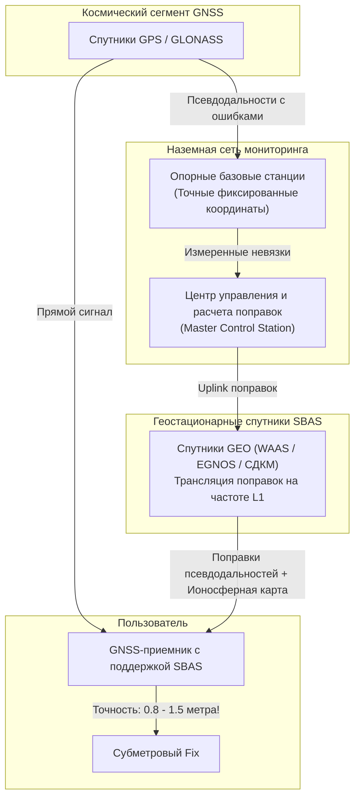

# DGPS и SBAS (WAAS, EGNOS, MSAS)

> [!info] Навигация
> Родительский раздел: [[GPS & Tracking MOC]]

## Введение

Обычный автономный GPS-приемник в чистом поле обеспечивает точность порядка $2.5–5\text{ метров}$. Этого достаточно для ориентации пешехода или автомобилиста, но недостаточно для точного земледелия, захода авиации на посадку в тумане по категории ICAO, дноуглубительных работ и геодезии.

Первой глобальной технологией повышения точности стал **дифференциальный метод (DGPS)** и его спутниковое развитие — системы функционального дополнения **SBAS** (*Satellite-Based Augmentation System*).

---

## 1. Фундаментальный принцип дифференциального GPS (DGPS)

Идея дифференциального позиционирования базируется на **пространственной и временной корреляции источников погрешностей**:

1. Если два приемника находятся на расстоянии нескольких десятков километров друг от друга, радиолучи от спутника к обоим приемникам проходят сквозь **практически одни и те же слои ионосферы и тропосферы**.
2. Погрешности атомных часов спутника и баллистических эфемерид орбиты абсолютно **идентичны** для обоих приемников.
3. Разместим один приемник на точке с заранее известными геодезическими координатами высокой точности — назовем его **Базовой станцией (Base Station)**.
4. Базовая станция вычисляет теоретическое истинное расстояние до спутника:
   $$R_{\text{true}, i} = \|\mathbf{X}_{\text{base}} - \mathbf{X}_{\text{sat}, i}\|$$
5. Станция сравнивает истинное расстояние с фактически измеренной псевдодальностью $\rho_{\text{base}, i}$ и находит поправку псевдодальности **PRC (Pseudorange Correction)**:
   $$\text{PRC}_i(t_0) = R_{\text{true}, i}(t_0) - \rho_{\text{base}, i}(t_0)$$
   а также скорость ее изменения **RRC (Range Rate Correction)**:
   $$\text{RRC}_i = \frac{\text{PRC}_i(t_1) - \text{PRC}_i(t_0)}{t_1 - t_0}$$
6. Базовая станция передает эти поправки на мобильный приемник (**Ровер — Rover**) по радиоканалу (УКВ, 433 МГц или интернет). Ровер прибавляет поправку к своим измерениям:
   $$\rho_{\text{rover}, i}^{\text{corrected}} = \rho_{\text{rover}, i} + \text{PRC}_i + \text{RRC}_i \cdot \Delta t$$

В результате ошибки часов спутника, эфемерид и 90% атмосферной задержки **взаимно уничтожаются**. Точность DGPS составляет **$0.5–1.5\text{ метра}$**.

---

## 2. Архитектура SBAS (Satellite-Based Augmentation System)

Классический локальный DGPS требует наличия базовой радиостанции в радиусе $50–100\text{ км}$. Для покрытия целых континентов и океанов авиационные агентства создали системы **SBAS**:

### Принцип работы:
1. Сеть из десятков опорных станций RIMS (Ranging and Integrity Monitoring Stations), распределенных по континенту, собирает данные.
2. Центральный вычислительный комплекс рассчитывает:
   - Отдельные векторные поправки на орбиты и часы каждого спутника.
   - Динамическую сетку задержек ионосферы (Ionospheric Grid).
   - Информацию о целостности (Integrity): предупреждение о сбойных спутниках транслируется за **$5.2\text{ секунды}$**, предотвращая авиакатастрофы.
3. Поправки передаются на наземную станцию передачи (Uplink), откуда загружаются на **геостационарные спутники (GEO)**.
4. Геостационарный спутник ретранслирует поток поправок на Землю **на той же стандартной частоте GPS L1 ($1575.42\text{ МГц}$)** с использованием специального PRN-кода (PRN 120–158).
5. Приемник воспринимает геостационарный спутник SBAS как еще один обычный спутник GPS и применяет поправки «на лету» без каких-либо внешних модемов и сим-карт.

---

## 3. Региональные системы SBAS в мире

Системы SBAS создавались региональными авиационными властями по единому стандарту ICAO SARPs (Standards and Recommended Practices), благодаря чему любой современный GNSS-приемник с поддержкой SBAS работает по всему миру:

| Название | Регион покрытия | Оператор | Спутники и PRN |
| :--- | :--- | :--- | :--- |
| **WAAS** (Wide Area Augmentation System) | Северная Америка (США, Канада, Мексика) | FAA (США) | Galaxy 15 (PRN 135), Anik F1R (PRN 138), SES-5 (PRN 133) |
| **EGNOS** (European Geostationary Navigation Overlay) | Европа, Средиземноморье, Сев. Африка | EUSPA / ESA | Astra 5B (PRN 123), Inmarsat 4F2 (PRN 126), Astra 4A (PRN 136) |
| **MSAS** (Multi-functional Satellite Augmentation) | Япония и Вост. Азия | JCAB (Япония) | QZS / MTSAT (PRN 129, 137) |
| **GAGAN** (GPS-Aided GEO Augmented Navigation) | Индия и Индийский океан | ISRO / AAI | GSAT-8 (PRN 127), GSAT-10 (PRN 128) |
| **СДКМ** (Система дифференциальной коррекции и мониторинга) | Россия и пространство СНГ | Роскосмос | Луч-5А, Луч-5Б, Луч-5В (PRN 125, 140, 141) |
| **SouthPAN** | Австралия и Новая Зеландия | Geoscience Australia | Inmarsat 4F1, Optus |

---

## 4. Ограничения SBAS

Несмотря на глобальность и бесплатность, у SBAS есть фундаментальные физические ограничения:

1. **Видимость геостационарных спутников на севере:**
   - Геостационарные спутники висят строго над экватором ($0^\circ$ широты).
   - В северных регионах (Санкт-Петербург $60^\circ$, Мурманск $69^\circ$, Скандинавия) спутник SBAS виден под крайне низким углом к горизонту ($10^\circ - 15^\circ$ и ниже).
   - Любое препятствие (дом, лес, рельеф) экранирует сигнал.
2. **Городские каньоны:**
   - В мегаполисах среди многоэтажек геостационарный луч с юга почти всегда заблокирован зданиями.
3. **Предел точности:**
   - Поправки применяются к **псевдодальностям кодовых измерений**. Длина чипа L1 составляет $300$ метров, поэтому дифференциальный предел кодового DGPS/SBAS лежит в диапазоне **$0.7–1.5\text{ метра}$**. Сантиметровую точность технология дать физически не может.

> [!important] Отображение SBAS в NMEA-протоколе
> Когда GPS-приемник начинает принимать поправки WAAS/EGNOS:
> - В предложении `$GPGGA` поле индикатора качества фикса переключается со значения `1` (GPS Fix) на `2` (**DGPS Fix**).
> - В предложении `$GPGSA` в список используемых спутников добавляется соответствующий PRN геостационарного аппарата (например, `123` или `138`).
> - Заявленная точность на экране смартфона или планшета возрастает до $\approx 1$ метра.
