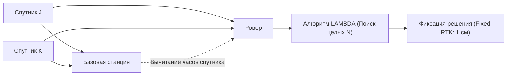

# RTK (Real-Time Kinematic) и PPP (Precise Point Positioning)

> [!info] Навигация
> Родительский раздел: [[GPS & Tracking MOC]]

## Введение

Обычные методы навигации измеряют псевдодальность по **модулирующему коду (PRN)**, длина элементарного импульса которого составляет 30–300 метров. Добиться точности уровня **1–2 сантиметров** возможно только одним путем: отказаться от грубого кода и начать измерять расстояние непосредственно по **фазе синусоиды несущей радиоволны** (Carrier Phase).

Двумя вершинами современного высокоточного позиционирования являются технологии **RTK** и **PPP**.

```mermaid
flowchart TD
    subgraph RTK_Arch ["RTK: Относительное позиционирование в реальном времени"]
        BASE["Базовая станция (Base)<br/>Точные известные координаты"]
        ROVER_RTK["Ровер (Rover)<br/>Дрон / Трактор / Геодезист"]
        SAT1["Спутники GNSS"] --> BASE
        SAT1 --> ROVER_RTK
        BASE -->|"RTCM 3.x поправки (NTRIP / Радио)<br/>Задержка < 1 сек, Радиус < 20 км"| ROVER_RTK
        ROVER_RTK --> FIX_RTK["RTK FIX: 1 - 2 см мгновенно!"]
    end

    subgraph PPP_Arch ["PPP: Абсолютное автономное позиционирование"]
        IGS["Глобальная сеть станций IGS"] --> ORB_CALC["Расчет орбит и атомных часов"]
        ORB_CALC --> GEO_SAT["Спутник L-диапазона (Galileo HAS, RTX)"]
        GEO_SAT -->|"SSR-поправки (Satellite State)"| ROVER_PPP["Автономный ровер (без базы!)"]
        ROVER_PPP --> FIX_PPP["PPP FIX: 2 - 5 см (Сходимость 15-30 мин)"]
    end
```

---

## 1. Фазовые измерения: Физика сантиметровой точности

Несущая частота GPS L1 составляет $f = 1575.42\text{ МГц}$. Длина волны этой синусоиды:
$$\lambda = \frac{c}{f} = \frac{299\,792\,458\text{ м/с}}{1575.42 \times 10^6\text{ Гц}} \approx \mathbf{19.03\text{ сантиметра}}$$

Современный фазовый дискриминатор приемника способен измерять сдвиг фазы несущей с точностью до $1\%$ от длины волны:
$$\sigma_{\phi} \approx 0.01 \times 19\text{ см} \approx \mathbf{1.9\text{ миллиметра!}}$$

### Проблема целочисленной неоднозначности (Integer Ambiguity, $N$)
Приемник может измерить дробную часть фазы $\phi \in [0, 2\pi)$, но он **не знает, сколько полных длин волн $\lambda$ укладывается на расстоянии $20\,000\text{ км}$ между спутником и антенной**:
$$\Phi = \frac{1}{\lambda} \rho + N + \delta \Phi$$
где $N$ — неизвестное **целое число полных циклов** (Integer Ambiguity, обычно от 100 до 150 миллионов витков волны). 

Пока значение $N$ не вычислено точно, фазовые измерения бесполезны. Задача разрешения неоднозначности — сложнейшая математическая проблема целочисленного программирования.

---

## 2. Архитектура RTK (Real-Time Kinematic)

RTK решает проблему разрешения неоднозначностей методом **двойных разностей (Double Differences)** между базовой станцией и ровером.

### Математический метод двойных разностей:
1. **Одинарные разности между приемниками (Single Difference):**
   Вычитание фазовых измерений базовой станции из измерений ровера для одного и того же спутника $j$:
   $$\Delta \Phi^j = \Phi_{\text{rover}}^j - \Phi_{\text{base}}^j$$
   Поскольку база и ровер смотрят на спутник с близкого расстояния, **погрешность часов спутника $\delta t^j$ полностью сокращается**!
2. **Двойные разности между спутниками (Double Difference):**
   Вычитание одинарной разности опорного спутника $k$ из одинарной разности спутника $j$:
   $$\nabla \Delta \Phi^{jk} = \Delta \Phi^j - \Delta \Phi^k$$
   В этой разности **полностью сокращаются аппаратные смещения часов обоих приемников $\delta t_{\text{rover}}$ и $\delta t_{\text{base}}$**, а атмосферные погрешности практически обнуляются при длине базиса (Baseline) $< 15–20\text{ км}$.

$$\nabla \Delta \Phi^{jk} = \frac{1}{\lambda} \nabla \Delta r^{jk} + \nabla \Delta N^{jk}$$

### Алгоритм LAMBDA (Lease-squares AMBiguity Decorrelation Adjustment)
Разработан в Делфтском техническом университете (Prof. Peter Teunissen). Выполняет декорреляцию ковариационной матрицы и производит эффективный целочисленный перебор в эллипсоиде поиска.
- **RTK Float:** Алгоритм пока не уверен в целочисленных значениях $N$, они оцениваются действительными числами (точность $10–50\text{ см}$).
- **RTK Fix:** Неоднозначности $N$ строго зафиксированы на целых числах с достоверностью $> 99.9\%$. Точность скачкообразно становится **$0.8–2.0\text{ сантиметра}$**!

---

## 3. Технология PPP (Precise Point Positioning)

Главный недостаток RTK — необходимость локальной базовой станции в радиусе $20–30\text{ км}$. В открытом океане, пустыне или малонаселенных регионах базы нет.

Здесь применяется **PPP (Абсолютное высокоточное позиционирование)**:
- Не требует локальной базы! Приемник работает автономно в любой точке планеты.
- Специализированная всемирная сеть станций (например, IGS — International GNSS Service) в реальном времени рассчитывает **State-Space Representation (SSR)**: сверхточные орбиты спутников ($< 2\text{ см}$) и смещения их атомных часов ($< 0.05\text{ нс}$).
- Эти поправки транслируются пользователю через геостационарные спутники L-диапазона или интернет.
- Приемник применяет двухчастотные ионосферно-свободные комбинации, модели приливов твердой Земли (Solid Earth Tides), релятивистские поправки и вариации фазовых центров антенн.

### Проблема времени сходимости (Convergence Time)
Поскольку PPP не имеет близкой базы для взаимного уничтожения ошибок, фильтру Калмана требуется время, чтобы постепенно «раскрутить» и отделить неоднозначности фазы от влажной задержки тропосферы:
- **Классический PPP:** Время сходимости до точности $5\text{ см}$ составляет **$15–30\text{ минут}$**!
- **PPP-RTK (Fast PPP):** Сеть станций дополнительно передает поправки фазовых задержек (FCB / IRC), сокращая время сходимости до **$1–3$ минут**.

---

## Сравнительная таблица: Автономный GPS, DGPS, RTK и PPP

| Параметр | Автономный GNSS | DGPS / SBAS | RTK (Real-Time Kinematic) | PPP (Precise Point Positioning) |
| :--- | :--- | :--- | :--- | :--- |
| **Точность (горизонтальная)** | $2.5 - 5.0\text{ м}$ | $0.8 - 1.5\text{ м}$ | **$0.01 - 0.02\text{ м}$ ($1 - 2\text{ см}$)** | **$0.02 - 0.05\text{ м}$ ($2 - 5\text{ см}$)** |
| **Используемые измерения** | Псевдодальности (код) | Псевдодальности (код) | **Фаза несущей волны + Код** | **Фаза несущей волны + Код** |
| **Необходимость базовой станции** | Нет | Опорные станции RIMS | **Да (в радиусе $< 20-30\text{ км}$)** | **Нет (глобальные поправки SSR)** |
| **Канал связи** | Не требуется | Спутники GEO (L1) | Интернет (NTRIP) / УКВ-радио | Интернет / Спутники L-band |
| **Время сходимости** | Мгновенно ($1-2\text{ с}$) | Мгновенно ($2-5\text{ с}$) | **Быстро ($2 - 10\text{ с}$)** | **Медленно ($10 - 30\text{ минут}$)** |
| **Области применения** | Смартфоны, автонавигация, курьеры | Авиация, флот, сельхоз | Геодезия, БПЛА-дроны, автопилоты | Морская геологоразведка, автономная техника |

---

## Бесплатный PPP в массах: Galileo HAS (High Accuracy Service)

В 2023 году Европейский союз официально запустил сервис **Galileo HAS**:
- Спутники Galileo передают бесплатные PPP-поправки прямо в сигнале **E6-B ($1278.75\text{ МГц}$)** на скорости $448\text{ бит/с}$.
- Любой чипсет с поддержкой E6B (например, новые модули u-blox F9 / X20) без подписок и SIM-карт получает точность **$< 20\text{ см}$** по всему миру.
