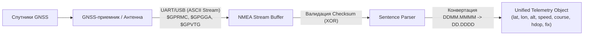

# NMEA 0183 — структура и парсинг предложений ($GPGGA, $GPRMC, $GPVTG)

> [!info] Навигация
> Родительский раздел: [[GPS & Tracking MOC]]

## Что это такое и какую боль решает

**NMEA 0183** (National Marine Electronics Association) — старейший, но де-факто абсолютный промышленный стандарт текстового протокола связи между морским и навигационным оборудованием, GPS/GNSS-приемниками, автопилотами и компьютерами.

Каждый раз, когда вы подключаете к микроконтроллеру, серверу или браузеру (через Web Serial API) внешний GNSS-модуль (u-blox, Quectel, SIMCom, MediaTek), по умолчанию через UART/RS-232/USB льется поток ASCII-строк со скоростью 4800, 9600 или 115200 бод.

Главные сложности при работе с NMEA:
1. **Координаты передаются в формате `DDMM.MMMM`** (градусы и минуты с долями минут), а не в привычных для GIS десятичных градусах `DD.DDDDDD`. Прямое использование сырых чисел ломает расчеты на сотни километров.
2. **Каждое предложение отвечает лишь за часть телеметрии:** в $GPGGA есть высота и HDOP, но нет курса и скорости, а в $GPRMC есть скорость и валидность фикса, но нет HDOP и высоты. Для полноценного трекинга их необходимо синхронизировать во времени.
3. **Целостность данных:** при передаче по UART возможны наводки и помехи, поэтому обязательна побайтовая валидация контрольной суммы XOR.



---

## Анатомия предложения NMEA 0183

Любая NMEA-строка имеет строгую структуру:
```text
$AATTT,d1,d2,d3,...,dn*CS<CR><LF>
```

- `$` — стартовый символ начала предложения (в NMEA 4.x может встречаться `!` для инкапсулированных данных, например AIS).
- `AA` — **Talker ID** (идентификатор источника данных/созвездия):
  - `GP` — GPS (США)
  - `GL` — ГЛОНАСС (РФ)
  - `GA` — Galileo (ЕС)
  - `GB` / `BD` — BeiDou (Китай)
  - `GN` — комбинированное GNSS-решение (мультисистемный фикс)
- `TTT` — **Sentence Formatter** (тип предложения: `GGA`, `RMC`, `VTG`, `GSA`, `GSV`).
- `,` — разделитель полей. Если данных нет, поле остается пустым (например, `,,`).
- `*` — разделитель контрольной суммы.
- `CS` — двузначный шестнадцатеричный код (Hex) контрольной суммы (XOR всех байтов между `$` и `*`).
- `<CR><LF>` (`\r\n`) — терминатор строки (ASCII 13, 10). Максимальная длина строки стандарта — 82 символа.

---

## Детальный разбор ключевых предложений

### 1. $GPGGA (Global Positioning System Fix Data)
Главное предложение для оценки трехмерного положения и качества позиционирования.

**Пример:**
```text
$GNGGA,123519.00,4807.03824,N,01131.00012,E,1,08,0.9,545.4,M,46.9,M,,*47
```

| Индекс поля | Значение | Описание |
| :--- | :--- | :--- |
| 1 | `123519.00` | Время UTC фикса (`hhmmss.sss` -> 12:35:19.00) |
| 2 | `4807.03824` | Широта: 48° 07.03824' |
| 3 | `N` | Полушарие широты (`N` — северное, `S` — южное) |
| 4 | `01131.00012` | Долгота: 011° 31.00012' |
| 5 | `E` | Полушарие долготы (`E` — восточное, `W` — западное) |
| 6 | `1` | **GPS Quality Indicator (Статус фикса)**:<br>`0` = Нет фикса<br>`1` = Автономный GNSS (SPS)<br>`2` = Дифференциальный GPS (DGPS/SBAS)<br>`4` = RTK Fixed (сантиметровая точность)<br>`5` = RTK Float |
| 7 | `08` | Количество используемых спутников (SVs in use) |
| 8 | `0.9` | **HDOP** (Horizontal Dilution of Precision). Чем меньше, тем точнее. |
| 9, 10 | `545.4`, `M` | Высота над уровнем моря (Orthometric height / MSL) в метрах |
| 11, 12 | `46.9`, `M` | Разделение геоида (Geoidal separation WGS84) в метрах |
| 13 | пустой | Возраст дифференциальных поправок DGPS (в секундах) |
| 14 | пустой | ID базовой станции DGPS/RTK |
| CS | `*47` | Контрольная сумма |

---

### 2. $GPRMC (Recommended Minimum Specific GNSS Data)
«Золотой стандарт» навигации. Содержит минимально достаточный набор для большинства трекеров: дату, время, координаты, путевую скорость и истинный курс.

**Пример:**
```text
$GNRMC,123519.00,A,4807.03824,N,01131.00012,E,022.4,084.4,230324,003.1,W,A*6A
```

| Индекс поля | Значение | Описание |
| :--- | :--- | :--- |
| 1 | `123519.00` | Время UTC (`12:35:19.00`) |
| 2 | `A` | **Статус:** `A` = Valid (активен), `V` = Void (предупреждение навигатора, фикс недостоверен) |
| 3, 4 | `4807.03824`, `N` | Широта и полушарие |
| 5, 6 | `01131.00012`, `E` | Долгота и полушарие |
| 7 | `022.4` | **Скорость над грунтом (SOG)** в узлах (Knots). $1 \text{ knot} \approx 1.852 \text{ км/ч} \approx 0.5144 \text{ м/с}$ |
| 8 | `084.4` | **Истинный путевой угол (Course over ground)** в градусах ($0^\circ..359.9^\circ$) |
| 9 | `230324` | Дата UTC: `ddmmyy` (23 марта 2024 года) |
| 10, 11 | `003.1`, `W` | Магнитное склонение (Magnetic variation) и направление |
| 12 | `A` | Режим работы приемника (Mode Indicator: A=Автономный, D=Дифференциальный, E=Dead Reckoning) |

---

### 3. $GPVTG (Course Over Ground and Ground Speed)
Специализированное предложение для векторов движения: дублирует скорость сразу в км/ч и узлах.

**Пример:**
```text
$GNVTG,054.7,T,034.4,M,005.5,N,010.2,K,A*28
```

- `054.7,T` — Истинный курс (True track) в градусах.
- `034.4,M` — Магнитный курс (Magnetic track).
- `005.5,N` — Скорость над грунтом в морских узлах.
- `010.2,K` — Скорость над грунтом в **километрах в час (км/ч)**.
- `A` — Режим позиционирования.

---

## Математика пересчета координат `DDMM.MMMM` в `DD.DDDDDD`

В NMEA координата кодируется блоком:
$$\text{Широта: } 4807.03824 \implies 48^\circ \text{ (градусы)} + 07.03824' \text{ (минуты)}$$
$$\text{Долгота: } 01131.00012 \implies 011^\circ \text{ (градусы)} + 31.00012' \text{ (минуты)}$$

> [!caution] Критическая ошибка парсинга
> Первые 2 цифры широты (или первые 3 цифры долготы) — это целые градусы. Все последующие цифры до запятой и после точки — это **минуты**. Чтобы перевести минуты в десятичные доли градусов, их нужно **разделить на 60**.

Формула:
$$\text{Decimal Degrees} = \text{Degrees} + \frac{\text{Minutes}}{60}$$
Если полушарие `S` (южное) или `W` (западное), итоговое значение умножается на $-1$.

---

## Production-парсер на TypeScript

Готовый класс для стримингового разбора NMEA предложений с валидацией чексуммы и поддержкой `$xxGGA`, `$xxRMC`, `$xxVTG`.

```typescript
export interface ParsedGNSSPoint {
  latitude: number;
  longitude: number;
  altitudeMeters?: number;
  speedKmh?: number;
  headingDegrees?: number;
  hdop?: number;
  satellitesInUse?: number;
  fixQuality?: number;
  timestampUtc?: Date;
  isValid: boolean;
}

export class Nmea0183Parser {
  /**
   * Проверка контрольной суммы XOR между '$' и '*'
   */
  public static verifyChecksum(sentence: string): boolean {
    const trimmed = sentence.trim();
    const asteriskIndex = trimmed.lastIndexOf('*');
    if (asteriskIndex === -1 || !trimmed.startsWith('$')) return false;

    const rawData = trimmed.slice(1, asteriskIndex);
    const expectedHex = trimmed.slice(asteriskIndex + 1);

    let calculatedChecksum = 0;
    for (let i = 0; i < rawData.length; i++) {
      calculatedChecksum ^= rawData.charCodeAt(i);
    }

    const calculatedHex = calculatedChecksum.toString(16).toUpperCase().padStart(2, '0');
    return calculatedHex === expectedHex.toUpperCase();
  }

  /**
   * Конвертация формата DDMM.MMMMM (NMEA) в WGS84 Decimal Degrees
   */
  public static parseCoordinate(raw: string, hemisphere: 'N' | 'S' | 'E' | 'W'): number | null {
    if (!raw || !hemisphere) return null;

    // Для широты (N/S) первые 2 символа - градусы, для долготы (E/W) - первые 3 символа
    const isLongitude = hemisphere === 'E' || hemisphere === 'W';
    const degLength = isLongitude ? 3 : 2;

    const degrees = parseFloat(raw.slice(0, degLength));
    const minutes = parseFloat(raw.slice(degLength));

    if (isNaN(degrees) || isNaN(minutes)) return null;

    let decimal = degrees + minutes / 60;
    if (hemisphere === 'S' || hemisphere === 'W') {
      decimal = -decimal;
    }
    return decimal;
  }

  /**
   * Парсинг времени hhmmss.sss и даты ddmmyy в объект Date
   */
  public static parseDateTime(timeStr: string, dateStr?: string): Date | null {
    if (!timeStr || timeStr.length < 6) return null;

    const hours = parseInt(timeStr.slice(0, 2), 10);
    const minutes = parseInt(timeStr.slice(2, 4), 10);
    const seconds = parseInt(timeStr.slice(4, 6), 10);
    const millis = timeStr.includes('.') ? Math.round(parseFloat('0' + timeStr.slice(6)) * 1000) : 0;

    let year = 1970, month = 0, day = 1;

    if (dateStr && dateStr.length === 6) {
      day = parseInt(dateStr.slice(0, 2), 10);
      month = parseInt(dateStr.slice(2, 4), 10) - 1;
      const rawYear = parseInt(dateStr.slice(4, 6), 10);
      year = rawYear >= 70 ? 1900 + rawYear : 2000 + rawYear;
    }

    return new Date(Date.UTC(year, month, day, hours, minutes, seconds, millis));
  }

  /**
   * Парсер строки предложения
   */
  public parseSentence(sentence: string): Partial<ParsedGNSSPoint> | null {
    if (!Nmea0183Parser.verifyChecksum(sentence)) {
      return null;
    }

    const clean = sentence.trim().split('*')[0];
    const parts = clean.split(',');
    const type = parts[0].slice(3); // Отрезаем Talker ID ($GP, $GN, $GL)

    switch (type) {
      case 'GGA': {
        const lat = Nmea0183Parser.parseCoordinate(parts[2], parts[3] as 'N' | 'S');
        const lon = Nmea0183Parser.parseCoordinate(parts[4], parts[5] as 'E' | 'W');
        const fixQuality = parseInt(parts[6], 10) || 0;
        const sats = parseInt(parts[7], 10) || 0;
        const hdop = parseFloat(parts[8]) || undefined;
        const alt = parseFloat(parts[9]) || undefined;
        const time = Nmea0183Parser.parseDateTime(parts[1]);

        return {
          latitude: lat ?? 0,
          longitude: lon ?? 0,
          altitudeMeters: alt,
          hdop,
          satellitesInUse: sats,
          fixQuality,
          isValid: fixQuality > 0 && lat !== null && lon !== null,
          timestampUtc: time ?? undefined,
        };
      }

      case 'RMC': {
        const isValid = parts[2] === 'A';
        const lat = Nmea0183Parser.parseCoordinate(parts[3], parts[4] as 'N' | 'S');
        const lon = Nmea0183Parser.parseCoordinate(parts[5], parts[6] as 'E' | 'W');
        const speedKnots = parseFloat(parts[7]) || 0;
        const heading = parseFloat(parts[8]) || 0;
        const time = Nmea0183Parser.parseDateTime(parts[1], parts[9]);

        return {
          latitude: lat ?? 0,
          longitude: lon ?? 0,
          speedKmh: speedKnots * 1.852,
          headingDegrees: heading,
          isValid: isValid && lat !== null && lon !== null,
          timestampUtc: time ?? undefined,
        };
      }

      case 'VTG': {
        const heading = parseFloat(parts[1]) || 0;
        const speedKmh = parseFloat(parts[7]) || 0;
        return {
          headingDegrees: heading,
          speedKmh,
          isValid: true,
        };
      }

      default:
        return null;
    }
  }
}
```

---

## Архитектурные рекомендации для Production
1. **Буферизация кольцевого потока:** UART отдает данные байтовыми кусками произвольной длины. Никогда не предполагайте, что один `read()` вернет целую NMEA-строку. Накапливайте байты в строковый буфер и режьте только по `\r\n`.
2. **Склейка фикса (Epoch Synchronization):** GNSS-чип в рамках одной эпохи (например, за один такт 10 Гц) выплевывает пачку: `$GNRMC`, затем `$GNGGA`, затем `$GNVTG`. Создавайте состояние `CurrentEpoch` и собирайте поля в один объект по совпадению метки времени UTC.
3. **Фильтрация по HDOP и спутникам:** Отбрасывайте координаты, если `HDOP > 3.0` или число спутников `< 5`, иначе на карте возникнут резкие прыжки («звездообразование» на светофорах).
