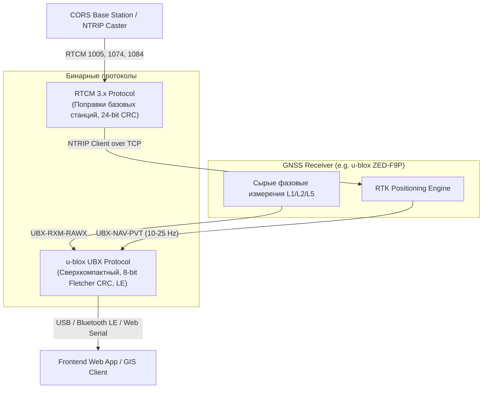

# Бинарные протоколы чипсетов (u-blox UBX, RTCM 3.x)

> [!info] Навигация
> Родительский раздел: [[GPS & Tracking MOC]]

## Зачем нужны бинарные протоколы, когда есть NMEA?

Текстовый протокол NMEA 0183 великолепен своей читаемостью человеком, но категорически не подходит для высокочастотного (10–25 Гц), геодезического (RTK) и энергоэффективного трекинга:

1. **Избыточность полосы пропускания (Overhead):** Каждое число передается строкой цифр в ASCII. Число типа `double` (8 байт) в NMEA превращается в 12–15 байт текста плюс запятые. На частотах 10–20 Гц стандартной скорости порта 9600 или даже 38400 бод начинает физически не хватать.
2. **Нагрузка на CPU:** Постоянный строковый сплит (`split(',')`), валидация строк и вызов `parseFloat` разряжают батарею IoT-трекера или смартфона. В бинарных протоколах поля лежат по фиксированным байтовым смещениям — их чтение сводится к чтению структур в памяти (`DataView` / `struct.unpack`).
3. **Отсутствие доступа к сырым фазовым измерениям:** NMEA выдает только готовые координаты. Чтобы рассчитать сантиметровую точность (RTK) или дифференциальные поправки, нужны сырые псевдодальности, несущие частоты и доплеровский сдвиг каждого спутника. Эти данные передаются исключительно в бинарном виде: проприетарном (например, **u-blox UBX**) или открытом международном (**RTCM 3.x**).



---

## 1. Протокол u-blox UBX

Протокол компании u-blox является отраслевым стандартом де-факто в коммерческих дронах, телематике и автономном транспорте (серии чипов NEO-M8, ZED-F9P, NEO-F9).

### Структура фрейма UBX
Каждый пакет UBX начинается с двух синхробайтов:

| Смещение (байт) | Поле | Длина (байт) | Значение | Описание |
| :--- | :--- | :--- | :--- | :--- |
| 0 | `Sync Char 1` | 1 | `0xB5` (ASCII 'µ') | Первый байт преамбулы |
| 1 | `Sync Char 2` | 1 | `0x62` (ASCII 'b') | Второй байт преамбулы |
| 2 | `Class` | 1 | `0x01` (NAV), `0x02` (RXM), `0x06` (CFG) | Класс сообщения |
| 3 | `ID` | 1 | `0x07` (PVT), `0x35` (SAT) | Идентификатор сообщения |
| 4..5 | `Length` | 2 (uint16 LE) | $N$ | Длина полезной нагрузки (Payload length) |
| 6..$N+5$ | `Payload` | $N$ | Данные | Содержимое (Little-Endian) |
| $N+6$ | `CK_A` | 1 | uint8 | Байт A контрольной суммы (Fletcher-8) |
| $N+7$ | `CK_B` | 1 | uint8 | Байт B контрольной суммы (Fletcher-8) |

### Алгоритм контрольной суммы Fletcher-8 (8-bit CRC)
Считается по всему пакету, исключая синхробайты `0xB5 0x62`:

$$\text{CK\_A} = \sum (\text{byte}), \quad \text{CK\_B} = \sum (\text{CK\_A}) \pmod{256}$$

```typescript
export function calculateUbxChecksum(buffer: Uint8Array, offset: number, length: number): [number, number] {
  let ckA = 0;
  let ckB = 0;
  for (let i = offset; i < offset + length; i++) {
    ckA = (ckA + buffer[i]) & 0xFF;
    ckB = (ckB + ckA) & 0xFF;
  }
  return [ckA, ckB];
}
```

### Ключевое навигационное сообщение: UBX-NAV-PVT (Class 0x01, ID 0x07)
Сообщение **NAV-PVT** (Navigation Position Velocity Time Solution) — это универсальный пакет длиной ровно **92 байта**, полностью заменяющий все предложения NMEA.

Поля упакованы в Little-Endian:
- `iTOW` (offset 0, 4 байта, U4): миллисекунды времени недели GPS.
- `year` (offset 4, 2 байта, U2), `month` (offset 6, 1 байт), `day` (offset 7, 1 байт), `hour` (offset 8), `min` (offset 9), `sec` (offset 10).
- `fixType` (offset 20, 1 байт): `0` = No Fix, `2` = 2D, `3` = 3D, `4` = GNSS + Dead Reckoning, `5` = Time only.
- `flags` (offset 21, 1 байт): бит 0 (`gnssFixOK`), биты 6–7 (`carrSoln`: `0` = No RTK, `1` = Float RTK, `2` = Fix RTK).
- `numSV` (offset 23, 1 байт): число спутников в фиксе.
- `lon` (offset 24, 4 байта, I4): Долгота в градусах, масштабированная $\times 10^{-7}$ ($\text{deg} = \text{val} \times 10^{-7}$).
- `lat` (offset 28, 4 байта, I4): Широта в градусах, масштабированная $\times 10^{-7}$.
- `height` (offset 32, 4 байта, I4): Высота над эллипсоидом (WGS84) в миллиметрах.
- `hMSL` (offset 36, 4 байта, I4): Высота над средним уровнем моря в миллиметрах.
- `hAcc` (offset 40, 4 байта, U4): Горизонтальная оценка точности (Horizontal accuracy estimate) в миллиметрах.
- `vAcc` (offset 44, 4 байта, U4): Вертикальная точность в миллиметрах.
- `gSpeed` (offset 60, 4 байта, I4): Скорость над землей в мм/с ($\text{м/с} = \text{val} / 1000$).
- `headMot` (offset 64, 4 байта, I4): Курс движения в градусах $\times 10^{-5}$.

---

## TypeScript-парсер UBX-NAV-PVT

```typescript
export interface UbxNavPvtData {
  timestamp: Date;
  latitude: number;
  longitude: number;
  altitudeMslMeters: number;
  horizontalAccuracyMeters: number;
  speedMps: number;
  headingDegrees: number;
  satellites: number;
  fixType: number;
  isRtkFixed: boolean;
  isRtkFloat: boolean;
  isValid: boolean;
}

export class UbxParser {
  public static parseNavPvt(payload: Uint8Array): UbxNavPvtData | null {
    if (payload.length < 92) return null;
    const view = new DataView(payload.buffer, payload.byteOffset, payload.byteLength);

    const year = view.getUint16(4, true);
    const month = view.getUint8(6) - 1;
    const day = view.getUint8(7);
    const hour = view.getUint8(8);
    const min = view.getUint8(9);
    const sec = view.getUint8(10);
    const validFlags = view.getUint8(11);
    const isValid = (validFlags & 0x01) !== 0; // validDate flag

    const fixType = view.getUint8(20);
    const flags = view.getUint8(21);
    const carrSoln = (flags >> 6) & 0x03; // RTK carrier solution
    const numSV = view.getUint8(23);

    // Долгота и широта передаются как int32 с масштабом 1e-7
    const lon = view.getInt32(24, true) * 1e-7;
    const lat = view.getInt32(28, true) * 1e-7;
    const hMSL = view.getInt32(36, true) / 1000; // мм -> м
    const hAcc = view.getUint32(40, true) / 1000; // мм -> м
    const gSpeed = view.getInt32(60, true) / 1000; // мм/с -> м/с
    const headMot = view.getInt32(64, true) * 1e-5; // 1e-5 град

    return {
      timestamp: new Date(Date.UTC(year, month, day, hour, min, sec)),
      latitude: lat,
      longitude: lon,
      altitudeMslMeters: hMSL,
      horizontalAccuracyMeters: hAcc,
      speedMps: Math.max(0, gSpeed),
      headingDegrees: (headMot + 360) % 360,
      satellites: numSV,
      fixType,
      isRtkFixed: carrSoln === 2,
      isRtkFloat: carrSoln === 1,
      isValid: isValid && fixType >= 3,
    };
  }
}
```

---

## 2. Стандарт RTCM 3.x (Radio Technical Commission for Maritime Services)

**RTCM SC-104 v3.x** — открытый международный бинарный протокол, используемый во всем мире для передачи дифференциальных поправок и сырых фазовых наблюдений от базовых референц-станций (CORS) к мобильным приемникам (роверам) по протоколу **NTRIP** (Networked Transport of RTCM via Internet Protocol).

### Архитектура фрейма RTCM 3:
Пакет RTCM упаковывается на битовом уровне:
```text
[0xD3 (8 bit)] [Reserved 6 bit: 000000] [Message Length (10 bit)] [Payload (Variable)] [CRC-24Q (24 bit)]
```
- Преамбула: строго фиксированный байт `0xD3`.
- Длина данных: 10 бит (до 1023 байт нагрузки).
- Контрольная сумма: полиномиальный 24-битный код **Qualcomm CRC-24Q** (полином $0x1864CFB$).

### Ключевые типы сообщений RTCM v3:

| Сообщение | Название | Что передает | Частота |
| :--- | :--- | :--- | :--- |
| **1005 / 1006** | Stationary RTK Reference Station ARP | Точные сантиметровые координаты фазового центра антенны базовой станции (ECEF X, Y, Z). Без него RTK невозможен! | 0.1 Гц (раз в 10 сек) |
| **1074 / 1077** | GPS MSM (Multiple Signal Messages) | MSM4/MSM7: сырые псевдодальности, фазы несущей, SNR для всех видимых спутников GPS (L1, L2, L5). | 1 Гц |
| **1084 / 1087** | GLONASS MSM | Аналогично для спутников ГЛОНАСС (G1, G2). | 1 Гц |
| **1094 / 1097** | Galileo MSM | Сырые данные для созвездия Galileo (E1, E5a, E5b). | 1 Гц |
| **1124 / 1127** | BeiDou MSM | Сырые данные для созвездия BeiDou (B1, B2, B3). | 1 Гц |
| **1029** | Text String | Служебные текстовые оповещения от оператора базовой сети. | По событию |

---

## Сравнение форматов для передачи телеметрии

| Параметр | NMEA 0183 | u-blox UBX | RTCM 3.x |
| :--- | :--- | :--- | :--- |
| **Тип данных** | ASCII Текст | Бинарный (Little-Endian) | Бинарный (Bit-packed) |
| **Расход байт на точку** | ~200–350 байт | ~92 байта (NAV-PVT) | Специализированный поток |
| **Парсинг в JS/TS** | `String.split()` (медленно) | `DataView` (мгновенно, Zero-Copy) | Битовый ридер (BitStream) |
| **Оценка точности** | Только HDOP/VDOP (косвенная) | Прямая $h_{acc}$ и $v_{acc}$ в мм | Ковариационные матрицы |
| **Сырые фазы (L1/L2)** | Нет | Да (UBX-RXM-RAWX) | Да (MSM4 / MSM7) |
| **Поддержка RTK** | Только флаг статуса (1/2/4/5) | Полная телеметрия RTK | Передача самих поправок |

> [!tip] Best Practice в современных Web GIS проектах
> При работе с высокоточными дронами или геодезическим оборудованием в браузере через Web Serial API переключайте чип u-blox командой `UBX-CFG-PRT` в режим бинарного вывода `UBX-NAV-PVT` с отключением вывода NMEA. Это снижает загрузку канала в 4 раза и гарантирует стабильные 20–25 Гц обновления маркера без дрожания интерфейса.
