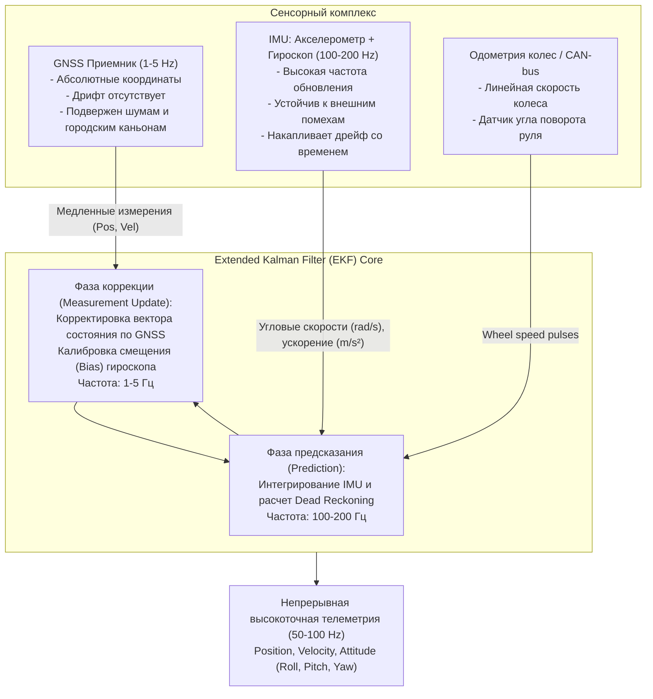

# Сенсорный фьюжн (Sensor Fusion) — GNSS + IMU + Dead Reckoning

> [!info] Навигация
> Родительский раздел: [[GPS & Tracking MOC]]

## Что это такое и почему одного GNSS недостаточно

В идеальных условиях (открытое поле, ясное небо) многочастотный GNSS-приемник дает точность в единицы метров или сантиметров. Но реальный мир трекинга состоит из «городских каньонов» (Urban Canyons) с небоскребами, многоуровневых тоннелей, подземных паркингов и мостов.

В этих сценариях чистый GNSS деградирует:
1. **Эффект многолучевости (Multipath):** Радиосигнал отражается от стеклянных фасадов и асфальта, приходя к антенне с опозданием. Метка мгновенно «улетает» на параллельную улицу или начинает хаотично метаться с разбросом 30–70 метров.
2. **Полное затенение (GNSS Outage):** В автомобильных тоннелях Лефортово или под Ла-Маншем спутниковый сигнал пропадает на 100%. Обычный навигатор замирает на въезде и «просыпается» лишь через несколько минут после выезда, пропустив нужный съезд.
3. **Низкая частота обновления:** Спутники обновляют фикс с частотой 1–5 Гц (в редких чипах до 10 Гц). Для динамики автомобиля на скорости 120 км/ч (33.3 м/с) задержка в 1 секунду означает «слепую зону» длиной 33 метра.

**Сенсорный фьюжн (Sensor Fusion)** решает эту проблему путем математического объединения взаимодополняющих физических датчиков: абсолютного, но медленного и подверженного шумам GNSS, и относительных, но сверхбыстрых (100–200 Гц) инерциальных датчиков (IMU).



---

## Архитектура IMU (Inertial Measurement Unit)

Инерциальный измерительный модуль в смартфонах и трекерах представляет собой 6-DOF или 9-DOF MEMS-чип (например, Bosch BMI160/BMI270, TDK InvenSense ICM-42688):

- **3-осевой акселерометр (Accelerometer):** измеряет удельную силу / кажущееся ускорение ($m/s^2$) вдоль осей $X, Y, Z$, включая вектор гравитации Земли ($g \approx 9.81 \, m/s^2$).
- **3-осевой гироскоп (Gyroscope):** измеряет угловую скорость вращения ($\text{rad/s}$ или $\text{deg/s}$) вокруг осей $X, Y, Z$ (крен, тангаж, рыскание: Roll, Pitch, Yaw).
- **3-осевой магнитометр (Magnetometer / Компас):** измеряет вектор магнитного поля Земли (в микротеслах $\mu T$), позволяя привязать рыскание (Heading) к магнитному полюсу.

---

## Принцип счисления пути: Dead Reckoning (DR)

**Dead Reckoning (DR)** — метод расчета текущего положения на основе предыдущего известного положения, скорости и направления движения:

$$x_k = x_{k-1} + v_k \cdot \Delta t \cdot \cos(\theta_k)$$
$$y_k = y_{k-1} + v_k \cdot \Delta t \cdot \sin(\theta_k)$$

Где:
- $(x_{k-1}, y_{k-1})$ — предыдущая координата;
- $v_k$ — линейная скорость (полученная от интеграла акселерометра или CAN-шины колес);
- $\theta_k$ — курс движения (интеграл угловой скорости гироскопа);
- $\Delta t$ — шаг времени между итерациями датчика (например, $0.01$ с при 100 Гц).

### Проблема квадратичного дрейфа (Drift Accumulation)
MEMS-датчики неизбежно страдают от смещения нуля (**Sensor Bias**). Даже ничтожное постоянное смещение гироскопа в $0.1^\circ/\text{с}$ за 60 секунд нахождения в тоннеле приведет к ошибке курса в $6^\circ$. А двукратное интегрирование малейшей ошибки акселерометра вызывает квадратичный рост ошибки положения ($s = \frac{a \cdot t^2}{2}$): за 1 минуту отклонение может составить несколько километров!

Именно поэтому чистый Dead Reckoning без коррекции спутниками быстро теряет смысл.

---

## Сравнение типов интеграции: Loosely vs Tightly Coupled

В телематических чипсетах (например, u-blox NEO-M8U / ZED-F9R с технологией **ADR / UDR** — Automotive/Untethered Dead Reckoning) применяются разные уровни связывания:

| Характеристика | Loosely Coupled (Слабосвязанный) | Tightly Coupled (Тесносвязанный) |
| :--- | :--- | :--- |
| **Входные данные GNSS** | Готовые координаты и скорость $(x, y, z, v_x, v_y, v_z)$ из спутникового решения | Сырые псевдодальности и доплеровские сдвиги каждого отдельного спутника |
| **Поведение при $< 4$ спутниках** | **Полный отказ GNSS:** фильтр переходит в слепой Dead Reckoning | **Продолжает обновляться:** даже 1 или 2 видимых спутника корректируют дрейф часов и траекторию |
| **Сложность алгоритма** | Умеренная (можно реализовать на прикладном уровне микроконтроллера/клиента) | Экстремально высокая (реализуется исключительно внутри кремния чипсета GNSS) |
| **Устойчивость в плотной застройке** | Средняя (отраженные сигналы искажают готовый фикс) | Максимальная (фильтр отбраковывает выбросы отдельных спутников) |

---

## Практическая реализация: Дополнительный фильтр (Complementary Filter) для ориентации в пространстве

Для объединения медленного, но точного акселерометра (показывающего горизонт через гравитацию) и быстрого, но дрейфующего гироскопа используется комплементарный фильтр:

$$\theta_{t} = \alpha \cdot (\theta_{t-1} + \omega \cdot \Delta t) + (1 - \alpha) \cdot \theta_{\text{accel}}$$

Где $\alpha \approx 0.96..0.98$ — весовой коэффициент (высокочастотный фильтр для гироскопа и низкочастотный для акселерометра).

```typescript
export interface ImuSample {
  gyroZ: number;       // рад/с (рыскание/yaw)
  accelX: number;      // м/с² (продольное ускорение автомобиля)
  accelY: number;      // м/с² (боковое ускорение)
  dtSeconds: number;   // интервал дискретизации (e.g. 0.01s)
}

export interface GnssSample {
  lat: number;
  lon: number;
  speedMps: number;
  headingRad: number;
  accuracy: number;    // точность в метрах
}

export class DeadReckoningEngine {
  private currentLat: number = 0;
  private currentLon: number = 0;
  private heading: number = 0;       // радианы
  private velocity: number = 0;      // м/с
  private gyroBiasZ: number = 0.001; // оценка смещения нуля

  private readonly METERS_PER_DEG_LAT = 111132.954;

  public initialize(lat: number, lon: number, headingRad: number, speedMps: number): void {
    this.currentLat = lat;
    this.currentLon = lon;
    this.heading = headingRad;
    this.velocity = speedMps;
  }

  /**
   * Шаг предсказания по инерциальным данным (100 Гц)
   */
  public predictByImu(imu: ImuSample): { lat: number; lon: number; heading: number; speed: number } {
    // 1. Коррекция гироскопа на смещение и интеграция угла
    const correctedGyro = imu.gyroZ - this.gyroBiasZ;
    this.heading += correctedGyro * imu.dtSeconds;
    this.heading = (this.heading + 2 * Math.PI) % (2 * Math.PI);

    // 2. Интеграция продольного ускорения в скорость (с защитой от отрицательной скорости назад)
    this.velocity = Math.max(0, this.velocity + imu.accelX * imu.dtSeconds);

    // 3. Вычисление перемещения в метрах
    const distance = this.velocity * imu.dtSeconds;
    const dNorth = distance * Math.cos(this.heading);
    const dEast = distance * Math.sin(this.heading);

    // 4. Перевод смещения в метрах в градусы WGS84
    const dLat = dNorth / this.METERS_PER_DEG_LAT;
    const metersPerDegLon = this.METERS_PER_DEG_LAT * Math.cos(this.currentLat * (Math.PI / 180));
    const dLon = dEast / metersPerDegLon;

    this.currentLat += dLat;
    this.currentLon += dLon;

    return {
      lat: this.currentLat,
      lon: this.currentLon,
      heading: this.heading,
      speed: this.velocity,
    };
  }

  /**
   * Шаг коррекции по пришедшему GNSS фиксу (1-5 Гц)
   */
  public updateByGnss(gnss: GnssSample): void {
    // Если точность GNSS плохая (туннель или сильный шум), доверяем IMU
    if (gnss.accuracy > 15.0) {
      return;
    }

    // Коэффициент доверия (чем точнее GNSS, тем выше вес)
    const weight = Math.min(0.8, Math.max(0.1, 5.0 / (gnss.accuracy + 5.0)));

    // Мягкая коррекция координат (интерполяция)
    this.currentLat = this.currentLat * (1 - weight) + gnss.lat * weight;
    this.currentLon = this.currentLon * (1 - weight) + gnss.lon * weight;

    // Коррекция скорости
    this.velocity = this.velocity * 0.7 + gnss.speedMps * 0.3;

    // Коррекция смещения нуля гироскопа во время движения по прямой
    if (gnss.speedMps > 5.0) {
      const headingDiff = gnss.headingRad - this.heading;
      this.heading += headingDiff * 0.2;
    }
  }
}
```

---

## Архитектурные выводы для телематики и Web GIS
1. **Тоннели и подземные паркинги:** Профессиональные трекеры без встроенного IMU (Dead Reckoning) непригодны для логистики «последней мили», курьерской доставки в мегаполисах и каршеринга.
2. **Нулевая скорость (Zero Velocity Update, ZUPT):** Когда акселерометр фиксирует отсутствие вибрации и движения (автомобиль стоит на светофоре), скорость жестко принудительно обнуляется ($v = 0$). Это полностью предотвращает паразитное блуждание метки по перекрестку.
3. **Плавная анимация на фронтенде:** Использование IMU позволяет веб-клиенту отрисовывать маркер с плавной частотой 60 fps даже при получении GNSS-пакетов всего один раз в 2 секунды.
