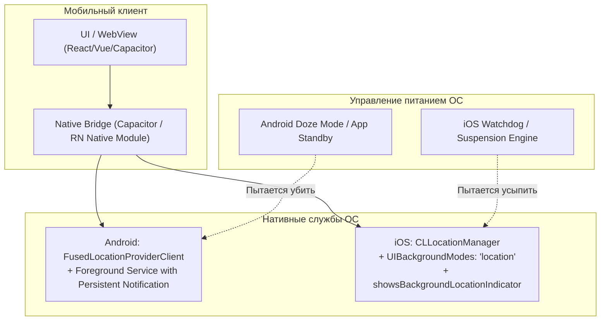

# Background Geolocation в iOS и Android (FusedLocationProvider, CoreLocation)

> [!info] Навигация
> Родительский раздел: [[GPS & Tracking MOC]]

## Реальность мобильного фонового трекинга

Если в браузере непрерывный трекинг при выключенном экране принципиально невозможен, то в гибридных и нативных мобильных приложениях (Capacitor, React Native, Flutter, Kotlin, Swift) он возможен, но является **самой жестко регулируемой областью мобильных ОС**.

Обе операционные системы (Apple iOS и Google Android) ведут беспощадную войну за автономность аккумулятора и конфиденциальность пользователей. Если фоновый сервис трекинга написан небрежно:
- Android Doze Mode и OEM-киллеры (Xiaomi MIUI, Huawei, Samsung) принудительно убьют процесс через 3–15 минут.
- Apple iOS заморозит приложение, отберет разрешение «Всегда разрешать» (Always Allow) через системный пуш-аудит и заблокирует релиз в App Store Review.



---

## Android: Архитектура FusedLocationProviderClient

Начиная с Android 8.0 (Oreo, API 26) и 10 (Q, API 29), прямое использование устаревшего `android.location.LocationManager` не рекомендуется. Стандартом является **Google Play Services: Fused Location Provider API (FLP)**.

### Принципы работы FLP:
1. **Слияние сенсоров:** FLP динамически комбинирует сигналы GPS, Wi-Fi, мобильных вышек и акселерометра, выбирая наименее энергозатратный источник.
2. **Пассивное слушание (Passive Provider):** Ваше приложение может получать координаты «бесплатно», если другое приложение (например, Яндекс Навигатор или Google Maps) уже запросило GPS с высокой точностью.

### Требования для непрерывного фонового трекинга на Android:
1. **Разрешения в `AndroidManifest.xml`:**
   - `ACCESS_FINE_LOCATION` (точная геопозиция)
   - `ACCESS_COARSE_LOCATION` (приблизительная геопозиция)
   - `ACCESS_BACKGROUND_LOCATION` (требуется начиная с Android 10 для фонового доступа без уведомления)
   - `FOREGROUND_SERVICE` и `FOREGROUND_SERVICE_LOCATION` (Android 14+)
2. **Foreground Service (Приоритетная служба):**
   Единственный 100% надежный способ предотвратить убийство процесса механизмом **Doze Mode** — запустить `Foreground Service` с постоянным неотключаемым уведомлением в шторке (Sticky Notification) со значком трекинга:

```kotlin
// Android Kotlin: Настройка запроса локации
val locationRequest = LocationRequest.Builder(Priority.PRIORITY_HIGH_ACCURACY, 5000)
    .setMinUpdateIntervalMillis(2000)    // Не чаще раза в 2 секунды
    .setMinUpdateDistanceMeters(5.0f)   // Фильтр смещения: игнорировать стояние на месте
    .setMaxUpdateDelayMillis(10000)     // Батчинг в фоне (экономия пробуждений CPU)
    .build()

fusedLocationClient.requestLocationUpdates(locationRequest, locationCallback, Looper.getMainLooper())
```

---

## iOS: Архитектура CoreLocation (CLLocationManager)

В iOS экосистеме фоновый трекинг контролируется классом `CLLocationManager`.

### Уровни разрешений:
- `When In Use` (Во время использования приложения)
- `Always` (Всегда разрешать в фоне)

> [!important] Двухэтапный запрос разрешений в iOS
> Разработчик больше не может сразу запросить статус `Always`. Сначала приложение обязано запросить `requestWhenInUseAuthorization()`. И лишь после того, как пользователь начал реальную поездку/трекинг, вызывается `requestAlwaysAuthorization()`. Позже iOS покажет системный диалог с картой трека и спросит: *"Приложение X использовало вашу локацию 48 раз в фоне. Продолжить разрешать?"*.

### Обязательные флаги в `Info.plist`:
```xml
<key>UIBackgroundModes</key>
<array>
    <string>location</string>
</array>
<key>NSLocationWhenInUseUsageDescription</key>
<string>Ваша геопозиция нужна для отображения курьера на карте.</string>
<key>NSLocationAlwaysAndWhenInUseUsageDescription</key>
<string>Трекинг в фоне необходим для непрерывной записи маршрута доставки при заблокированном экране.</string>
```

### Настройки CLLocationManager в Swift:
```swift
let locationManager = CLLocationManager()
locationManager.delegate = self
locationManager.desiredAccuracy = kCLLocationAccuracyBestForNavigation
locationManager.distanceFilter = 5.0 // метры

// КРИТИЧЕСКИ ВАЖНО для фона:
locationManager.allowsBackgroundLocationUpdates = true
locationManager.pausesLocationUpdatesAutomatically = false // Запретить iOS самой глушить GPS при остановках
locationManager.showsBackgroundLocationIndicator = true   // Синий индикатор в статус-баре (Dynamic Island)
locationManager.startUpdatingLocation()
```

---

## Оптимизация энергопотребления и батареи

Постоянно включенный модуль GPS потребляет **150–350 мА**, что способно разрядить батарею смартфона емкостью 4000 мАч за 5–7 часов.

### Стратегии энергосбережения:

1. **Distance Filter (Пространственная фильтрация):**
   Не запрашивайте события чаще, чем автомобиль переместился на $X$ метров (`distanceFilter = 5` или `10` метров). Стояние в пробке не должно спамить локациями.
2. **Activity Recognition API (Детекция активности):**
   Использование нативных сопроцессоров движения (Apple CMMotionActivityManager / Android ActivityRecognitionClient).
   - Если пользователь `STILL` (неподвижен) -> глушим GPS, переходим на геозону (Geofencing).
   - Если `ON_FOOT` (пешеход) -> интервал 10–15 сек, точность 15 метров.
   - Если `IN_VEHICLE` (в автомобиле) -> интервал 2–4 сек, максимальная точность для навигации.
3. **Пакетная доставка (Batching):**
   Приемник накапливает точки в аппаратном буфере чипсета и будит центральный процессор пачкой раз в 30–60 секунд.

---

## Сравнение режимов фонового трекинга

| Режим | Расход батареи | Точность | Применение |
| :--- | :--- | :--- | :--- |
| **Continuous Navigation** | Экстремальный (15–20% в час) | 3–5 м | Навигаторы (Яндекс Карты, Waze), спортивные трекеры (Strava) |
| **Significant Location Changes (SLC)** | Минимальный (<1% в день) | 500–1000 м | Перемещение между сотовыми вышками, смена городов |
| **Geofencing (Круговые геозоны)** | Низкий (1–3% в день) | 50–150 м | Уведомление «Вы вошли в магазин», умный дом |
| **Adaptive Tracking (Motion-based)** | Умеренный (3–6% в час) | 5–10 м | Корпоративный трекинг курьеров, инкассация |

---

## Рекомендуемый Production-стек для кроссплатформенных Web-проектов

Для гибридных приложений на React / Vue / Vite наилучшим промышленным решением является плагин **`background-geolocation`** (Transistor Software):
- Автоматически поднимает Foreground Service на Android и удерживает CoreLocation в фоне на iOS.
- Включает встроенный локальный SQLite буфер (если пропал мобильный интернет, точки сохраняются и выгружаются на бэкенд пачкой при восстановлении связи).
- Встроенный детектор движения (Odometer + Accelerometer trigger).
