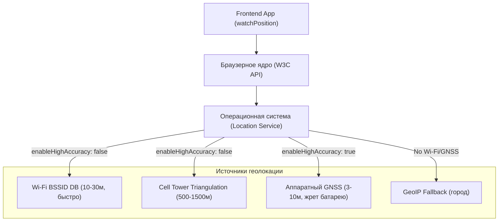

# W3C Geolocation API (watchPosition, limitations, highAccuracy)

> [!info] Навигация
> Родительский раздел: [[GPS & Tracking MOC]]

## Что это такое и как браузер определяет координаты

**W3C Geolocation API** — стандартный интерфейс веб-платформы, позволяющий веб-приложению получать географическое положение пользователя через объект `navigator.geolocation`.

Многие фронтенд-разработчики ошибочно полагают, что вызов `navigator.geolocation.getCurrentPosition()` обращается напрямую к спутникам GPS в телефоне. На самом деле браузер является лишь клиентом высокоуровневых служб операционной системы (Google Location Services на Android, Apple CoreLocation на iOS/macOS, Windows Location Provider).

Браузер использует гибридный стек источников (Location Providers):
1. **Базы данных Wi-Fi BSSID (Wi-Fi Positioning System, WPS):** Браузер сканирует MAC-адреса и уровень сигнала (RSSI) окружающих роутеров и отправляет их на геолокационные серверы (Google/Apple). Точность: 10–30 метров. Работает внутри помещений мгновенно без видимости неба!
2. **Идентификаторы базовых станций сотовой связи (Cell ID):** Определение трилатерацией по вышкам GSM/LTE/5G. Точность: 200–2000 метров.
3. **Чип GNSS/GPS:** Включается **только** на мобильных устройствах при установке флага `enableHighAccuracy: true`. Точность: 3–10 метров.
4. **GeoIP (IP Lookups):** Резервный метод на десктопах без Wi-Fi адаптеров. Точность: на уровне города или провайдера (ошибка до десятков километров).



---

## Методы API: getCurrentPosition против watchPosition

В интерфейсе `Geolocation` есть два метода:
- `getCurrentPosition(success, error, options)` — разовый запрос текущей координаты.
- `watchPosition(success, error, options)` — регистрация коллбэка, вызываемого каждый раз при физическом смещении устройства или уточнении фикса. Возвращает числовой `watchId` для отписки через `clearWatch(watchId)`.

### Конфигурация PositionOptions

```typescript
const options: PositionOptions = {
  enableHighAccuracy: true, // Включает аппаратный GPS (если доступен)
  timeout: 10000,            // Макс. время ожидания фикса (мс) до выброса TIMEOUT ошибки
  maximumAge: 0              // Допустимый возраст кэшированной координаты (мс)
};
```

> [!warning] Ловушка `maximumAge`
> Если передать `maximumAge: Infinity` или большое значение (например, 60000), браузер не станет опрашивать сенсоры, а мгновенно вернет координату 5-минутной давности из кэша ОС. Для real-time трекинга всегда устанавливайте `maximumAge: 0`.

> [!important] Что на самом деле делает `enableHighAccuracy`
> Значение `true` сообщает операционной системе: *"Приложению требуется максимальная точность, включи чип GNSS/GPS"*.
> **Плата за это:** повышенный расход аккумулятора и увеличение времени «холодного старта» первого фикса (до 5–15 секунд). На ноутбуках без GPS флаг часто игнорируется или просто форсирует сканирование Wi-Fi эфира.

---

## Анатомия объекта GeolocationPosition

При успешном получении координаты передается объект со следующими полями:

```typescript
interface GeolocationCoordinates {
  readonly latitude: number;          // Десятичные градусы WGS84
  readonly longitude: number;         // Десятичные градусы WGS84
  readonly altitude: number | null;   // Высота над эллипсоидом WGS84 в метрах
  readonly accuracy: number;          // Радиус доверительного интервала (метры, ~68% вероятность / 1-sigma)
  readonly altitudeAccuracy: number | null; // Точность высоты в метрах
  readonly heading: number | null;    // Направление движения в градусах (0..359.9, по часовой от севера)
  readonly speed: number | null;      // Скорость над землей в м/с (НЕ км/ч!)
}

interface GeolocationPosition {
  readonly coords: GeolocationCoordinates;
  readonly timestamp: EpochTimeStamp; // Epoch time в миллисекундах
}
```

> [!caution] Подводные камни полей `heading` и `speed`
> - Поле `heading` равно `NaN` или `null`, если устройство неподвижно (`speed === 0` или скорость ниже порога обнаружения) или на десктопе!
> - Поле `speed` часто равно `null` при первом старте или если координаты получены по Wi-Fi/IP, а не по спутникам.
> - `accuracy` измеряется строго в метрах. Если `accuracy > 50`, точка непригодна для автомобильной навигации.

---

## Обработка ошибок (GeolocationPositionError)

Код ошибки передается числовой константой в свойстве `error.code`:

| Код | Константа | Причина | Что делать в UI |
| :--- | :--- | :--- | :--- |
| `1` | `PERMISSION_DENIED` | Пользователь нажал «Запретить» в диалоге разрешений | Показать баннер с инструкцией, как включить доступ в настройках браузера |
| `2` | `POSITION_UNAVAILABLE` | Нет сигнала GPS, отключен модуль Wi-Fi, сбой службы ОС | Предложить выйти на открытое пространство или включить геолокацию в шторке телефона |
| `3` | `TIMEOUT` | Время истекло быстрее, чем получен фикс (таймаут `timeout`) | Повторить запрос с ослабленным требованием точности или увеличенным таймаутом |

---

## Фундаментальные ограничения W3C API для Real-Time трекинга

1. **Фоновая работа в браузерах заблокирована:** Как только пользователь переключается на другую вкладку или блокирует экран смартфона, таймеры троттлятся, а `watchPosition` **полностью усыпляется** браузером (в Safari на iOS практически мгновенно, в Chrome на Android через 15–30 секунд) ради энергосбережения. Полноценный непрерывный трекинг курьера или бегуна в чистом браузере при заблокированном экране **невозможен** без PWA с Screen Wake Lock или нативного моста (Capacitor/React Native).
2. **Отсутствие доступа к сырым GNSS-параметрам:** API не дает информацию о количестве спутников, созвездиях, HDOP, SNR и сырых псевдодальностях.
3. **Безопасность (Secure Context):** Geolocation API работает **исключительно** по протоколу `https://` или на `http://localhost`. В незащищенных HTTP-соединениях `navigator.geolocation` равен `undefined`.

---

## Production-обертка: Типизированный реактивный трекер с фильтром точности

```typescript
export interface TrackingConfig {
  enableHighAccuracy?: boolean;
  timeoutMs?: number;
  maxAccuracyMeters?: number; // Отсечение неточных точек
  onPoint: (coords: GeolocationCoordinates, timestamp: number) => void;
  onError: (error: GeolocationPositionError) => void;
}

export class ReactiveGeoTracker {
  private watchId: number | null = null;
  private config: Required<TrackingConfig>;

  constructor(config: TrackingConfig) {
    this.config = {
      enableHighAccuracy: true,
      timeoutMs: 15000,
      maxAccuracyMeters: 30, // Игнорируем точки хуже 30 метров
      ...config,
    };
  }

  public start(): void {
    if (!('geolocation' in navigator)) {
      throw new Error('Geolocation API не поддерживается данным браузером');
    }

    if (this.watchId !== null) return;

    this.watchId = navigator.geolocation.watchPosition(
      (pos: GeolocationPosition) => {
        // Фильтр «шумных» точек с гигантским радиусом ошибки
        if (pos.coords.accuracy > this.config.maxAccuracyMeters) {
          console.warn(`[Tracker] Пропущена точка с низкой точностью: ±${pos.coords.accuracy}м`);
          return;
        }

        this.config.onPoint(pos.coords, pos.timestamp);
      },
      (err: GeolocationPositionError) => {
        this.config.onError(err);
      },
      {
        enableHighAccuracy: this.config.enableHighAccuracy,
        timeout: this.config.timeoutMs,
        maximumAge: 0,
      }
    );
  }

  public stop(): void {
    if (this.watchId !== null) {
      navigator.geolocation.clearWatch(this.watchId);
      this.watchId = null;
    }
  }

  public isTracking(): boolean {
    return this.watchId !== null;
  }
}
```

---

## Чеклист перед релизом в Production
- [ ] Проверен запуск приложения строго по протоколу HTTPS.
- [ ] Реализован экран-заглушка с объяснением ценности предоставления доступа к геопозиции перед вызовом системного диалога (Permission Primer).
- [ ] Установлен `maximumAge: 0` для исключения старых кэшированных точек при движении.
- [ ] Реализована фильтрация по `coords.accuracy` для предотвращения ложных бросков трека.
- [ ] Проверено корректное поведение при переходе вкладки в фоновый режим (`document.visibilitychange`).
