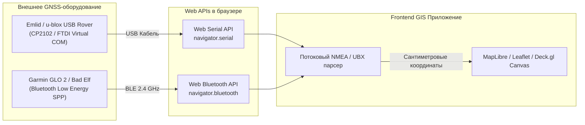

# Web Bluetooth и Web Serial API для подключения внешних GNSS-приемников

> [!info] Навигация
> Родительский раздел: [[GPS & Tracking MOC]]

## Зачем подключать внешнее оборудование к веб-странице?

Встроенный GPS в смартфонах и ноутбуках имеет точность в лучшем случае 3–5 метров. Этого достаточно для поиска ресторана, но категорически непригодно для:
- Кадастровой съемки, высокоточного картографирования и землеустройства (нужна точность $\le 2$ см).
- Сельскохозяйственной автонавигации комбайнов и опрыскивателей.
- Морской навигации на яхтах (AIS-транспондеры и картплоттеры).
- Инспекции объектов инфраструктуры (трубопроводы, опоры ЛЭП).

Современные стандарты Web API (**Web Bluetooth** и **Web Serial**) позволяют прямо из вкладки браузера (без установки драйверов, нативных приложений или расширений) общаться с профессиональными внешними GNSS/RTK-приемниками (u-blox, Emlid Reach, Trimble, Leica, Garmin GLO).



---

## 1. Web Serial API: Подключение GNSS через USB / Virtual COM-порт

**Web Serial API** предоставляет прямой доступ к последовательным портам (RS-232, UART, USB CDC-ACM) через объект `navigator.serial`.

### Пошаговый алгоритм работы:
1. Запрос физического порта пользователем (User Gesture: клик по кнопке).
2. Открытие соединения с указанием бодрейта (`baudRate`: 9600 для стандартного NMEA, 115200 для RTK/UBX).
3. Потоковое чтение байтов через `ReadableStream` с использованием `TextDecoderStream` и сплиттера строк.

### Полноценная реализация на TypeScript:

```typescript
export class WebSerialGnssReader {
  private port: SerialPort | null = null;
  private reader: ReadableStreamDefaultReader<string> | null = null;
  private isReading: boolean = false;

  /**
   * Запрос подключения к порту (вызывает системный диалог выбора устройства)
   */
  public async connect(baudRate: number = 115200, onLine: (nmeaLine: string) => void): Promise<void> {
    if (!('serial' in navigator)) {
      throw new Error('Web Serial API не поддерживается вашим браузером (требуется Chrome/Edge/Opera)');
    }

    // Фильтр по USB Vendor ID (например, u-blox VID: 0x1546, FTDI VID: 0x0403)
    const filters = [
      { usbVendorId: 0x1546 }, // u-blox AG
      { usbVendorId: 0x0403 }, // FTDI
      { usbVendorId: 0x10c4 }, // Silicon Labs CP210x
    ];

    try {
      this.port = await navigator.serial.requestPort({ filters });
      await this.port.open({ baudRate });

      this.isReading = true;
      this.readLoop(onLine);
    } catch (err) {
      console.error('Ошибка открытия последовательного порта:', err);
      throw err;
    }
  }

  /**
   * Непрерывный стриминг и разбор строк \r\n
   */
  private async readLoop(onLine: (line: string) => void): Promise<void> {
    if (!this.port || !this.port.readable) return;

    // Пайплайн декодирования байтов в UTF-8 текст
    const textDecoder = new TextDecoderStream();
    const readableStreamClosed = this.port.readable.pipeTo(textDecoder.writable);
    this.reader = textDecoder.readable.getReader();

    let buffer = '';

    try {
      while (this.isReading) {
        const { value, done } = await this.reader.read();
        if (done) break;
        if (value) {
          buffer += value;
          const lines = buffer.split('\r\n');
          // Последний элемент — незавершенный кусок строки
          buffer = lines.pop() || '';

          for (const line of lines) {
            if (line.startsWith('$') && line.includes('*')) {
              onLine(line);
            }
          }
        }
      }
    } catch (err) {
      console.error('Ошибка в потоке чтения Web Serial:', err);
    } finally {
      this.reader.releaseLock();
    }
  }

  public async disconnect(): Promise<void> {
    this.isReading = false;
    if (this.reader) {
      await this.reader.cancel();
      this.reader = null;
    }
    if (this.port) {
      await this.port.close();
      this.port = null;
    }
  }
}
```

---

## 2. Web Bluetooth API (BLE): Беспроводные приемники

Большинство портативных геодезических антенн и трекеров (Garmin GLO, Bad Elf, EOS Arrow) передают данные по Bluetooth. В Web используется стандарт **Bluetooth Low Energy (GATT)**.

### Архитектура подключения:
- **GATT Service:** Устройство анонсирует сервис (например, стандартный `0x1819` — Location and Navigation Service или кастомный проприетарный UUID для прозрачного UART/Serial Port Profile).
- **GATT Characteristic:** Характеристика с дескриптором `Notify` (например, Nordic UART TX Characteristic `6e400003-b5a3-f393-e0a9-e50e24dcca9e`), которая пушит чанки NMEA в браузер.

### Код подписки на BLE UART:

```typescript
export async function connectBleGnss(onSentence: (sentence: string) => void): Promise<BluetoothDevice> {
  const UART_SERVICE_UUID = '6e400001-b5a3-f393-e0a9-e50e24dcca9e';
  const UART_TX_CHAR_UUID = '6e400003-b5a3-f393-e0a9-e50e24dcca9e';

  // 1. Поиск устройства с фильтром по сервису
  const device = await navigator.bluetooth.requestDevice({
    filters: [{ services: [UART_SERVICE_UUID] }],
    optionalServices: ['generic_access']
  });

  // 2. Подключение к GATT серверу
  const server = await device.gatt!.connect();
  const service = await server.getPrimaryService(UART_SERVICE_UUID);
  const txCharacteristic = await service.getCharacteristic(UART_TX_CHAR_UUID);

  // 3. Подписка на уведомления
  await txCharacteristic.startNotifications();

  let bleBuffer = '';
  const decoder = new TextDecoder('utf-8');

  txCharacteristic.addEventListener('characteristicvaluechanged', (event: any) => {
    const value = event.target.value as DataView;
    const chunk = decoder.decode(value);
    bleBuffer += chunk;

    const lines = bleBuffer.split('\r\n');
    bleBuffer = lines.pop() || '';

    for (const line of lines) {
      if (line.trim().startsWith('$')) {
        onSentence(line.trim());
      }
    }
  });

  return device;
}
```

---

## Сравнение возможностей Web API для железа

| Параметр | Web Serial API | Web Bluetooth API (BLE) | W3C Geolocation |
| :--- | :--- | :--- | :--- |
| **Пропускная способность** | До 1–3 Мбит/с (хватит для сырых UBX/RTCM) | До 50–100 Кбит/с (только NMEA или сжатый UBX) | < 1 Кбит/с (только итоговый фикс) |
| **Связь** | Проводная (USB-C / OTG / адаптер) | Беспроводная (BLE 2.4 GHz) | Встроенные датчики телефона |
| **Точность** | Сантиметровая (при подключении RTK) | Сантиметровая (RTK) / Субметровая | 3–30 метров |
| **Поддержка браузерами** | Chrome, Edge, Chromium (Desktop & Android) | Chrome, Edge, Safari (частично), Bluefy (iOS) | Все современные браузеры |
| **Полномочия (Permissions)** | Однократный физический выбор порта | Однократный диалог спаривания устройств | Запрос системного разрешения |

> [!important] Ограничение iOS Safari
> Apple намеренно не включает поддержку Web Serial и Web Bluetooth в стандартный мобильный Safari по соображениям безопасности и политики App Store. Для работы с внешними геодезическими GNSS на iPhone/iPad в вебе используется специализированный браузер **Bluefy** (поддерживающий Web Bluetooth) либо сборка PWA в нативную оболочку через Capacitor с нативными Bluetooth плагинами.
