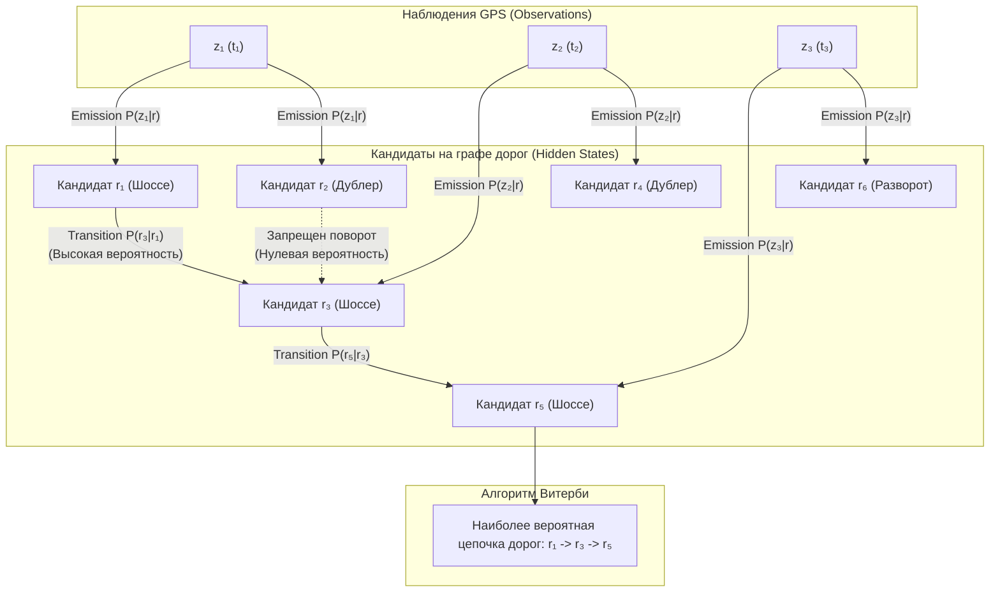

# Map Matching (HMM алгоритмы, привязка трека к графу OSRM и Valhalla)

> [!info] Навигация
> Родительский раздел: [[GPS & Tracking MOC]]

## Проблема: почему нельзя просто спроецировать точку на ближайшую дорогу?

При отображении трека автомобиля на карте наивный подход заключается в поиске ближайшего ребра дорожного графа:
$$e^* = \arg\min_{e \in E} \text{Distance}(P_{\text{gps}}, e)$$

Этот жадный метод катастрофически ошибается в реальном городе:
1. **Многоуровневые эстакады и тоннели:** GPS-точка находится ровно посередине между нижним ярусом Третьего транспортного кольца и верхним съездом. Жадный поиск начнет хаотично перебрасывать автомобиль между мостом и землей.
2. **Параллельные дублеры и трамвайные пути:** Машина едет по главному шоссе со скоростью 80 км/ч, но из-за шума в 5 метров точка падает ближе к параллельному одностороннему дворовому проезду.
3. **Запрещенные маневры:** Жадная привязка может «прилепить» точки так, что автомобиль совершит мгновенный разворот через двойную сплошную или поедет против шерсти по улице с односторонним движением.

**Map Matching** — задача восстановления истинного маршрута на графе дорожной сети по последовательности шумных и разреженных пространственно-временных наблюдений GPS.



---

## Математический фундамент: Скрытые Марковские Модели (HMM)

Современным де-факто стандартом привязки треков является алгоритм **Newson & Krumm (Microsoft Research, 2009)**, формулирующий задачу как поиск пути в Скрытой Марковской Модели (**Hidden Markov Model, HMM**).

В HMM:
- **Наблюдения (Observations $z_t$):** Сырые GPS-точки $(lat, lon, t)$.
- **Скрытые состояния (Hidden States $r_t$):** Истинные точки проекции на сегментах дорожного графа.

Алгоритм ищет последовательность состояний $R = (r_1, r_2, \dots, r_n)$, максимизирующую совместную апостериорную вероятность:
$$\arg\max_R \prod_{t=1}^n p(z_t \mid r_t) \cdot \prod_{t=2}^n p(r_t \mid r_{t-1})$$

### 1. Вероятность эмиссии (Emission Probability)
Отражает вероятность того, что истинная точка на дороге $r_t$ породит наблюдаемую точку GPS $z_t$. Моделируется как нормальное (Гауссово) распределение с нулевым средним и стандартным отклонением GPS $\sigma_z \approx 10$ м:
$$p(z_t \mid r_t) = \frac{1}{\sqrt{2\pi}\sigma_z} \exp\left(-\frac{\|z_t - r_t\|^2}{2\sigma_z^2}\right)$$
Чем ближе кандидат на дороге к GPS-точке, тем выше вероятность.

### 2. Вероятность перехода (Transition Probability)
Отражает физическую правдоподобность перехода автомобиля из кандидата $r_{t-1}$ в кандидат $r_t$.
Сравниваются две величины:
1. Прямое евклидово (геодезическое) расстояние между точками замера: $d_{\text{great\_circle}} = \|z_t - z_{t-1}\|$.
2. Длина кратчайшего легального маршрута по графу дорог: $d_{\text{network}} = \text{ShortestPathRoute}(r_{t-1}, r_t)$.

Вероятность задается экспоненциальным распределением:
$$p(r_t \mid r_{t-1}) = \frac{1}{\beta} \exp\left(-\frac{|d_{\text{great\_circle}} - d_{\text{network}}|}{\beta}\right)$$

> [!important] Физический смысл перехода
> Если реальная машина ехала по шоссе, расстояние по дороге $d_{\text{network}}$ почти в точности совпадет с расстоянием по воздуху $d_{\text{great\_circle}}$, то есть $|d_{\text{great\_circle}} - d_{\text{network}}| \approx 0 \implies$ вероятность максимальна.
> Если же алгоритм попробует перескочить на параллельный дублер, соединенный через далекую развязку, сетевое расстояние $d_{\text{network}}$ будет 2 км при расстоянии по воздуху 50 метров. Экспонента мгновенно обратит эту вероятность в ноль!

### 3. Алгоритм Витерби (Viterbi Algorithm)
Поиск глобально оптимальной последовательности выполняется методом динамического программирования (алгоритм Витерби) за время $O(T \cdot K^2)$, где $T$ — число точек трека, а $K$ — число кандидатов дорог для каждой точки (обычно $K = 5..10$).

---

## Промышленные движки Map Matching

### 1. OSRM (Open Source Routing Machine) — Match Service
Движок OSRM содержит сверхбыстрый сервис привязки `/match/v1/driving/`, написанный на C++ с использованием алгоритма Contraction Hierarchies.

**Пример запроса к OSRM Match API:**
```http
GET https://router.project-osrm.org/match/v1/driving/13.388860,52.517037;13.397634,52.529407;13.428555,52.523219?geometries=geojson&overview=full&timestamps=1678886400;1678886430;1678886460
```

### 2. Valhalla — Meili Map Matching Engine
**Meili** — микромодуль матчинга внутри графового движка Valhalla. Является самым продвинутым открытым решением на рынке:
- Поддерживает мультимодальность (автомобиль, велосипед, пешеход).
- Учитывает ограничения скорости, маневры и развороты.
- Возвращает сопоставленный трек с атрибутами дорог (название улицы, скоростной лимит, тип покрытия, тоннель/мост).

---

## TypeScript-клиент для Map Matching через OSRM

```typescript
export interface RawCoordinate {
  lon: number;
  lat: number;
  timestampSeconds?: number;
}

export interface MatchedResult {
  matchedCoordinates: [number, number][]; // Линия, привязанная к дорогам
  distanceMeters: number;
  durationSeconds: number;
  confidence: number; // От 0.0 до 1.0
}

export class OsrmMapMatcher {
  private baseUrl: string;

  constructor(baseUrl: string = 'https://router.project-osrm.org') {
    this.baseUrl = baseUrl.replace(/\/$/, '');
  }

  /**
   * Привязка трека к дорожному графу OpenStreetMap
   */
  public async matchTrack(
    points: RawCoordinate[],
    radiusesMeters: number = 25
  ): Promise<MatchedResult> {
    if (points.length < 2) {
      throw new Error('Для Map Matching требуется минимум 2 точки');
    }

    // OSRM ожидает формат "lon,lat;lon,lat;..."
    const coordsString = points.map((p) => `${p.lon.toFixed(6)},${p.lat.toFixed(6)}`).join(';');
    const radiusesString = points.map(() => radiusesMeters.toString()).join(';');

    let url = `${this.baseUrl}/match/v1/driving/${coordsString}?geometries=geojson&overview=full&radiuses=${radiusesString}`;

    if (points[0].timestampSeconds !== undefined) {
      const timestamps = points.map((p) => Math.round(p.timestampSeconds || 0)).join(';');
      url += `&timestamps=${timestamps}`;
    }

    const response = await fetch(url);
    if (!response.ok) {
      throw new Error(`OSRM Match error: ${response.status} ${response.statusText}`);
    }

    const data = await response.json();
    if (data.code !== 'Ok' || !data.matchings || data.matchings.length === 0) {
      throw new Error(`OSRM matching failed: ${data.message || 'No match found'}`);
    }

    // Берем наиболее правдоподобный сегмент сопоставления
    const bestMatch = data.matchings[0];

    return {
      matchedCoordinates: bestMatch.geometry.coordinates,
      distanceMeters: bestMatch.distance,
      durationSeconds: bestMatch.duration,
      confidence: bestMatch.confidence,
    };
  }
}
```

---

## Архитектурные рекомендации
1. **Предварительное прореживание трека:** Никогда не отправляйте в OSRM/Valhalla трек с частотой 10 Гц. Сначала выполните RDP или фильтр по расстоянию (оставляя точки с шагом 15–30 метров). Слишком частые точки увеличивают вычислительную нагрузку HMM без повышения точности.
2. **Батчинг при длительных поездках:** Публичные сервисы OSRM ограничивают длину URL (обычно до 100 точек на запрос). Разбивайте 500-километровый трек на перекрывающиеся батчи с оверлепом в 2–3 точки для гладкой склейки геометрий.
