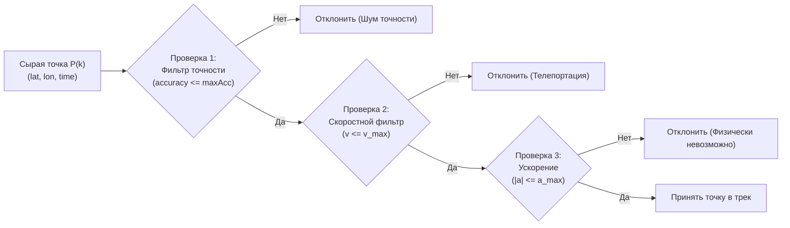

# Борьба с выбросами (Outlier Detection) по скорости и ускорению

> [!info] Навигация
> Родительский раздел: [[GPS & Tracking MOC]]

## Природа выбросов в спутниковом трекинге

Сырой поток геокоординат от любого GPS-трекера или смартфона изобилует аномалиями (Outliers, «выколотые точки», телепортации). Типичные сценарии:
1. **Городской каньон:** Автомобиль стоит на светофоре возле высотного здания со стеклянным фасадом. Отраженный сигнал создает иллюзию мгновенного скачка на 150 метров в сторону со скоростью 300 км/ч, а через 1 секунду точка возвращается обратно.
2. **Выезд из тоннеля / паркинга:** Приемник теряет сигнал на 5 минут, а при первом «холодном» захвате спутников выдает предварительную точку с погрешностью в десятки километров, прежде чем сойдется эфемеридный фильтр.
3. **Спуфинг и глушилки:** В зонах действия средств РЭБ координаты начинают хаотично метаться со сверхзвуковыми скоростями.

Если скармливать такой «грязный» трек в алгоритмы расчета пробега или отображения на карте, одометр накрутит лишние десятки километров, а полилиния превратится в «ежа» с длинными острыми шипами.



---

## Физико-математические критерии валидации

Для каждого движущегося объекта существуют фундаментальные кинематические ограничения реального мира.

### 1. Фильтр точности (Accuracy Gating)
Служба геолокации возвращает радиус погрешности `accuracy` (1-sigma / 68% доверительный интервал).
$$\text{Если } \text{accuracy}_k > \text{THRESHOLD}_{\text{acc}} \implies \text{DROP}$$
Типичные пороги: $\le 30$ м для автотранспорта, $\le 15$ м для бега и пешеходов.

### 2. Кинематический фильтр скорости (Velocity Threshold)
Расстояние между последовательными точками $P_{k-1}$ и $P_k$ вычисляется по формуле **Хаверсина (Haversine)** или геодезической дуге Винсенти.
Мгновенная путевая скорость:
$$v_k = \frac{\text{Distance}(P_{k-1}, P_k)}{\Delta t_k}, \quad \text{где } \Delta t_k = t_k - t_{k-1}$$

| Режим перемещения | Максимальная реалистичная скорость $v_{\max}$ |
| :--- | :--- |
| Пешеход / Турист | $15 \text{ км/ч} \approx 4.16 \text{ м/с}$ |
| Велосипед / Самокат | $50 \text{ км/ч} \approx 13.88 \text{ м/с}$ |
| Городской автомобиль | $160 \text{ км/ч} \approx 44.44 \text{ м/с}$ |
| Скоростной поезд / Самолет | $350 \text{ км/ч} / 1000 \text{ км/ч}$ |

Если $v_k > v_{\max}$, точка $P_k$ является явной телепортацией и бракуется.

### 3. Фильтр ускорения (Acceleration Validation)
Реальный автомобиль не может мгновенно разогнаться с 0 до 100 км/ч за 0.1 секунды. Предельное ускорение гражданского транспорта ограничено физикой сцепления шин с дорогой ($\approx 0.8..1.0 \, g$):
$$a_k = \frac{|v_k - v_{k-1}|}{\Delta t_k}$$
Порог: для автомобиля $|a_{\max}| \le 8.0 \text{ м/с}^2$, для пешехода $\le 3.0 \text{ м/с}^2$.

### 4. Треугольный фильтр разворота (Angle / Spike Detection)
Выброс часто выглядит как одиночный скачок в сторону и возврат назад. В этом случае угол между векторами $\vec{P_{k-1}P_k}$ и $\vec{P_k P_{k+1}}$ близок к $180^\circ$ (острый угол возврата):
$$\cos(\theta) = \frac{\vec{u} \cdot \vec{v}}{|\vec{u}| \cdot |\vec{v}|} \approx -1$$
Если точка отклоняется на большое расстояние, а следующая точка возвращается близко к исходной траектории — средняя точка отбрасывается как ложный спайк.

---

## Production-пайплайн очистки на TypeScript

Ниже представлена потоковая реализация очистки гео-трека в режиме реального времени:

```typescript
export interface TrackPoint {
  lat: number;
  lon: number;
  timestampMs: number;
  accuracy?: number;
}

export interface OutlierFilterConfig {
  maxAccuracyMeters: number;
  maxSpeedMps: number;
  maxAccelerationMps2: number;
  minDeltaTimeMs: number;
}

export class KinematicOutlierDetector {
  private lastAcceptedPoint: TrackPoint | null = null;
  private previousVelocityMps: number = 0;
  private config: OutlierFilterConfig;

  private readonly EARTH_RADIUS_METERS = 6371000;

  constructor(config?: Partial<OutlierFilterConfig>) {
    this.config = {
      maxAccuracyMeters: 35,       // Максимально допустимая погрешность
      maxSpeedMps: 45,             // 45 м/с = 162 км/ч (для авто)
      maxAccelerationMps2: 7.0,    // Допустимое ускорение (м/с²)
      minDeltaTimeMs: 200,         // Игнорируем дублирующие точки с разницей < 200мс
      ...config,
    };
  }

  /**
   * Вычисление расстояния по формуле Хаверсина
   */
  public getDistanceMeters(p1: TrackPoint, p2: TrackPoint): number {
    const toRad = Math.PI / 180;
    const dLat = (p2.lat - p1.lat) * toRad;
    const dLon = (p2.lon - p1.lon) * toRad;

    const a =
      Math.sin(dLat / 2) * Math.sin(dLat / 2) +
      Math.cos(p1.lat * toRad) * Math.cos(p2.lat * toRad) *
      Math.sin(dLon / 2) * Math.sin(dLon / 2);

    const c = 2 * Math.atan2(Math.sqrt(a), Math.sqrt(1 - a));
    return this.EARTH_RADIUS_METERS * c;
  }

  /**
   * Проверка входящей точки на валидность.
   * Возвращает true, если точка физически достоверна.
   */
  public validatePoint(point: TrackPoint): { isValid: boolean; reason?: string } {
    // 1. Проверка точности (accuracy)
    if (point.accuracy !== undefined && point.accuracy > this.config.maxAccuracyMeters) {
      return { isValid: false, reason: `Excessive accuracy error: ±${point.accuracy}m` };
    }

    // Первая точка всегда принимается как базовый ориентир
    if (!this.lastAcceptedPoint) {
      this.lastAcceptedPoint = point;
      return { isValid: true };
    }

    const dtSeconds = (point.timestampMs - this.lastAcceptedPoint.timestampMs) / 1000;

    // 2. Защита от дублей и отрицательного времени
    if (dtSeconds < (this.config.minDeltaTimeMs / 1000)) {
      return { isValid: false, reason: 'Time interval too short or negative' };
    }

    const distance = this.getDistanceMeters(this.lastAcceptedPoint, point);
    const speed = distance / dtSeconds;

    // 3. Проверка на максимальную скорость
    if (speed > this.config.maxSpeedMps) {
      return { isValid: false, reason: `Speed violation: ${(speed * 3.6).toFixed(1)} km/h` };
    }

    // 4. Проверка на максимальное ускорение
    const acceleration = Math.abs(speed - this.previousVelocityMps) / dtSeconds;
    if (this.previousVelocityMps > 0 && acceleration > this.config.maxAccelerationMps2) {
      return { isValid: false, reason: `Acceleration violation: ${acceleration.toFixed(2)} m/s²` };
    }

    // Точка прошла все фильтры
    this.lastAcceptedPoint = point;
    this.previousVelocityMps = speed;
    return { isValid: true };
  }

  public reset(): void {
    this.lastAcceptedPoint = null;
    this.previousVelocityMps = 0;
  }
}
```

---

## Архитектурные нюансы: «Ловушка первого ошибочного фикса»

Что произойдет, если первая точка поездки оказалась выбросом (например, из-за кэша сотовой вышки в другом районе города)? Если зафиксировать ее как `lastAcceptedPoint`, все последующие **правильные** точки будут отклоняться фильтром скорости как телепортация!

**Решение проблемы:**
Реализация скользящего счетчика отказов (Consecutive Rejections Counter):
- Если подряд бракуется более $N$ точек (например, 4–5 точек подряд), алгоритм объявляет сброс состояния (Reset State), сбрасывает предыдущий базис и инициализирует трек с новой пришедшей точки.
