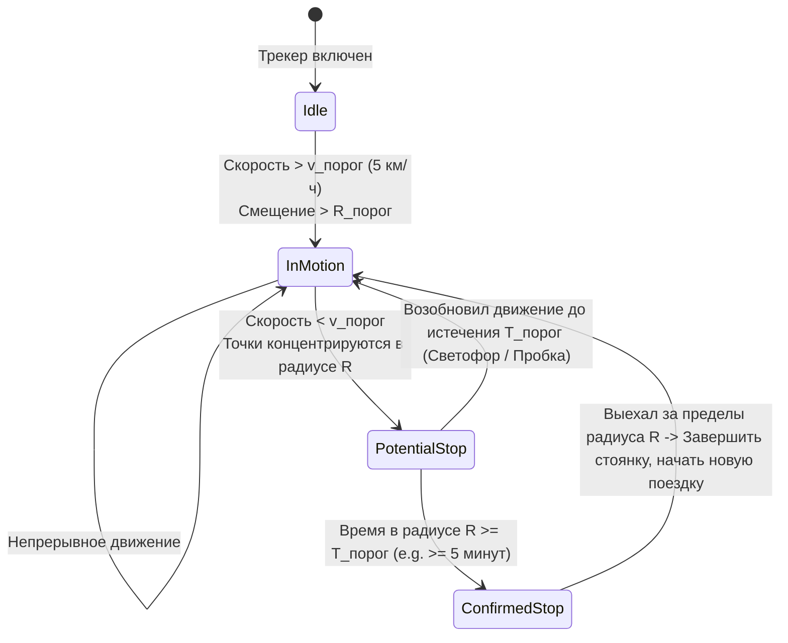

# Детекция остановок (Stop Detection) и сегментация поездок

> [!info] Навигация
> Родительский раздел: [[GPS & Tracking MOC]]

## Что такое сегментация трека и зачем она нужна

Сплошной сырой лог GPS-трекера за неделю представляет собой хаотичный массив из полумиллиона точек. В реальной жизни перемещение любого объекта (курьера, грузовика, шерингового электросамоката, туриста) дискретно и состоит из двух принципиально разных состояний:
1. **Поездка / Движение (Trip / Move):** Целенаправленное перемещение в пространстве из точки А в точку Б.
2. **Остановка / Стоянка (Stop / Stay / Dwell):** Нахождение в ограниченной области радиусом 10–50 метров в течение времени (разгрузка товара у клиента, ожидание светофора, ночная парковка, обед в кафе).

Если не выделять остановки, возникают классические проблемы телематики:
- **«Звездная болезнь» на стоянках:** Когда машина стоит на парковке 8 часов, GPS-приемник продолжает шуметь. На карте вокруг машины вырастает гигантский спутанный клубок линий, накручивая 3–5 километров фиктивного пробега («дрейф неподвижного приемника»).
- **Невозможность бизнес-аналитики:** Нельзя автоматически рассчитать KPI водителя: время в пути, среднюю скорость в движении, время простоя у клиента и расход топлива на холостом ходу.



---

## Алгоритмы обнаружения остановок

Существуют два основных подхода к детекции остановок:

### 1. Пространственно-временное окно (Time-Window Spatial Clustering)
Классический алгоритм Харихарана и Крамма (**Hariharan & Krumm, 2004**).
Остановка детектируется, если последовательность точек $P_i, \dots, P_j$ удовлетворяет двум условиям:
1. Временной интервал: $\Delta t = t_j - t_i \ge T_{\min}$ (например, не менее 300 секунд / 5 минут).
2. Пространственный разброс: диаметр охватывающего круга точек $\le 2 \cdot R_{\max}$ (например, не более 35 метров):
   $$\max_{k, m \in [i, j]} \text{Distance}(P_k, P_m) \le 2 \cdot R_{\max}$$

Все промежуточные точки схлопываются в одну точку стоянки с координатами центроида:
$$C = \left( \frac{1}{N}\sum \text{lat}_k, \, \frac{1}{N}\sum \text{lon}_k \right)$$

### 2. Плотность точек во времени: DBSCAN / ST-DBSCAN
Для оффлайн-аналитики исторических треков применяется алгоритм пространственно-временной кластеризации **ST-DBSCAN** (Spatio-Temporal DBSCAN). Он автоматически находит кластеры высокой плотности точек, учитывая как географическое расстояние ($\varepsilon_1$), так и разницу во времени ($\varepsilon_2$).

---

## Различие между светофором и реальной стоянкой

Критическая ошибка начинающих инженеров — считать остановкой любое падение скорости до нуля:
- **Задержка на светофоре или в заторе (Traffic Jam Delay):** Длится от 30 секунд до 2–3 минут. Автомобиль остается в фазе активного маршрута.
- **Бизнес-стоянка (True Stop):** Длится $\ge 5..10$ минут, двигатель часто глушится, координаты центроида стабильны.

| Тип события | Типичная длительность | Радиус дрейфа | Статус зажигания (ACC) | Действие алгоритма |
| :--- | :--- | :--- | :--- | :--- |
| **Светофор** | 30 – 120 сек | 5 – 15 м | Двигатель включен | Входит в состав текущей поездки (Trip) |
| **Погрузка / Разгрузка** | 5 – 30 минут | 20 – 40 м | Включен / Выключен | Создается маркер промежуточной стоянки |
| **Ночная стоянка** | > 2 часов | 10 – 30 м | Выключен | Трек закрывается, создается рубеж сегментации |

---

## Production-реализация детектора остановок на TypeScript

Потоковый класс, разделяющий сырой GPS-трек на массив поездок (Trips) и стоянок (Stops):

```typescript
export interface TrackPoint {
  lat: number;
  lon: number;
  timeMs: number;
  speedKmh?: number;
}

export interface StopEvent {
  centroid: [number, number]; // [lat, lon]
  startTimeMs: number;
  endTimeMs: number;
  durationSeconds: number;
  pointCount: number;
}

export interface TripSegment {
  points: TrackPoint[];
  distanceMeters: number;
  durationSeconds: number;
  avgSpeedKmh: number;
}

export class TrackSegmenter {
  private minStopDurationMs: number;
  private maxStopRadiusMeters: number;

  constructor(minStopDurationMinutes: number = 5, maxStopRadiusMeters: number = 30) {
    this.minStopDurationMs = minStopDurationMinutes * 60 * 1000;
    this.maxStopRadiusMeters = maxStopRadiusMeters;
  }

  private distanceMeters(p1: TrackPoint, p2: TrackPoint): number {
    const R = 6371000;
    const dLat = (p2.lat - p1.lat) * (Math.PI / 180);
    const dLon = (p2.lon - p1.lon) * (Math.PI / 180);
    const a =
      Math.sin(dLat / 2) ** 2 +
      Math.cos(p1.lat * (Math.PI / 180)) * Math.cos(p2.lat * (Math.PI / 180)) * Math.sin(dLon / 2) ** 2;
    return R * 2 * Math.atan2(Math.sqrt(a), Math.sqrt(1 - a));
  }

  /**
   * Сегментация массива сырых точек на упорядоченные отрезки поездок и стоянок
   */
  public segment(rawPoints: TrackPoint[]): { trips: TripSegment[]; stops: StopEvent[] } {
    const stops: StopEvent[] = [];
    const trips: TripSegment[] = [];

    if (rawPoints.length === 0) return { trips, stops };

    let i = 0;
    let currentTripPoints: TrackPoint[] = [];

    while (i < rawPoints.length) {
      let j = i + 1;
      let isStopFound = false;

      while (j < rawPoints.length) {
        const dist = this.distanceMeters(rawPoints[i], rawPoints[j]);

        // Если точка вышла за радиус стоянки
        if (dist > this.maxStopRadiusMeters) {
          const duration = rawPoints[j - 1].timeMs - rawPoints[i].timeMs;
          // Если мы провели в радиусе достаточно времени — это подтвержденная стоянка
          if (duration >= this.minStopDurationMs) {
            isStopFound = true;
          }
          break;
        }
        j++;
      }

      if (isStopFound) {
        // Завершаем текущую поездку, если в ней были точки
        if (currentTripPoints.length > 1) {
          trips.push(this.buildTrip(currentTripPoints));
          currentTripPoints = [];
        }

        // Вычисляем центроид стоянки
        const cluster = rawPoints.slice(i, j);
        const avgLat = cluster.reduce((sum, p) => sum + p.lat, 0) / cluster.length;
        const avgLon = cluster.reduce((sum, p) => sum + p.lon, 0) / cluster.length;
        const startTime = cluster[0].timeMs;
        const endTime = cluster[cluster.length - 1].timeMs;

        stops.push({
          centroid: [avgLat, avgLon],
          startTimeMs: startTime,
          endTimeMs: endTime,
          durationSeconds: Math.round((endTime - startTime) / 1000),
          pointCount: cluster.length,
        });

        // Перемещаем указатель за пределы стоянки
        i = j;
      } else {
        // Точка принадлежит движению
        currentTripPoints.push(rawPoints[i]);
        i++;
      }
    }

    if (currentTripPoints.length > 1) {
      trips.push(this.buildTrip(currentTripPoints));
    }

    return { trips, stops };
  }

  private buildTrip(points: TrackPoint[]): TripSegment {
    let totalDist = 0;
    for (let k = 1; k < points.length; k++) {
      totalDist += this.distanceMeters(points[k - 1], points[k]);
    }

    const durationSec = Math.max(1, (points[points.length - 1].timeMs - points[0].timeMs) / 1000);
    const avgSpeed = (totalDist / durationSec) * 3.6;

    return {
      points,
      distanceMeters: Math.round(totalDist),
      durationSeconds: Math.round(durationSec),
      avgSpeedKmh: parseFloat(avgSpeed.toFixed(1)),
    };
  }
}
```

---

## Архитектурная ценность для интерфейса Web GIS
1. **Интерактивные маркеры остановок:** Вместо гигантского клубка дрожащих линий на карте отображается аккуратная иконка парковки `[P]` с бейджем продолжительности: «Стоянка: 42 мин».
2. **Палитра скорости трека:** Поездки раскрашиваются градиентом скорости (зеленый -> желтый -> красный), а участки остановок визуально скрываются.
