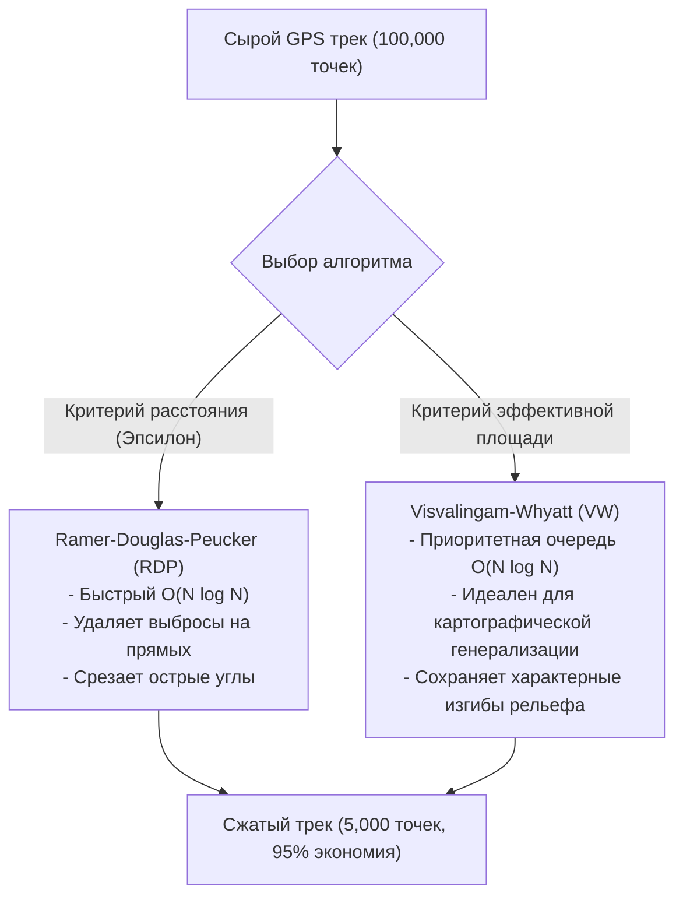

# Упрощение треков (Ramer-Douglas-Peucker, Visvalingam-Whyatt)

> [!info] Навигация
> Родительский раздел: [[GPS & Tracking MOC]]

## Зачем упрощать гео-треки?

При непрерывной записи GPS-трека с частотой 1 Гц за 8-часовую смену курьера или поездку на автомобиле накапливается около **28 800 точек**. При частоте 5 Гц — свыше **140 000 точек**.

Попытка отправить такой массив данных в браузер и отрисовать через MapLibre/Leaflet приводит к трем критическим проблемам:
1. **Гигантский размер JSON/GeoJSON:** Сырой файл весит 10–30 МБ, тратя трафик мобильных пользователей.
2. **Падение FPS и фризы WebGL/DOM:** Перегрузка GPU и буферов вершин видеопамяти.
3. **Визуальная избыточность:** На прямом 5-километровом участке шоссе сотни точек лежат практически на одной линии. Для идеальной отрисовки геометрии достаточно всего двух точек: начала и конца отрезка.

**Упрощение полилиний (Line Simplification)** — процесс сокращения количества вершин кривой при максимальном сохранении ее визуальной формы и географической топологии.



---

## 1. Алгоритм Рамера — Дугласа — Пекера (Ramer-Douglas-Peucker, RDP)

Классический алгоритм, основанный на парадигме **«Разделяй и властвуй» (Divide and Conquer)**.

### Математический принцип работы:
1. Соединяем прямой линией первую ($A$) и последнюю ($B$) точки сегмента трека.
2. Ищем точку $C$, которая максимально перпендикулярно удалена от отрезка $AB$:
   $$d_{\max} = \max_{i} \text{PerpendicularDistance}(P_i, AB)$$
3. Сравниваем $d_{\max}$ с заданным порогом $\varepsilon$ (Epsilon):
   - Если $d_{\max} \le \varepsilon$, все промежуточные точки между $A$ и $B$ удаляются.
   - Если $d_{\max} > \varepsilon$, точка $C$ **сохраняется**, а алгоритм рекурсивно вызывается для двух отрезков: от $A$ до $C$ и от $C$ до $B$.

```text
       C (макс. расстояние d > ε) -> СОХРАНЯЕМ!
      /\
     /  \
    /    \
   A------B  (базовый отрезок)
```

### Расчет перпендикулярного расстояния от точки до отрезка:
Для точки $P(x_0, y_0)$ и отрезка между $A(x_1, y_1)$ и $B(x_2, y_2)$:
$$d = \frac{|(y_2 - y_1)x_0 - (x_2 - x_1)y_0 + x_2 y_1 - y_2 x_1|}{\sqrt{(y_2 - y_1)^2 + (x_2 - x_1)^2}}$$

---

## 2. Алгоритм Висвалингама — Уайатта (Visvalingam-Whyatt, VW)

В то время как RDP оценивает расстояние до хорды, алгоритм Висвалингама — Уайатта удаляет точки на основе **эффективной площади треугольника** (Effective Area), образованного точкой и двумя ее соседями: $P_{i-1}, P_i, P_{i+1}$.

### Математический принцип:
1. Для каждой внутренней точки вычисляется площадь треугольника:
   $$\text{Area}(P_{i-1}, P_i, P_{i+1}) = \frac{1}{2} |x_{i-1}(y_i - y_{i+1}) + x_i(y_{i+1} - y_{i-1}) + x_{i+1}(y_{i-1} - y_i)|$$
2. Все точки помещаются в **Min-Priority Queue (кучу)** по значению площади.
3. Точка с наименьшей площадью последовательно извлекается и удаляется из трека. При удалении площади соседних треугольников пересчитываются.
4. Процесс повторяется, пока минимальная площадь не превысит порог или пока не останется желаемое количество точек $K$.

> [!tip] Преимущество Висвалингама
> Алгоритм VW создает значительно более плавную, естественную картографическую генерализацию. Он не «ломает» узкие длинные мысы и излучины рек, которые RDP часто срезает из-за малого перпендикулярного расстояния к основанию.

---

## Высокопроизводительная реализация RDP на TypeScript

```typescript
export type GeoPoint = [number, number]; // [lon, lat] или [x, y]

/**
 * Квадрат расстояния от точки p до отрезка v-w
 */
function getSqDistToSegment(p: GeoPoint, v: GeoPoint, w: GeoPoint): number {
  let l2 = (v[0] - w[0]) ** 2 + (v[1] - w[1]) ** 2;
  if (l2 === 0) return (p[0] - v[0]) ** 2 + (p[1] - v[1]) ** 2;

  // Проекция точки p на прямую v-w
  let t = ((p[0] - v[0]) * (w[0] - v[0]) + (p[1] - v[1]) * (w[1] - v[1])) / l2;
  t = Math.max(0, Math.min(1, t));

  const projX = v[0] + t * (w[0] - v[0]);
  const projY = v[1] + t * (w[1] - v[1]);

  return (p[0] - projX) ** 2 + (p[1] - projY) ** 2;
}

/**
 * Итеративная реализация Ramer-Douglas-Peucker (без риска переполнения стека)
 * @param points массив точек трека
 * @param tolerance допустимое отклонение (в градусах или метрах, если спроецировано)
 */
export function simplifyRDP(points: GeoPoint[], tolerance: number): GeoPoint[] {
  if (points.length <= 2) return points;

  const sqTolerance = tolerance * tolerance;
  const len = points.length;
  const markers = new Uint8Array(len);
  markers[0] = 1;
  markers[len - 1] = 1;

  // Стек индексов отрезков [startIndex, endIndex]
  const stack: [number, number][] = [[0, len - 1]];

  while (stack.length > 0) {
    const [first, last] = stack.pop()!;
    let maxSqDist = 0;
    let index = 0;

    for (let i = first + 1; i < last; i++) {
      const sqDist = getSqDistToSegment(points[i], points[first], points[last]);
      if (sqDist > maxSqDist) {
        index = i;
        maxSqDist = sqDist;
      }
    }

    if (maxSqDist > sqTolerance) {
      markers[index] = 1;
      stack.push([first, index]);
      stack.push([index, last]);
    }
  }

  const result: GeoPoint[] = [];
  for (let i = 0; i < len; i++) {
    if (markers[i]) {
      result.push(points[i]);
    }
  }

  return result;
}
```

---

## Сравнение алгоритмов упрощения

| Параметр | Рамер — Дуглас — Пекер (RDP) | Висвалингам — Уайатт (VW) | Radial Distance (Фильтр шага) |
| :--- | :--- | :--- | :--- |
| **Вычислительная сложность** | $O(N \log N)$ в среднем, $O(N^2)$ худший | $O(N \log N)$ (с Min-Heap) | $O(N)$ (Линейный) |
| **Критерий отбора** | Перпендикулярное расстояние $\varepsilon$ | Эффективная площадь треугольника | Евклидово расстояние между соседями |
| **Качество генерализации** | Отличное для дорожных треков | Идеальное для береговых линий и рельефа | Грубое (оставляет зубцы) |
| **Популярные JS-библиотеки** | `simplify-js`, `turf-simplify` | `topojson-simplify` | Встроено в `simplify-js` (highQuality: false) |

> [!important] Золотое правило веб-картографии: Проекция перед упрощением
> Если рассчитывать перпендикулярное расстояние непосредственно в угловых градусах WGS84 (`[lon, lat]`), то на широте Санкт-Петербурга ($60^\circ$) или Москвы ($55^\circ$) долготные градусы сжаты почти вдвое относительно широтных. В результате трек будет упрощаться асимметрично.
> **Решение:** Перед вызовом RDP переведите координаты в метры проекции Web Mercator (`EPSG:3857`) или UTM, упростите с допуском в метрах (например, $\varepsilon = 5.0$ метров), а затем верните обратно в WGS84.
