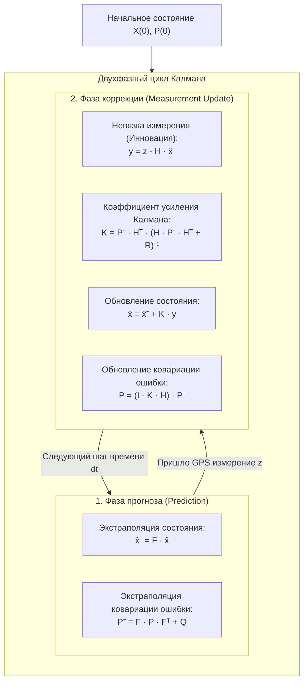

# Фильтр Калмана (Kalman Filter, EKF) для сглаживания координат

> [!info] Навигация
> Родительский раздел: [[GPS & Tracking MOC]]

## Что это такое и зачем он нужен в трекинге

Даже после отсечения грубых выбросов сырые GPS-координаты подвержены высокочастотному шуму: когда автомобиль едет строго по прямой трассе, последовательность точек рисует «пьяную» пилообразную змейку с амплитудой 2–6 метров.

Простое скользящее среднее (Moving Average) здесь не подходит, так как оно вносит **фазовую задержку (лаг)**: на поворотах и при резком торможении сглаженная метка будет опаздывать за реальным автомобилем, «срезая» углы перекрестков.

**Фильтр Калмана (Kalman Filter)** — оптимальный рекурсивный байесовский алгоритм, объединяющий:
1. **Математическую модель движения** (кинематику: где объект *должен* находиться согласно законам физики и предыдущей скорости).
2. **Физическое измерение** сенсора (зашумленную GPS-координату и ее точность `accuracy`).

Фильтр Калмана вычисляет динамический весовой коэффициент — **коэффициент усиления Калмана ($K$)**:
- Если GPS-приемник сообщает о высокой точности (`accuracy = 2.0` м), фильтр верит измерению и быстро подтягивает траекторию.
- Если сигнал ухудшился (`accuracy = 25.0` м), фильтр практически игнорирует измерение и продолжает экстраполировать движение по инерции.



---

## Математический аппарат (2D Constant Velocity Model)

Для сглаживания трека на плоскости в географических координатах или метрах проекции Web Mercator используется кинематическая модель постоянной скорости (**Constant Velocity, CV**).

### 1. Вектор состояния (State Vector)
Состояние объекта описывается 4-мерным вектором:
$$\mathbf{x} = \begin{bmatrix} x \\ y \\ v_x \\ v_y \end{bmatrix}$$
где $x, y$ — координаты (в метрах), а $v_x, v_y$ — скорости по осям (м/с).

### 2. Матрица перехода состояния (State Transition Matrix $F$)
За время $\Delta t$ положение меняется в соответствии со скоростью:
$$\mathbf{F} = \begin{bmatrix} 1 & 0 & \Delta t & 0 \\ 0 & 1 & 0 & \Delta t \\ 0 & 0 & 1 & 0 \\ 0 & 0 & 0 & 1 \end{bmatrix}$$

### 3. Матрица измерений (Measurement Matrix $H$)
GPS измеряет только координаты $(x, y)$, но не скорости:
$$\mathbf{H} = \begin{bmatrix} 1 & 0 & 0 & 0 \\ 0 & 1 & 0 & 0 \end{bmatrix}$$

### 4. Матрица шума процесса (Process Noise Covariance $Q$)
Отражает непредсказуемые ускорения объекта (рывки, торможения):
$$\mathbf{Q} = q \cdot \begin{bmatrix} \frac{\Delta t^4}{4} & 0 & \frac{\Delta t^3}{2} & 0 \\ 0 & \frac{\Delta t^4}{4} & 0 & \frac{\Delta t^3}{2} \\ \frac{\Delta t^3}{2} & 0 & \Delta t^2 & 0 \\ 0 & \frac{\Delta t^3}{2} & 0 & \Delta t^2 \end{bmatrix}$$
где $q$ — дисперсия ускорения (например, $1.0..3.0 \text{ м}^2/\text{с}^3$).

### 5. Матрица шума измерений (Measurement Noise Covariance $R$)
Определяется текущей погрешностью GPS-чипа (`accuracy`):
$$\mathbf{R} = \begin{bmatrix} \sigma_{\text{gps}}^2 & 0 \\ 0 & \sigma_{\text{gps}}^2 \end{bmatrix}$$

---

## 1D Упрощенный фильтр Калмана для Real-Time Web GIS

Для быстрой работы во Frontend без тяжелых матричных вычислений часто применяют независимые фильтры для широты и долготы (или метров Меркатора):

```typescript
export class KalmanLatLonFilter {
  // Дисперсия шума процесса (насколько быстро объект может менять скорость)
  private processNoise: number;
  // Оценка дисперсии ошибки измерения (по умолчанию)
  private measurementNoise: number;

  private lat: number = 0;
  private lon: number = 0;
  private varianceLat: number = -1; // -1 означает неинициализирован
  private varianceLon: number = -1;
  private lastTimestampMs: number = 0;

  constructor(processNoise: number = 3.0, defaultMeasurementNoise: number = 10.0) {
    this.processNoise = processNoise;
    this.measurementNoise = defaultMeasurementNoise;
  }

  /**
   * Сглаживание входящей точки
   * @param lat широта WGS84
   * @param lon долгота WGS84
   * @param accuracy точность GPS в метрах (из GeolocationCoordinates.accuracy)
   * @param timestampMs время фикса
   */
  public filter(lat: number, lon: number, accuracy: number, timestampMs: number): [number, number] {
    if (this.varianceLat < 0) {
      // Инициализация первой точки
      this.lat = lat;
      this.lon = lon;
      this.varianceLat = accuracy * accuracy;
      this.varianceLon = accuracy * accuracy;
      this.lastTimestampMs = timestampMs;
      return [lat, lon];
    }

    const dt = Math.max(0.1, (timestampMs - this.lastTimestampMs) / 1000);
    this.lastTimestampMs = timestampMs;

    // 1. Фаза прогноза: дисперсия ошибки растет со временем из-за неопределенности движения
    this.varianceLat += this.processNoise * dt;
    this.varianceLon += this.processNoise * dt;

    // 2. Фаза коррекции: расчет коэффициента усиления Калмана K
    const r = Math.max(accuracy * accuracy, 1.0); // Дисперсия шума текущего замера
    const kLat = this.varianceLat / (this.varianceLat + r);
    const kLon = this.varianceLon / (this.varianceLon + r);

    // 3. Обновление оценки координат
    this.lat = this.lat + kLat * (lat - this.lat);
    this.lon = this.lon + kLon * (lon - this.lon);

    // 4. Обновление дисперсии ошибки состояния
    this.varianceLat = (1 - kLat) * this.varianceLat;
    this.varianceLon = (1 - kLon) * this.varianceLon;

    return [this.lat, this.lon];
  }

  public reset(): void {
    this.varianceLat = -1;
    this.varianceLon = -1;
  }
}
```

---

## Расширенный фильтр Калмана (EKF) и Unscented (UKF)

Когда траектория движения существенно нелинейна (автомобиль дрифтует, совершает круговые маневры на развязках, или уравнения измерений включают нелинейные функции расстояния и углов):
- **Extended Kalman Filter (EKF):** Линеаризует нелинейные функции через разложение в ряд Тейлора первого порядка с вычислением матрицы частных производных — **Якобиана (Jacobian)** $J = \frac{\partial f}{\partial x}$.
- **Unscented Kalman Filter (UKF):** Вместо вычисления сложных якобианов использует детерминированный набор сигма-точек (**Sigma Points**), прогоняемых через нелинейную функцию. UKF точнее отслеживает резкие виражи и развороты.

---

## Настройка параметров $Q$ и $R$ на практике

| Ситуация | Симптом | Решение |
| :--- | :--- | :--- |
| **Слишком высокое сглаживание** | Метка сильно отстает от машины, «срезает» углы перекрестков | **Увеличить $Q$ (Process Noise)**: сообщить фильтру, что динамика объекта выше. |
| **Слишком слабое сглаживание** | Трек дрожит и дергается на светофорах | **Уменьшить $Q$** или убедиться, что передается реалистичный $R$ (`accuracy`). |
| **Прыжок при выезде из тоннеля** | Фильтр медленно тянется к новому положению | Принудительно сбрасывать фильтр (`reset()`), если $\Delta t > 10$ секунд или невязка измерения превышает правило трех сигм ($3\sigma$). |
