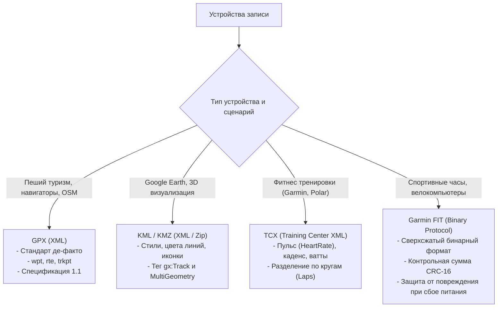

# Обменные форматы (GPX, KML, TCX, Garmin FIT)

> [!info] Навигация
> Родительский раздел: [[GPS & Tracking MOC]]

## Ландшафт форматов записи гео-треков

В мире навигации, спорта, туризма и телематики исторически сложилось несколько ключевых форматов для сохранения и обмена пространственно-временными траекториями. При разработке Web GIS приложений фронтенд-инженер обязан уметь парсить эти файлы при drag-and-drop загрузке пользователем и экспортировать их обратно.

Все форматы делятся на две категории:
1. **Текстовые XML-форматы:** GPX, KML, TCX (человекочитаемые, поддерживаются всеми открытыми библиотеками, но тяжелые по размеру).
2. **Бинарные форматы:** Garmin FIT (сверхкомпактные, оптимизированы под спортивные датчики и flash-память носимых гаджетов).



---

## 1. GPX (GPS Exchange Format)

**GPX** — открытый XML-стандарт, созданный компанией TopoGrafix в 2002 году. Поддерживается 100% навигаторов, трекеров и картографических сервисов (Garmin, Strava, Komoot, OsmAnd, AllTrails).

### Иерархия элементов GPX:
- `<wpt>` (**Waypoint**): Одиночная путевая точка интереса (POI), например «Вершина горы» или «Родник».
- `<rte>` (**Route**): Запланированный маршрут движения со списком контрольных поворотов (`<rtept>`).
- `<trk>` (**Track**): Фактически пройденный трек. Состоит из одного или нескольких сегментов `<trkseg>`, внутри которых содержатся упорядоченные точки `<trkpt>`.

```xml
<?xml version="1.0" encoding="UTF-8"?>
<gpx version="1.1" creator="WebGIS Tracker" xmlns="http://www.topografix.com/GPX/1/1">
  <metadata>
    <name>Вечерняя пробежка в парке</name>
    <time>2024-06-15T18:00:00Z</time>
  </metadata>
  <trk>
    <name>Трек #1</name>
    <trkseg>
      <trkpt lat="55.751244" lon="37.618423">
        <ele>156.4</ele>
        <time>2024-06-15T18:00:01Z</time>
        <extensions>
          <!-- Расширения Garmin TrackPointExtension v2 -->
          <gpxtpx:TrackPointExtension xmlns:gpxtpx="http://www.garmin.com/xmlschemas/TrackPointExtension/v2">
            <gpxtpx:hr>142</gpxtpx:hr>
            <gpxtpx:cad>85</gpxtpx:cad>
          </gpxtpx:TrackPointExtension>
        </extensions>
      </trkpt>
      <trkpt lat="55.751310" lon="37.618510">
        <ele>156.8</ele>
        <time>2024-06-15T18:00:02Z</time>
      </trkpt>
    </trkseg>
  </trk>
</gpx>
```

---

## 2. KML и KMZ (Keyhole Markup Language)

Формат разработан компанией Keyhole (приобретенной Google) и стандартизирован OGC. Родной формат **Google Earth** и **Google My Maps**.

### Особенности KML:
- Предназначен не просто для геометрии, но и для ее **оформления (стилизации)**: цвета линий `<LineStyle>`, ширина, прозрачность, кастомные иконки меток `<Style>` и HTML-описания в всплывающих балунах `<description>`.
- Для временных треков использует расширение `<gx:Track>`: параллельные массивы временных меток `<when>` и координат `<gx:coord>lon lat alt</gx:coord>`.
- **KMZ:** Обычный ZIP-архив, содержащий внутри файл `doc.kml` и папку с иконками/изображениями.

```xml
<?xml version="1.0" encoding="UTF-8"?>
<kml xmlns="http://www.opengis.net/kml/2.2" xmlns:gx="http://www.google.com/kml/ext/2.2">
  <Document>
    <name>Маршрут экспедиции</name>
    <Placemark>
      <name>Пройденный путь</name>
      <LineString>
        <extrude>1</extrude>
        <tessellate>1</tessellate>
        <altitudeMode>absolute</altitudeMode>
        <coordinates>
          37.618423,55.751244,156.4
          37.618510,55.751310,156.8
        </coordinates>
      </LineString>
    </Placemark>
  </Document>
</kml>
```

---

## 3. TCX (Training Center XML)

Специализированный фитнес-формат Garmin для записи циклических тренировок (бег, велоспорт, плавание).

### Ключевые отличия от GPX:
- Тренировка жестко разбита на круги/интервалы (`<Lap>`).
- Для каждого круга вычисляются суммарные агрегаты: общее время (`<TotalTimeSeconds>`), дистанция (`<DistanceMeters>`), сожженные калории (`<Calories>`), средний пульс.
- Точки `<Trackpoint>` содержат точные метрики датчиков: пульс (`<HeartRateBpm>`), каденс педалирования/шагов (`<Cadence>`) и датчики мощности в ваттах (`<Watts>`).

---

## 4. Garmin FIT (Flexible and Interoperable Data Transfer)

**FIT** — компактный бинарный протокол, разработанный дочерней компанией Garmin (Dynastream Innovations). Сегодня на нем работают все спортивные часы (Garmin Forerunner/Fenix, Coros, Suunto, Wahoo ELEMNT).

### Почему фитнес-индустрия перешла с GPX на FIT?
1. **Сжатие до 10 раз:** Текстовый GPX с пульсом и мощностью весит 5–10 МБ на одну длинную тренировку. Бинарный FIT-файл той же тренировки весит всего 200–400 КБ!
2. **Атомарность и устойчивость к сбоям:** Запись в flash-память часов идет короткими самодостаточными бинарными сообщениями. Если во время марафона у часов внезапно сядет аккумулятор, XML-файл останется незакрытым (сломанный синтаксис `</gpx>`), а FIT-файл поврежден не будет — все данные вплоть до последней секунды гарантированно сохранятся.
3. **Архитектура:** Состоит из заголовка (Header, 14 байт с CRC), последовательности записей (Data Records) и итоговой контрольной суммы файла CRC-16.

---

## Сравнительная таблица форматов

| Критерий | GPX 1.1 | KML / KMZ | TCX | Garmin FIT |
| :--- | :--- | :--- | :--- | :--- |
| **Формат данных** | XML Текст | XML / ZIP | XML Текст | Бинарный (Little-Endian) |
| **Размер файла** | Большой (1x) | Большой / Средний | Большой (1.2x) | **Сверхмалый (~0.1x)** |
| **Парсинг в браузере** | `DOMParser` / `@tmcw/togeojson` | `DOMParser` / `@tmcw/togeojson` | `DOMParser` | `fit-file-parser` (DataView) |
| **Поддержка стилей/цветов**| Нет (только через vendor tags) | **Да (полная стилизация)** | Нет | Нет |
| **Спортивные метрики (HR/Power)**| Только через Extensions | Нет | Да (нативно в схеме) | **Да (полная телеметрия)** |
| **Поддержка кругов (Laps)** | Нет | Нет | Да | Да |

---

## Парсинг GPX и KML в GeoJSON прямо в браузере

Библиотека `@tmcw/togeojson` позволяет мгновенно превратить любой GPX или KML файл в стандартную GeoJSON FeatureCollection:

```typescript
import { gpx, kml } from '@tmcw/togeojson';

export function parseTrackFileToGeoJSON(fileContent: string, format: 'gpx' | 'kml') {
  const dom = new DOMParser().parseFromString(fileContent, 'text/xml');

  // Проверка ошибок синтаксиса XML
  const parserError = dom.querySelector('parsererror');
  if (parserError) {
    throw new Error('Некорректный XML файл: ' + parserError.textContent);
  }

  if (format === 'gpx') {
    return gpx(dom);
  } else {
    return kml(dom);
  }
}
```
