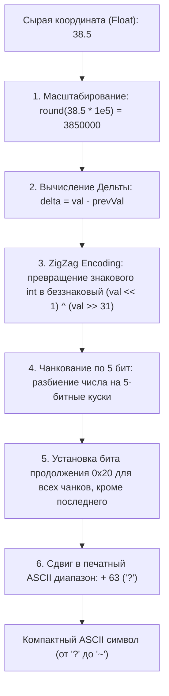

# Сжатие полилиний (Google Encoded Polyline Algorithm)

> [!info] Навигация
> Родительский раздел: [[GPS & Tracking MOC]]

## Что это такое и какую проблему решает

При передаче маршрутов из бэкенда во фронтенд (например, в ответ на запрос маршрутизации из OSRM, Valhalla или Google Directions API) возвращать массив координат в стандартном формате JSON крайне расточительно:

```json
[
  [37.617342, 55.755814],
  [37.617410, 55.755920],
  [37.617505, 55.756050]
]
```

Для маршрута длиной в 10 000 точек такой JSON весит более **400 КБ**. 

В 2006 году инженеры Google разработали **Encoded Polyline Algorithm Format** — алгоритм сжатия со сдвигом дельты (Delta Encoding) и упаковкой чисел в печатные ASCII-символы Base64-подобного алфавита. Та же самая линия из 10 000 точек сжимается в компактную ASCII-строку размером всего **35–45 КБ** (сжатие на **90%** без дополнительного gzip).

---

## Математический алгоритм кодирования (Шаг за шагом)

Алгоритм работает независимо для широты (Lat) и долготы (Lon), используя относительную разность между соседними точками (**Дельта-кодирование**).



### Детальные шаги алгоритма:

1. **Квантование (Fixed-Point Representation):**
   Координата умножается на масштабный коэффициент $10^5$ (для точности 5 знаков после запятой, что дает точность $\approx 1.1$ метра на экваторе) или $10^6$ (формат Polyline6 в OSRM/Valhalla с точностью 11 см) и округляется до ближайшего целого:
   $$\text{scaled} = \text{round}(\text{coord} \times 10^5)$$
2. **Дельта-кодирование (Delta Encoding):**
   Кодируется не абсолютное значение точки, а разность с предыдущей точкой:
   $$\Delta_k = \text{scaled}_k - \text{scaled}_{k-1}$$
   Поскольку соседние точки в треке находятся рядом, их дельты очень малы (обычно десятки или сотни единиц вместо миллионов).
3. **ZigZag кодирование знака:**
   Отрицательные числа в дополнительном коде начинаются с единичных старших битов. Zigzag маппит знаковые целые в беззнаковые, чередуя положительные и отрицательные:
   $$Z = \begin{cases} 2 \cdot \Delta & \text{если } \Delta \ge 0 \\ -2 \cdot \Delta - 1 & \text{если } \Delta < 0 \end{cases}$$
   В бинарном виде: `binary = (val < 0) ? ~(val << 1) : (val << 1)`.
4. **Разбиение на 5-битные чанки (Chunking):**
   Число разрезается на блоки по 5 бит с младших разрядов.
5. **Флаг продолжения (Continuity Bit):**
   Если после текущего 5-битного блока остаются еще значащие биты, в 6-й бит устанавливается единица (побитовое `| 0x20`). У последнего блока 6-й бит равен 0.
6. **Сдвиг ASCII диапазона:**
   К каждому 6-битному значению прибавляется `63` (код символа ASCII `?`). Это гарантирует, что итоговые байты попадут в диапазон печатных символов (`?`..`~`, коды 63..126) и никогда не будут содержать управляющих символов, кавычек или обратных слэшей, что позволяет передавать строку напрямую внутри JSON или URL параметров.

---

## Production-реализация на TypeScript (Кодирование и Декодирование)

```typescript
export type CoordinatePair = [number, number]; // [lat, lon]

export class PolylineCodec {
  /**
   * Декодирование Encoded Polyline строки в массив координат [lat, lon]
   * @param encoded закодированная строка
   * @param precision точность (5 для стандарта Google / 6 для Valhalla/OSRM Polyline6)
   */
  public static decode(encoded: string, precision: number = 5): CoordinatePair[] {
    const factor = Math.pow(10, precision);
    const coordinates: CoordinatePair[] = [];
    let index = 0;
    let lat = 0;
    let lon = 0;

    while (index < encoded.length) {
      // 1. Декодируем широту (Latitude)
      let shift = 0;
      let result = 0;
      let byte: number;

      do {
        byte = encoded.charCodeAt(index++) - 63;
        result |= (byte & 0x1f) << shift;
        shift += 5;
      } while (byte >= 0x20);

      const dLat = (result & 1) !== 0 ? ~(result >> 1) : result >> 1;
      lat += dLat;

      // 2. Декодируем долготу (Longitude)
      shift = 0;
      result = 0;

      do {
        byte = encoded.charCodeAt(index++) - 63;
        result |= (byte & 0x1f) << shift;
        shift += 5;
      } while (byte >= 0x20);

      const dLon = (result & 1) !== 0 ? ~(result >> 1) : result >> 1;
      lon += dLon;

      coordinates.push([lat / factor, lon / factor]);
    }

    return coordinates;
  }

  /**
   * Кодирование массива координат [lat, lon] в компактную строку Polyline
   */
  public static encode(points: CoordinatePair[], precision: number = 5): string {
    const factor = Math.pow(10, precision);
    let output = '';
    let prevLat = 0;
    let prevLon = 0;

    const encodeSignedNumber = (num: number): string => {
      let sgnNum = num < 0 ? ~(num << 1) : num << 1;
      let str = '';
      while (sgnNum >= 0x20) {
        str += String.fromCharCode((0x20 | (sgnNum & 0x1f)) + 63);
        sgnNum >>= 5;
      }
      str += String.fromCharCode(sgnNum + 63);
      return str;
    };

    for (let i = 0; i < points.length; i++) {
      const [lat, lon] = points[i];
      const scaledLat = Math.round(lat * factor);
      const scaledLon = Math.round(lon * factor);

      output += encodeSignedNumber(scaledLat - prevLat);
      output += encodeSignedNumber(scaledLon - prevLon);

      prevLat = scaledLat;
      prevLon = scaledLon;
    }

    return output;
  }
}
```

---

## Polyline5 против Polyline6

| Параметр | Polyline5 (Google Standard) | Polyline6 (OSRM / Valhalla Precision) |
| :--- | :--- | :--- |
| **Множитель масштаба** | $10^5$ ($100\,000$) | $10^6$ ($1\,000\,000$) |
| **Точность в пространстве** | $\approx 1.1$ метра | $\approx 11$ сантиметров |
| **Длина строки** | Компактнее на 10–15% | Чуть длиннее из-за дополнительных 5-битных блоков |
| **Применение** | Автомобильная навигация, отображение маршрутов на зумах 0–18 | Пешеходная навигация, точные съезды развязок, геодезия |

> [!tip] Готовые библиотеки
> В продакшене рекомендуется использовать высокооптимизированную библиотеку `@mapbox/polyline`. Она написана на чистом C-стиле JavaScript и обрабатывает сотни тысяч точек за миллисекунды.
