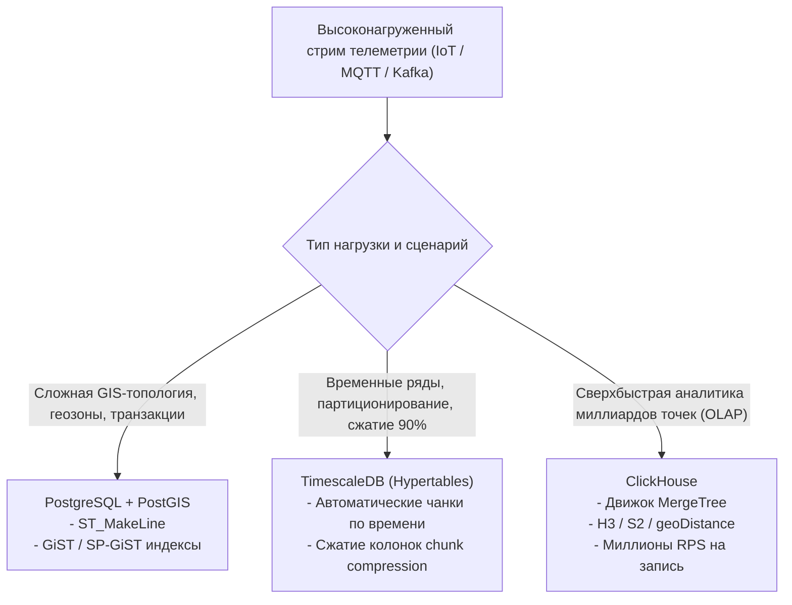

# Хранение временных рядов треков (TimescaleDB, ClickHouse, PostGIS ST_MakeLine)

> [!info] Навигация
> Родительский раздел: [[GPS & Tracking MOC]]

## Проблема масштабирования GPS-данных (Big Geodata)

GPS-трекинг флота из 10 000 автомобилей или курьеров генерирует при частоте 1 раз в 5 секунд:
- **120 000 записей в минуту**
- **7.2 миллиона строк в час**
- **172 миллиона строк в сутки**
- **~62 миллиарда строк в год**

Классическая реляционная СУБД (PostgreSQL / MySQL с B-Tree индексами) под такой нагрузкой деградирует за пару недель:
- Память под индексы (B-Tree) превышает объем доступного RAM.
- Время вставки (`INSERT`) падает с тысяч до сотен строк в секунду.
- Аналитические запросы (например, «показать среднюю скорость курьеров в районе Хамовники за прошлый вторник») приводят к многоминутным блокировкам дискового ввода-вывода (I/O).

Для эффективной работы с гео-телеметрией применяются три фундаментальных архитектурных паттерна:
1. **PostGIS с аггрегацией в траектории (`ST_MakeLine`);**
2. **Временно-пространственные гипертаблицы (TimescaleDB);**
3. **Колоночные аналитические СУБД сверхвысокой производительности (ClickHouse).**



---

## 1. PostgreSQL + PostGIS: Агрегация точек через ST_MakeLine

Вместо хранения трека в виде миллионов отдельных строк с точками, PostGIS позволяет агрегировать массив точек одной поездки в единую пространственную геометрию `LineString` с помощью функции **`ST_MakeLine`**.

### Паттерн создания полилинии из временного ряда точек:
```sql
-- Таблица сырых телеметрических сообщений
CREATE TABLE vehicle_telemetry (
    id BIGSERIAL,
    vehicle_id INT NOT NULL,
    recorded_at TIMESTAMPTZ NOT NULL,
    speed_kmh NUMERIC(5, 2),
    geom GEOMETRY(Point, 4326) NOT NULL
);

-- Пространственный индекс по точкам
CREATE INDEX idx_telemetry_geom ON vehicle_telemetry USING GIST (geom);
CREATE INDEX idx_telemetry_vehicle_time ON vehicle_telemetry (vehicle_id, recorded_at);

-- Сборка всей поездки автомобиля в одну геометрию LineString:
SELECT 
    vehicle_id,
    DATE(recorded_at) AS trip_date,
    COUNT(*) AS total_points,
    ROUND((ST_Length(ST_Transform(ST_MakeLine(geom ORDER BY recorded_at), 3857)) / 1000)::numeric, 2) AS distance_km,
    ST_AsGeoJSON(ST_MakeLine(geom ORDER BY recorded_at)) AS geojson_track
FROM vehicle_telemetry
WHERE vehicle_id = 42 
  AND recorded_at >= '2024-06-15 00:00:00+00' 
  AND recorded_at < '2024-06-16 00:00:00+00'
GROUP BY vehicle_id, DATE(recorded_at);
```

> [!tip] PostGIS Trajectory Data Type (ST_AddMeasure)
> Для 4D-трекинга (Широта, Долгота, Высота, Время) в PostGIS используется тип `LineStringM` (где $M$ — Measure, время эпохи UNIX). Функция `ST_LocateAlong` позволяет мгновенно интерполировать и вернуть точную точку автомобиля в любую секунду времени $T$, даже если в эту точную секунду GPS-фикс отсутствовал!

---

## 2. TimescaleDB: Временные ряды и автоматическое сжатие

**TimescaleDB** — расширение для PostgreSQL, превращающее его в распределенную базу данных временных рядов без потери возможностей PostGIS.

### Ключевые преимущества:
- **Гипертаблицы (Hypertables):** Данные автоматически партиционируются по времени (например, чанки по 1 дню или 1 неделе). Новые вставки всегда попадают в «горячий» чанк в оперативной памяти.
- **Колоночное сжатие (Native Columnar Compression):** Старые чанки автоматически сжимаются на **90–95%**. При этом таблица остается доступной для прямых SQL/PostGIS запросов!

```sql
-- Создание обычной таблицы
CREATE TABLE gps_pings (
    time TIMESTAMPTZ NOT NULL,
    device_id UUID NOT NULL,
    latitude DOUBLE PRECISION NOT NULL,
    longitude DOUBLE PRECISION NOT NULL,
    elevation REAL,
    speed REAL,
    heading REAL
);

-- Превращение в гипертаблицу TimescaleDB с чанками по 1 дню
SELECT create_hypertable('gps_pings', 'time', chunk_time_interval => INTERVAL '1 day');

-- Включение сжатия (сортировка по времени, группировка по устройству)
ALTER TABLE gps_pings SET (
    timescaledb.compress,
    timescaledb.compress_segmentby = 'device_id',
    timescaledb.compress_orderby = 'time DESC'
);

-- Политика: сжимать данные старше 7 дней
SELECT add_compression_policy('gps_pings', INTERVAL '7 days');
```

---

## 3. ClickHouse: Экстремальная OLAP-производительность

Для сервисов каршеринга, такси и городского мониторинга масштаба сотен тысяч бортов непревзойденным лидером является колоночная СУБД **ClickHouse**.

### Почему ClickHouse доминирует в аналитике трекинга:
1. **Скорость вставки:** Способен поглощать более **1 000 000 строк в секунду** на один сервер без блокировок.
2. **Векторизованные гео-функции:** В ClickHouse встроены сверхбыстрые функции расчета расстояний:
   - `greatCircleDistance(lon1, lat1, lon2, lat2)`
   - `geoDistance(lon1, lat1, lon2, lat2)` — расчет на WGS84 эллипсоиде
   - Встроенные индексы дискретной глобальной сетки: **Uber H3** (`geoToH3`) и **Google S2**.

### Схема таблицы трекинга в ClickHouse:
```sql
CREATE TABLE default.device_track_pings (
    device_id UInt32,
    timestamp DateTime64(3, 'UTC'),
    longitude Float64,
    latitude Float64,
    speed Float32,
    course Float32,
    accuracy Float32,
    h3_index UInt64 DEFAULT geoToH3(longitude, latitude, 9)
)
ENGINE = MergeTree()
PARTITION BY toYYYYMM(timestamp)
PRIMARY KEY (device_id, timestamp)
ORDER BY (device_id, timestamp)
SETTINGS index_granularity = 8192;
```

### Аналитический запрос: Суммарный пробег всего автопарка за день
```sql
SELECT 
    device_id,
    count() AS total_pings,
    -- Векторизованный расчет суммы расстояний между соседними точками
    round(sum(geoDistance(
        longitude, 
        latitude, 
        anyOrNull(longitude) OVER (PARTITION BY device_id ORDER BY timestamp ROWS BETWEEN 1 PRECEDING AND 1 PRECEDING),
        anyOrNull(latitude) OVER (PARTITION BY device_id ORDER BY timestamp ROWS BETWEEN 1 PRECEDING AND 1 PRECEDING)
    )) / 1000, 2) AS total_mileage_km
FROM default.device_track_pings
WHERE timestamp >= '2024-06-15 00:00:00' AND timestamp < '2024-06-16 00:00:00'
GROUP BY device_id
ORDER BY total_mileage_km DESC
LIMIT 10;
```

---

## Сравнительная матрица выбора хранилища гео-треков

| Критерий | PostgreSQL + PostGIS | TimescaleDB | ClickHouse |
| :--- | :--- | :--- | :--- |
| **Тип базы данных** | Реляционная СУБД (OLTP) | Time-Series + Реляционная | Колоночная аналитическая (OLAP) |
| **Предельный поток вставок** | До 10 000 строк/сек | До 50 000 строк/сек | **> 1 000 000 строк/сек** |
| **Сложные гео-операции** | **Идеально** (все 500+ функций PostGIS) | Отлично (PostGIS в комплекте) | Базовые гео-дистанции, H3, полигоны |
| **Сжатие данных на диске** | Слабое (1x) | Отличное (5–10x) | **Экстремальное (10–20x)** |
| **Изменение / удаление строк** | Нативно (`UPDATE`, `DELETE`) | Нативно | Ограничено (`ALTER TABLE UPDATE`) |
| **Рекомендуемая роль** | Мастер-данные, геозоны, актуальное текущее положение флота | Хранение истории треков за последние 1–6 месяцев | Долгосрочный архив сотен миллиардов точек, тепловые карты (Heatmaps), Big Data |
