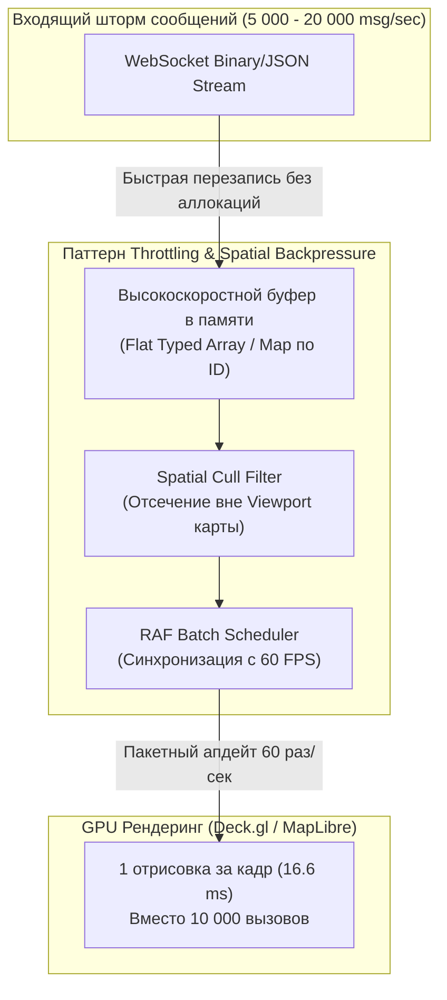
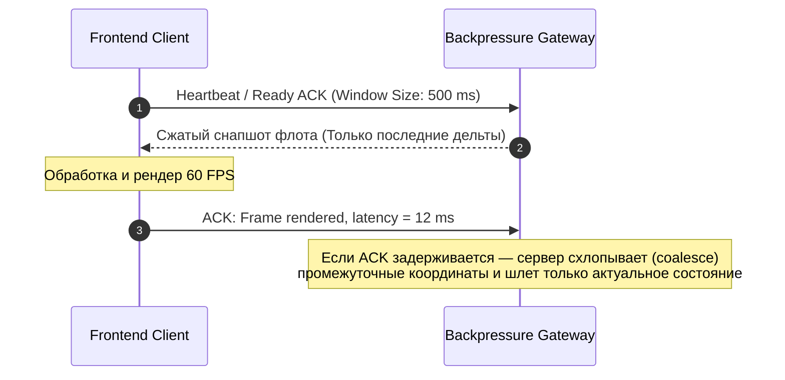

# Backpressure и throttling потоков координат при тысячах объектов

> [!info] Навигация
> Родительский раздел: [[GPS & Tracking MOC]]

## Проблема «цунами сообщений» во Frontend

При мониторинге крупного флота (например, 15 000 такси, каршерингов или курьеров) серверный брокер может выплескивать во фронтенд от $5\,000$ до $20\,000$ сообщений о координатах в секунду. 

Если фронтенд-инженер пытается обновлять состояние интерфейса наивным способом (`socket.onmessage = (msg) => updateState(msg)`), происходит мгновенный коллапс приложения:
1. **Event Loop Starvation:** Очередь макротасок браузера забивается обработчиками событий сокета. Браузер перестает реагировать на пользовательский ввод (клики, зум карты, переключение вкладок).
2. **Garbage Collection Churn:** Создание сотен тысяч мелких JavaScript-объектов в секунду провоцирует частые паузы сборщика мусора (Stop-The-World GC spikes на 100–300 мс).
3. **Дропы кадров карты (Jank):** Движок карты (MapLibre/Mapbox) пытается пересчитывать геометрию GeoJSON на каждый чих вместо синхронизации с частотой развертки экрана ($60\text{ Гц} / 120\text{ Гц}$, то есть раз в $16.6\text{ мс}$).



---

## Архитектурные паттерны защиты фронтенда

### 1. In-place Update по ID вместо создания новых объектов
Вместо накопления массива `events.push(msg)` используется плоский ассоциативный массив или `Map<VehicleId, Float64Array>`, где новые координаты машины **мутируют** уже выделенный буфер в памяти, не создавая мусора для GC.

### 2. RAF-Batched Throttling (Синхронизация с разверткой монитора)
Обновление координат на карте имеет физический смысл не чаще, чем происходит отрисовка кадра дисплеем ($60\text{ FPS} \rightarrow 16.6\text{ мс}$, $120\text{ FPS} \rightarrow 8.3\text{ мс}$). Все сообщения, поступившие между кадрами, лишь обновляют последнее целевое состояние. В момент срабатывания `requestAnimationFrame` карта обновляется единым пакетом.

### 3. Spatial Viewport Culling (Пространственное отсечение)
Если диспетчер приблизил карту к району центра города, нет никакого смысла передавать в визуализацию 14 000 машин, находящихся в других регионах.

---

## Продакшн-реализация: Высокопроизводительный Telemetry Stream Throttle

Ниже приведена промышленная реализация диспетчера телеметрии на TypeScript с поддержкой Bounding Box фильтрации и пакетного сброса в GPU:

```typescript
export interface RawVehicleTelemetry {
  id: number;
  lng: number;
  lat: number;
  bearing: number;
  speed: number;
  timestamp: number;
}

// Bounding Box: [minLng, minLat, maxLng, maxLat]
export type BoundingBox = [number, number, number, number];

export class HighThroughputTelemetryPipeline {
  // Хранилище последних позиций: ID -> TypedArray [lng, lat, bearing, speed, timestamp]
  // Использование Float64Array полностью устраняет GC аллокации при частых апдейтах
  private vehiclePositions = new Map<number, Float64Array>();
  
  // Флаг того, изменились ли данные с момента предыдущего кадра
  private isDirty = false;
  private rafId: number | null = null;
  private currentViewport: BoundingBox | null = null;

  constructor(
    private readonly onFlushToMap: (activeVehicles: Map<number, Float64Array>) => void,
    private readonly maxVehiclesLimit: number = 20000
  ) {
    this.startLoop();
  }

  // Быстрый синхронный прием координаты из сокета
  public push(telemetry: RawVehicleTelemetry): void {
    let record = this.vehiclePositions.get(telemetry.id);

    if (!record) {
      if (this.vehiclePositions.size >= this.maxVehiclesLimit) {
        return; // Защита от переполнения памяти клиента
      }
      record = new Float64Array(5);
      this.vehiclePositions.set(telemetry.id, record);
    }

    // In-place перезапись ячеек памяти без вызова new Object()
    record[0] = telemetry.lng;
    record[1] = telemetry.lat;
    record[2] = telemetry.bearing;
    record[3] = telemetry.speed;
    record[4] = telemetry.timestamp;

    this.isDirty = true;
  }

  // Обновление Bounding Box при панорамировании / зуме карты
  public setViewport(bbox: BoundingBox): void {
    this.currentViewport = bbox;
    this.isDirty = true;
  }

  // Запуск цикла синхронизации с частотой кадров (60/120 FPS)
  private startLoop(): void {
    const tick = () => {
      if (this.isDirty) {
        this.flush();
        this.isDirty = false;
      }
      this.rafId = requestAnimationFrame(tick);
    };
    this.rafId = requestAnimationFrame(tick);
  }

  // Сброс отфильтрованных координат на уровень рендера
  private flush(): void {
    if (!this.currentViewport) {
      this.onFlushToMap(this.vehiclePositions);
      return;
    }

    const [w, s, e, n] = this.currentViewport;
    const visibleVehicles = new Map<number, Float64Array>();

    for (const [id, data] of this.vehiclePositions.entries()) {
      const lng = data[0];
      const lat = data[1];

      // Простейшая проверка попадания точки в Bounding Box (AABB)
      if (lng >= w && lng <= e && lat >= s && lat <= n) {
        visibleVehicles.set(id, data);
      }
    }

    this.onFlushToMap(visibleVehicles);
  }

  public destroy(): void {
    if (this.rafId !== null) {
      cancelAnimationFrame(this.rafId);
    }
    this.vehiclePositions.clear();
  }
}
```

---

## Backpressure на стороне сервера: WebSocket Windowing и Coalescing

Если входящий поток превышает пропускную способность соединения клиента (например, диспетчер работает через мобильный модем или медленный Wi-Fi), сетевой буфер браузера заполняется, и данные начинают отставать от реального времени на десятки секунд.



### Паттерн State Coalescing на шлюзе
Серверный шлюз ведет промежуточный буфер `Map<VehicleId, LastCoords>`. Если клиент не успевает вычитывать сокет, сервер не ставит 10 промежуточных точек в очередь, а перезаписывает значение для этого `VehicleId`. В итоге клиент получает только самое свежее положение без накопления лага (Zero-Lag Delivery).

---

## Сравнение подходов к троттлингу координат

| Подход | Задержка | Нагрузка на CPU | Риск потери плавности |
| :--- | :--- | :--- | :--- |
| **Naive (Апдейт на каждое WS сообщение)** | $0\text{ мс}$ | Критическая ($100\%$, фризы UI) | Непригодно для $>500$ объектов |
| **`lodash.throttle(fn, 100)`** | $\le 100\text{ мс}$ | Средняя (таймеры вне синхронизации с V-Sync) | Возможен тиринг и микрорывки |
| **RAF Batching + Float64Array (Золотой стандарт)** | $\le 16.6\text{ мс}$ | Минимальная ($\le 5\%$ CPU) | Идеальные стабильные 60 кадров/сек |

> [!tip] Контроль памяти при удалении объектов
> Если машина уходит на техническое обслуживание или выходит из зоны обслуживания, сервер должен присылать событие `TOMBSTONE` или `REMOVED`. Не забывайте удалять записи из `vehiclePositions`, иначе длительная работа диспетчерской вкладки (например, сутки без перезагрузки) приведет к утечке памяти.
