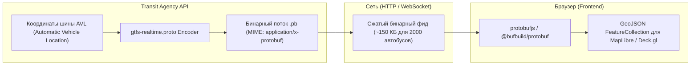
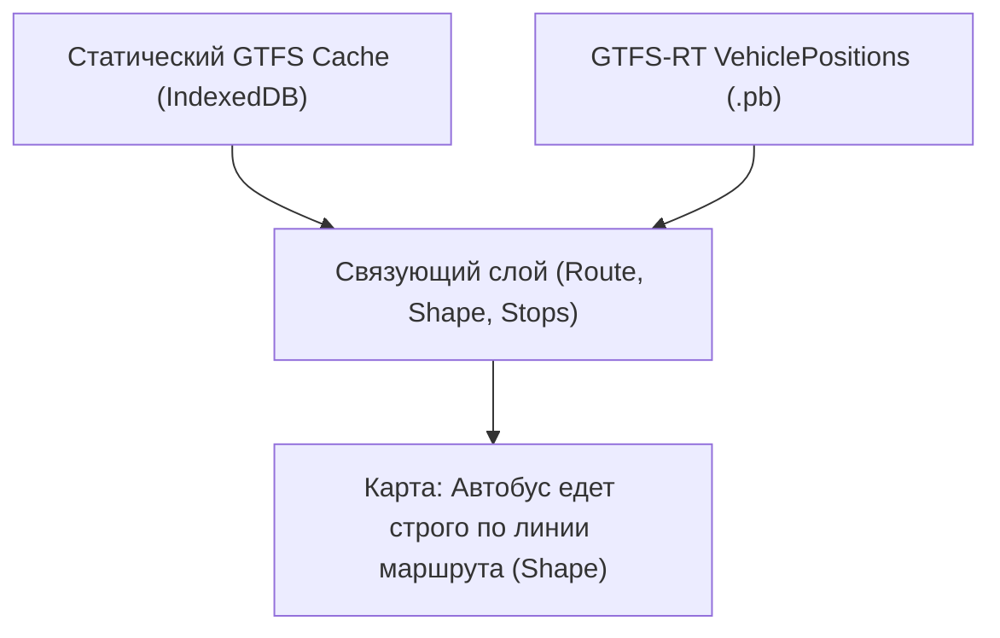

# GTFS Realtime (GTFS-RT Vehicle Positions) и Protocol Buffers

> [!info] Навигация
> Родительский раздел: [[GPS & Tracking MOC]]

## Что такое GTFS Realtime

**General Transit Feed Specification Realtime (GTFS-RT)** — это международный открытый стандарт обмена оперативной информацией об общественном транспорте (автобусы, трамваи, поезда метро, паромы), разработанный Google и консорциумом MobilityData.

В то время как статический **GTFS** описывает расписание, остановки, геометрию маршрутов (shapes.txt) и тарифы в виде набора CSV-файлов, **GTFS-RT** предоставляет динамические обновления:
1. **Trip Updates:** Задержки рейсов, отмены, изменения маршрута следования.
2. **Alerts:** Сервисные оповещения (ремонт путей, аварии).
3. **Vehicle Positions:** Текущие GPS-координаты подвижного состава, привязка к рейсу, текущий статус остановки, скорость и курс (bearing).

---

## Почему Protocol Buffers (Protobuf)

В отличие от статического GTFS (CSV/ZIP), спецификация GTFS Realtime строго базируется на бинарном формате сериализации **Protocol Buffers (v2/v3)** от Google.



### Преимущества Protobuf над GeoJSON/JSON в городском транспорте:
1. **Компактность данных:** Для крупного мегаполиса с 5000 автобусами JSON-фид весит $pprox 3.5	ext{ МБ}$, а аналогичный бинарный Protobuf — всего $pprox 180-250	ext{ КБ}$.
2. **Скорость декодирования:** Браузер декодирует типизированный бинарный буфер в 4–8 раз быстрее, чем выполняется `JSON.parse()` над гигантской строкой.
3. **Строгая обратная совместимость:** Добавление новых полей в `.proto`-схему не ломает клиентские парсеры старых версий.

---

## Анатомия структуры VehiclePosition (`gtfs-realtime.proto`)

Ключевой фрагмент официальной protobuf-схемы GTFS Realtime:

```protobuf
syntax = "proto2";
package transit_realtime;

message FeedMessage {
  required FeedHeader header = 1;
  repeated FeedEntity entity = 2;
}

message FeedEntity {
  required string id = 1;
  optional bool is_deleted = 2 [default = false];
  optional TripUpdate trip_update = 3;
  optional VehiclePosition vehicle = 4;
  optional Alert alert = 5;
}

message VehiclePosition {
  optional TripDescriptor trip = 1;
  optional VehicleDescriptor vehicle = 8;
  optional Position position = 2;
  optional uint32 current_stop_sequence = 3;
  optional string stop_id = 7;
  optional VehicleStopStatus current_status = 4 [default = IN_TRANSIT_TO];
  optional uint64 timestamp = 5;
  optional CongestionLevel congestion_level = 6;
  optional OccupancyStatus occupancy_status = 9;

  enum VehicleStopStatus {
    INCOMING_AT = 0;      // Приближается к остановке
    STOPPED_AT = 1;       // Стоит на остановке
    IN_TRANSIT_TO = 2;    // В пути к остановке
  }
}

message Position {
  required float latitude = 1;
  required float longitude = 2;
  optional float bearing = 3;       // Курс в градусах (0..360 по часовой стрелке от Севера)
  optional double odometer = 4;     // Пробег в метрах
  optional float speed = 5;         // Скорость в метрах в секунду (м/с)
}
```

---

## Декодирование GTFS-RT на клиенте (TypeScript + Protobuf.js)

Для декодирования фида в браузере используется `protobufjs` или скомпилированные TypeScript-типы:

```typescript
import protobuf from "protobufjs";
import type { FeatureCollection, Point } from "geojson";

// 1. Определение интерфейсов декодированного сообщения
export interface GtfsVehicleFeatureProperties {
  vehicleId: string;
  label: string;
  routeId: string;
  tripId: string;
  speedKmh: number;
  bearing: number;
  status: "INCOMING_AT" | "STOPPED_AT" | "IN_TRANSIT_TO";
  updatedAt: number;
  occupancy?: string;
}

export class GtfsRealtimeClient {
  private root: protobuf.Root | null = null;
  private feedMessageType: protobuf.Type | null = null;

  // Инициализация proto-схемы (может быть вкомпилирована статически или загружена json-дескриптором)
  public async init(protoJsonOrUrl: string | object): Promise<void> {
    if (typeof protoJsonOrUrl === "string") {
      this.root = await protobuf.load(protoJsonOrUrl);
    } else {
      this.root = protobuf.Root.fromJSON(protoJsonOrUrl);
    }
    this.feedMessageType = this.root.lookupType("transit_realtime.FeedMessage");
  }

  // Загрузка и декодирование бинарного фида по HTTP
  public async fetchVehiclePositions(feedUrl: string): Promise<FeatureCollection<Point, GtfsVehicleFeatureProperties>> {
    if (!this.feedMessageType) {
      throw new Error("GTFS Realtime Client не инициализирован. Вызовите init()");
    }

    const response = await fetch(feedUrl, {
      headers: {
        "Accept": "application/x-protobuf, application/octet-stream"
      }
    });

    if (!response.ok) {
      throw new Error(`Ошибка загрузки GTFS-RT фида: ${response.status} ${response.statusText}`);
    }

    const arrayBuffer = await response.arrayBuffer();
    const uint8Array = new Uint8Array(arrayBuffer);

    // Десериализация бинарного буфера
    const decodedMessage = this.feedMessageType.decode(uint8Array) as any;
    const feed = this.feedMessageType.toObject(decodedMessage, {
      enums: String,
      longs: Number,
      defaults: true
    });

    return this.transformToGeoJSON(feed);
  }

  // Преобразование FeedMessage в стандартный GeoJSON для MapLibre / OpenLayers
  private transformToGeoJSON(feed: any): FeatureCollection<Point, GtfsVehicleFeatureProperties> {
    const features: any[] = [];

    for (const entity of feed.entity || []) {
      const v = entity.vehicle;
      if (!v || !v.position || typeof v.position.latitude !== "number" || typeof v.position.longitude !== "number") {
        continue;
      }

      const speedMps = v.position.speed || 0;
      const speedKmh = Math.round(speedMps * 3.6);

      features.push({
        type: "Feature",
        id: v.vehicle?.id || entity.id,
        geometry: {
          type: "Point",
          coordinates: [v.position.longitude, v.position.latitude]
        },
        properties: {
          vehicleId: v.vehicle?.id || entity.id,
          label: v.vehicle?.label || v.vehicle?.licensePlate || entity.id,
          routeId: v.trip?.routeId || "Unknown",
          tripId: v.trip?.tripId || "",
          speedKmh,
          bearing: v.position.bearing || 0,
          status: v.currentStatus || "IN_TRANSIT_TO",
          updatedAt: v.timestamp ? v.timestamp * 1000 : Date.now(),
          occupancy: v.occupancyStatus
        }
      });
    }

    return {
      type: "FeatureCollection",
      features
    };
  }
}
```

---

## Привязка Realtime позиций к статическому GTFS (Shapes и Расписание)

Ключевая ценность GTFS-RT на фронтенде раскрывается в связке с реляционными данными статического GTFS:

| Статический GTFS (`.txt`) | Ключ связи | Динамический GTFS-RT (`.pb`) | Отображение на карте |
| :--- | :--- | :--- | :--- |
| `trips.txt` | `trip_id` | `trip.trip_id` | Определение маршрута следования, конечной станции |
| `routes.txt` | `route_id` | `trip.route_id` | Цвет линии на карте (`route_color`), номер автобуса |
| `shapes.txt` | `shape_id` | (через `trip_id`) | Отрисовка трассы движения (Polyline) под маркером |
| `stops.txt` | `stop_id` | `stop_id` | Подсветка следующей остановки по ходу движения |



> [!tip] Производительность: перенос декодирования в Web Worker
> Никогда не декодируйте фид размером более 1 МБ в основном UI-потоке. Передавайте `ArrayBuffer` через `postMessage({ buffer }, [buffer])` (Zero-copy Transferable Objects) в фоновый **Web Worker**, где бинарный Protobuf парсится и преобразуется в типизированный массив координат без замораживания карты.
