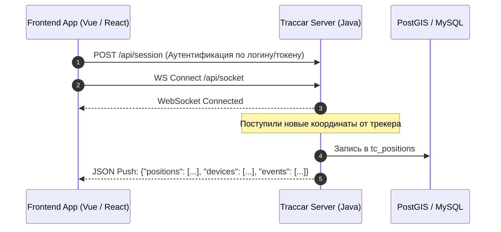

# Телематические протоколы (Wialon IPS, Teltonika, Traccar)

> [!info] Навигация
> Родительский раздел: [[GPS & Tracking MOC]]

## Мир профессиональной телематики

В потребительском сегменте координаты обычно генерируются смартфонами и отправляются в JSON/HTTP. В промышленном мониторинге транспорта (Fleet Management, спецтехника, логистика рефрижераторов) источником данных выступают автономные аппаратные бортовые контроллеры (**GPS/GLONASS трекеры**).

Эти устройства работают в жестких условиях: нестабильная сотовая связь (2G/GPRS, NB-IoT, LTE-M), жесткие ограничения на трафик SIM-карт и необходимость передавать не только координаты, но и показания десятков датчиков:
- Уровень топлива в баках (ДУТ через интерфейс RS-485).
- Данные CAN-шины автомобиля (обороты двигателя, температура охлаждающей жидкости, педаль газа, пробег).
- Температурные датчики 1-Wire (для рефрижераторов с заморозкой).
- Статус зажигания (ACC / DIN1), тревожная кнопка (SOS), метки водителей iButton/RFID.

Для решения этих задач были созданы специализированные телематические протоколы: **Wialon IPS**, **Teltonika Codec 8/8 Extended/16** и открытая платформа-шлюз **Traccar**.

```mermaid
flowchart LR
    subgraph Hardware ["Бортовое оборудование автопарка"]
        T1["Teltonika FMC130 (CAN + ДУТ)"]
        T2["Navtelecom / Galileosky"]
        T3["OBD-II Dongle"]
    end

    subgraph TelematicsHub ["Телематический шлюз"]
        Traccar["Traccar Server (Порты 5001-5150)"]
        Parser["Декодер бинарных кодеков"]
    end

    subgraph BusinessLogic ["Бизнес-логика & API"]
        EventProc["Детектор сливов топлива и геозон"]
        WSServer["WebSocket / WebSub Gateway"]
    end

    subgraph FrontendApp ["Диспетчерский Frontend"]
        Map["MapLibre: Иконки авто с курсом"]
        Sensors["Дашборд: Топливо, CAN-шина, Водитель"]
    end

    Hardware -->|"TCP/UDP пакеты"| Traccar
    Traccar --> Parser --> EventProc --> WSServer --> FrontendApp
```



---

## 1. Протокол Wialon IPS (Текстовый и полубинарный)

Разработан компанией Gurtam для системы Wialon. Представляет собой легковесный протокол обмена через постоянное TCP/UDP-соединение. Каждое сообщение разделяется символами `\r\n`.

### Структура пакета сообщений Wialon IPS:
- `#L#` — Пакет авторизации трекера по IMEI:
  `#L#358245000000001;NA\r\n` (IMEI трекера; Пароль). Ответ сервера: `#AL#1\r\n` (1 — успешно).
- `#D#` — Пакет полных навигационных данных:
  `#D#date;time;lat1;lat2;lon1;lon2;speed;course;alt;sats;hdop;inputs;outputs;adc;ibutton;params\r\n`

#### Пример сырого пакета `#D#`:
```text
#D#100926;211500;5545.1234;N;03737.5678;E;65;142;180;14;1.2;1;0;12.6,4.8;;fuel:1:142.5,temp:1:22.4,engine_hours:2:1240.5\r\n
```

#### Разбор полей для фронтенда:
- `5545.1234;N` — $55^\circ 45.1234'$ N. Для перевода в десятичные градусы WGS-84:
  $$\text{Lat} = 55 + \frac{45.1234}{60} = 55.752056^\circ$$
- `03737.5678;E` — $37^\circ 37.5678'$ E:
  $$\text{Lon} = 37 + \frac{37.5678}{60} = 37.626130^\circ$$
- `params` — расширенные датчики в формате `ключ:тип:значение` (`fuel:1:142.5` — аналоговый датчик уровня топлива, 142.5 литра).

---

## 2. Семейство бинарных протоколов Teltonika (Codec 8, 8 Extended, 16)

Оборудование литовской компании Teltonika (FMB920, FMC130, FMM640) является самым массовым в коммерческом мониторинге. Протокол **Codec 8** передает данные в компактном бинарном виде (Big-Endian).

### Структура фрейма данных Teltonika Codec 8:

| Смещение (байты) | Размер | Название | Описание |
| :--- | :--- | :--- | :--- |
| `0..3` | 4 байта | Preamble | Всегда `0x00000000` |
| `4..7` | 4 байта | Data Field Length | Длина блока данных |
| `8` | 1 байт | Codec ID | `0x08` (Codec 8), `0x8E` (Codec 8 Ext), `0x10` (Codec 16) |
| `9` | 1 байт | Number of Data 1 | Количество AVL-записей в пакете ($N$) |
| `10..X` | Переменный | AVL Data Array | Массив записей телеметрии |
| `X+1` | 1 байт | Number of Data 2 | Контрольное число записей (должно совпадать с $N$) |
| `X+2..X+5` | 4 байта | CRC-16 | Контрольная сумма пакета (полином `0xA001`) |

### Структура одной записи AVL Data:
1. **Timestamp:** 8 байт (UNIX epoch в миллисекундах).
2. **Priority:** 1 байт (0 — Low, 1 — High, 2 — Panic/SOS).
3. **GPS Element (15 байт):**
   - Longitude (4 байта, int32 со знаком, градусы $\times 10^7$).
   - Latitude (4 байта, int32 со знаком, градусы $\times 10^7$).
   - Altitude (2 байта, метры).
   - Angle / Bearing (2 байта, $0..360^\circ$).
   - Satellites (1 байт, число спутников).
   - Speed (2 байта, км/ч).
4. **IO Element:** Переменный размер. Передача сработавших дискретных и аналоговых входов (зажигание, ДУТ, акселерометр).

---

## 3. Traccar: Универсальный шлюз и его WebSocket API для Frontend

**Traccar** — самая популярная в мире Open Source платформа GPS-трекинга (поддерживает $>200$ протоколов, включая Teltonika, Wialon, Concox, Suntech, Queclink, Meitrack). 

В архитектуре современного диспетчерского фронтенда Traccar выступает в роли транслятора: он слушает сотни TCP/UDP-портов трекеров, нормализует разрозненные бинарные форматы в единую модель данных и отдает их фронтенду через **WebSocket API**.



### TypeScript: Клиент для Traccar WebSocket API

```typescript
export interface TraccarPosition {
  id: number;
  deviceId: number;
  protocol: string;
  serverTime: string;
  deviceTime: string;
  fixTime: string;
  valid: boolean;
  latitude: number;
  longitude: number;
  altitude: number;
  speed: number;       // Узлы (knots), для км/ч умножать на 1.852
  course: number;      // Направление (0-360)
  address?: string;
  accuracy: number;
  attributes: {
    batteryLevel?: number;
    ignition?: boolean;
    motion?: boolean;
    totalDistance?: number;
    fuel?: number;     // Литры
    temp1?: number;    // Температура рефрижератора
    charge?: boolean;
    alarm?: string;
  };
}

export interface TraccarSocketMessage {
  devices?: Array<{ id: number; name: string; status: string; lastUpdate: string }>;
  positions?: TraccarPosition[];
  events?: Array<{ id: number; type: string; serverTime: string; deviceId: number }>;
}

export class TraccarLiveStream {
  private socket: WebSocket | null = null;

  constructor(
    private readonly host: string,
    private readonly onData: (msg: TraccarSocketMessage) => void
  ) {}

  public connect(): void {
    // В Traccar WebSocket использует ту же сессию cookie (JSESSIONID) после REST-логина
    const protocol = window.location.protocol === "https:" ? "wss:" : "ws:";
    const url = `${protocol}//${this.host}/api/socket`;

    this.socket = new WebSocket(url);

    this.socket.onmessage = (event) => {
      try {
        const payload: TraccarSocketMessage = JSON.parse(event.data);
        this.onData(payload);
      } catch (err) {
        console.error("[TraccarLiveStream] Ошибка парсинга пакета:", err);
      }
    };

    this.socket.onclose = () => {
      console.warn("[TraccarLiveStream] Соединение разорвано. Переподключение через 3 секунды...");
      setTimeout(() => this.connect(), 3000);
    };
  }

  public disconnect(): void {
    this.socket?.close();
  }
}
```

---

## Сравнительная таблица протоколов

| Характеристика | Wialon IPS | Teltonika Codec 8 | Traccar Unified Model |
| :--- | :--- | :--- | :--- |
| **Формат кодирования** | Текстовый ASCII | Чистый Binary (Big Endian) | Нормализованный JSON / REST / WS |
| **Расход трафика на точку** | $\approx 80-150$ байт | $\approx 35-50$ байт (экстремально сжат) | $\approx 200-400$ байт (в веб-сокете) |
| **Парсинг на фронтенде** | Требует парсинга строк и долей минут | Требует DataView / ArrayBuffer | Готовый объект TypeScript с полями |
| **Поддержка сенсоров** | Гибкая через key-value params | Фиксированная/динамическая IO таблица | Расширяемый объект `attributes: {}` |

> [!tip] Практический совет при конвертации единиц скорости
> Обратите внимание: Traccar отдает скорость трекера в **узлах (морских милях в час)**:
> $$V_{\text{км/ч}} = V_{\text{knots}} \times 1.852$$
> Всегда конвертируйте эту величину на фронтенде перед выводом в UI карточки автомобиля.
