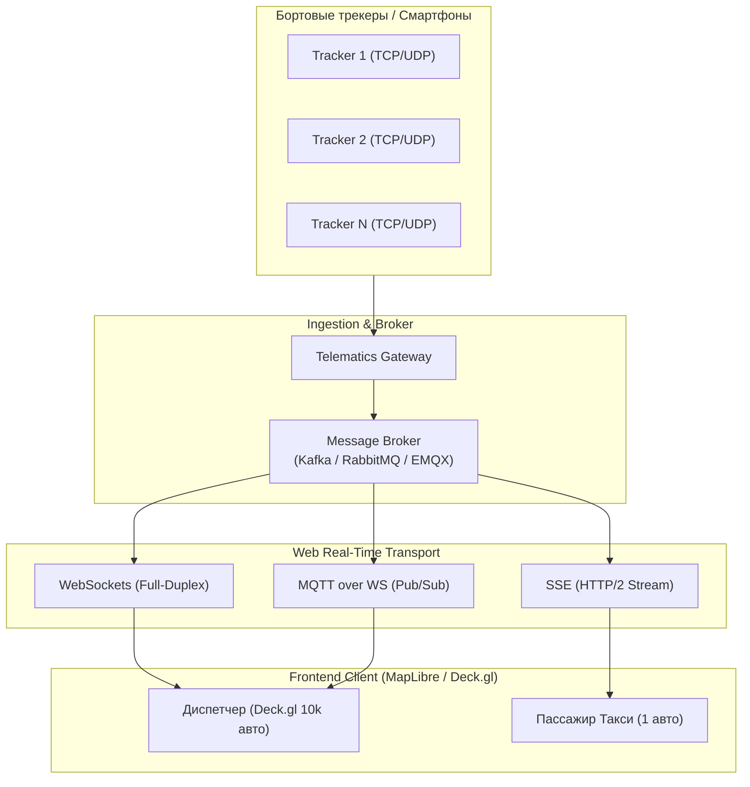
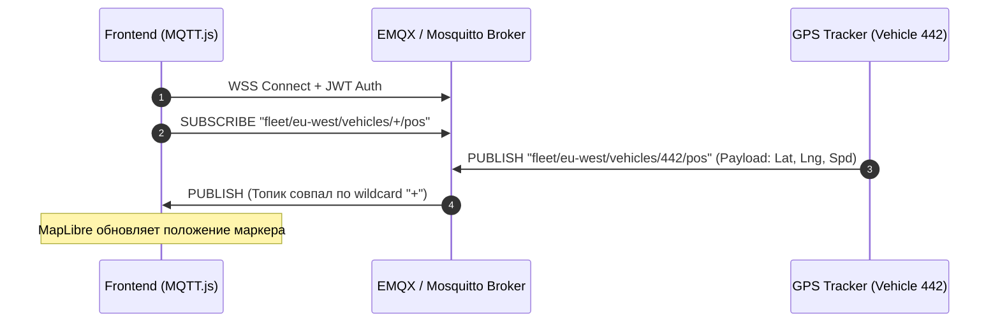
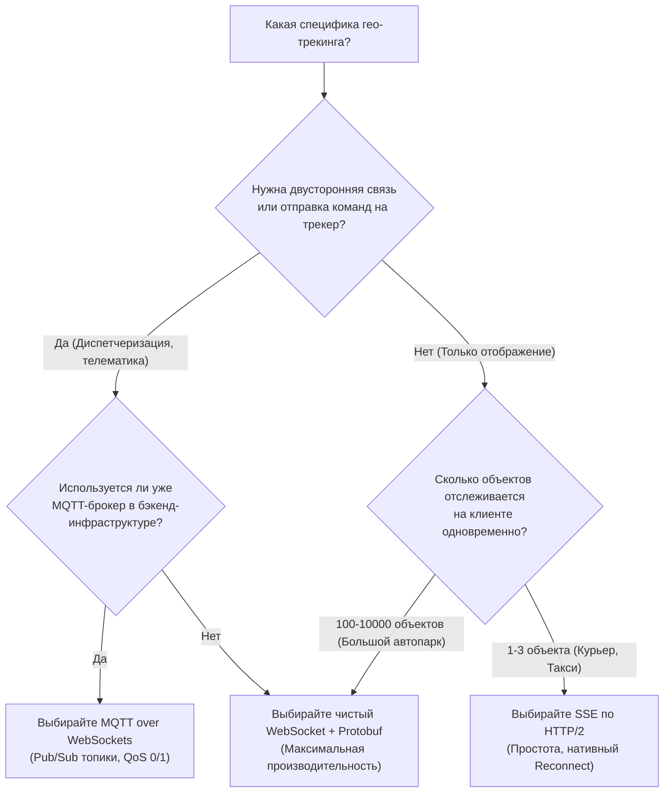

# Транспорт в веб — WebSockets vs SSE vs MQTT over WebSockets

> [!info] Навигация
> Родительский раздел: [[GPS & Tracking MOC]]

## Проблема стриминга координат в браузер

В классических Web-приложениях клиент запрашивает данные по запросу (Pull-модель через REST или GraphQL). В системах мониторинга транспорта (Fleet Management, диспетчерские такси, трекинг курьеров) поток телеметрии является непрерывным (Push-модель). Перемещение сотен или десятков тысяч объектов с частотой обновления от $1\text{ Гц}$ до $10\text{ Гц}$ делает традиционный HTTP-поллинг катастрофически неэффективным:
- **HTTP Short Polling:** Создает колоссальный overhead TCP/TLS-рукопожатий и HTTP-заголовков (от 500 байт до 2 КБ на запрос при полезной нагрузке координаты всего в 30–50 байт).
- **HTTP Long Polling:** Снижает трафик в моменты простоя, но при высокой частоте сообщений деградирует в частые переподключения с задержками и накапливанием очередей.

Для доставки геоданных с низкой задержкой (Low-latency $\le 100\text{ мс}$) применяются потоковые веб-протоколы: **WebSockets**, **Server-Sent Events (SSE)** и **MQTT over WebSockets**.



---

## Архитектурное сравнение протоколов

| Критерий | WebSockets (RFC 6455) | Server-Sent Events (SSE) | MQTT over WebSockets |
| :--- | :--- | :--- | :--- |
| **Направление** | Двунаправленный (Full-Duplex) | Однонаправленный (Server-to-Client) | Двунаправленный (Pub/Sub брокер) |
| **Базовый протокол** | Отдельный протокол поверх TCP (`ws://`, `wss://`) | Стандартный HTTP/1.1 или HTTP/2 (`text/event-stream`) | Стек MQTT поверх WebSocket-фреймов |
| **Overhead на пакет** | 2–10 байт framing | 5–15 байт (`data: ...\n\n`) | 2–5 байт MQTT header + 2–4 байта WS frame |
| **Бинарные данные** | Нативная поддержка (`ArrayBuffer`, `Blob`, Protobuf) | Только UTF-8 текст (требуется Base64-кодирование) | Нативная поддержка бинарного payload |
| **Мультиплексирование** | 1 TCP-сокет = 1 соединение | Автоматически мультиплексируется в HTTP/2 | Множество топиков внутри одного сокета |
| **Reconnect и Recovery** | Ручная реализация логики повтора и очереди | Нативно встроено в браузер (`EventSource`, `Last-Event-ID`) | Нативно встроено в клиентскую библиотеку MQTT |
| **Прохождение через Proxy** | Иногда блокируется строгими корпоративными прокси | Проходит через любые корпоративные прокси как HTTP | Проходит через прокси, поддерживающие WSS |
| **Подписки по фильтрам** | Кастомный протокол на стороне сервера | URL-параметры или переподключение с новым URL | Иерархические топики (`fleet/+/vehicle/123/telemetry`) |

---

## 1. WebSockets (Низкий оверхед и высокая частота)

WebSocket устанавливает постоянное дуплексное TCP-соединение после HTTP-Upgrade рукопожатия. Это идеальный выбор для внутренних высоконагруженных диспетчерских интерфейсов, где требуется как прием потока, так и отправка гео-команд (блокировка двигателя, опрос статуса датчиков, подписка на bounding box карты).

### TypeScript: Robust WebSocket Client с Protobuf и Heartbeat

```typescript
import { decodePositionUpdate, PositionUpdate } from "./proto/telemetry";

export interface TrackerConnectionOptions {
  url: string;
  reconnectIntervalMs?: number;
  maxReconnectAttempts?: number;
  heartbeatIntervalMs?: number;
  onPosition: (pos: PositionUpdate) => void;
  onStatusChange: (connected: boolean) => void;
}

export class RobustTrackerSocket {
  private ws: WebSocket | null = null;
  private reconnectAttempts = 0;
  private isExplicitClose = false;
  private heartbeatTimer?: number;

  constructor(private readonly opts: TrackerConnectionOptions) {
    this.opts.reconnectIntervalMs = opts.reconnectIntervalMs ?? 3000;
    this.opts.maxReconnectAttempts = opts.maxReconnectAttempts ?? 10;
    this.opts.heartbeatIntervalMs = opts.heartbeatIntervalMs ?? 15000;
    this.connect();
  }

  public connect(): void {
    this.isExplicitClose = false;
    this.ws = new WebSocket(this.opts.url);
    this.ws.binaryType = "arraybuffer";

    this.ws.onopen = () => {
      this.reconnectAttempts = 0;
      this.opts.onStatusChange(true);
      this.startHeartbeat();
    };

    this.ws.onmessage = (event: MessageEvent) => {
      if (event.data instanceof ArrayBuffer) {
        // Декодирование бинарного Protobuf payload без накладных расходов JSON
        const update = decodePositionUpdate(new Uint8Array(event.data));
        this.opts.onPosition(update);
      }
    };

    this.ws.onclose = () => {
      this.stopHeartbeat();
      this.opts.onStatusChange(false);
      if (!this.isExplicitClose) {
        this.scheduleReconnect();
      }
    };

    this.ws.onerror = (err) => {
      console.error("[RobustTrackerSocket] Ошибка сокета:", err);
    };
  }

  private scheduleReconnect(): void {
    if (this.reconnectAttempts < (this.opts.maxReconnectAttempts ?? 10)) {
      this.reconnectAttempts++;
      // Экспоненциальный бэкофф с джиттером
      const jitter = Math.random() * 1000;
      const delay = Math.min(this.opts.reconnectIntervalMs! * Math.pow(1.5, this.reconnectAttempts) + jitter, 30000);
      window.setTimeout(() => this.connect(), delay);
    }
  }

  private startHeartbeat(): void {
    this.stopHeartbeat();
    this.heartbeatTimer = window.setInterval(() => {
      if (this.ws && this.ws.readyState === WebSocket.OPEN) {
        // Легковесный пинг для предотвращения разрыва соединения NAT/Firewall
        this.ws.send(new Uint8Array([0x09])); // Ping opcode byte
      }
    }, this.opts.heartbeatIntervalMs);
  }

  private stopHeartbeat(): void {
    if (this.heartbeatTimer) clearInterval(this.heartbeatTimer);
  }

  public updateViewport(bbox: [number, number, number, number]): void {
    if (this.ws && this.ws.readyState === WebSocket.OPEN) {
      // Отправка границ видимости карты (Spatial Bounding Box) для отсечения лишнего
      this.ws.send(JSON.stringify({ type: "SET_VIEWPORT", bbox }));
    }
  }

  public close(): void {
    this.isExplicitClose = true;
    this.stopHeartbeat();
    this.ws?.close();
  }
}
```

---

## 2. Server-Sent Events (SSE) в связке с HTTP/2

Server-Sent Events — это однонаправленный механизм передачи текстовых событий от сервера к клиенту поверх стандартного протокола HTTP. 
Главное преимущество раскрывается при использовании **HTTP/2 (h2)**: в отличие от HTTP/1.1, где действует лимит браузера на максимум 6 соединений на домен, в HTTP/2 поток SSE мультиплексируется внутри единственного TCP-соединения рядом с загрузкой тайлов карты, стилей и скриптов.

### Применение:
- Пассажирские приложения (трекинг одного назначенного такси или курьера к двери).
- Мониторинг статуса рейса или парома.

```typescript
export function subscribeToDriverStream(
  orderId: string,
  onCoords: (point: { lat: number; lng: number; bearing: number }) => void
): () => void {
  const eventSource = new EventSource(`/api/v1/orders/${orderId}/tracking-stream`);

  eventSource.addEventListener("position", (event: MessageEvent) => {
    const payload = JSON.parse(event.data);
    onCoords({
      lat: payload.latitude,
      lng: payload.longitude,
      bearing: payload.bearing
    });
  });

  eventSource.onerror = (err) => {
    console.warn("[SSE] Разрыв соединения, браузер переподключится автоматически:", err);
  };

  return () => {
    eventSource.close();
  };
}
```

> [!important] Ограничение SSE для геоданных
> SSE не поддерживает нативный бинарный формат данных. Если вы планируете передавать плотные потоки координат (например, 10 000 точек в секунду от крупного автопарка), накладные расходы на JSON-сериализацию или Base64-энкодинг увеличат нагрузку на CPU и память браузера в 2–3 раза.

---

## 3. MQTT over WebSockets (Pub/Sub для IoT и телематики)

MQTT (Message Queuing Telemetry Transport) — индустриальный стандарт для телематических платформ (AWS IoT Core, EMQX, HiveMQ). Стек **MQTT over WebSockets** позволяет фронтенду взаимодействовать с брокером сообщений напрямую по тем же правилам, что и физическим GPS-трекерам.



### TypeScript: Использование MQTT.js в браузере с иерархическими топиками

```typescript
import mqtt, { MqttClient } from "mqtt";

export class FleetMqttSubscriber {
  private client: MqttClient;

  constructor(brokerUrl: string, token: string) {
    this.client = mqtt.connect(brokerUrl, {
      protocol: "wss",
      path: "/mqtt",
      clientId: `web_dispatcher_${Math.random().toString(16).substring(2, 8)}`,
      username: "token-auth",
      password: token,
      clean: true,
      reconnectPeriod: 2000,
      keepalive: 30
    });

    this.client.on("connect", () => {
      console.info("[MQTT] Подключено к брокеру сообщений");
      // Подписка на все машины депо #12 с помощью wildcard "+"
      this.client.subscribe("depot/12/vehicle/+/telemetry", { qos: 0 }, (err) => {
        if (err) console.error("[MQTT] Ошибка подписки:", err);
      });
    });

    this.client.on("message", (topic, payload) => {
      // topic: depot/12/vehicle/v-884/telemetry
      const parts = topic.split("/");
      const vehicleId = parts[3];

      try {
        const telemetry = JSON.parse(payload.toString());
        this.handleTelemetry(vehicleId, telemetry);
      } catch (e) {
        console.error("[MQTT] Ошибка разбора сообщения:", e);
      }
    });
  }

  private handleTelemetry(vehicleId: string, data: any): void {
    // Диспетчеризация данных во внутренний реактивный стейт (Pinia / Redux)
  }

  public changeDepot(depotId: string): void {
    this.client.unsubscribe("depot/+/vehicle/+/telemetry");
    this.client.subscribe(`depot/${depotId}/vehicle/+/telemetry`);
  }

  public disconnect(): void {
    this.client.end(true);
  }
}
```

---

## Сводная матрица выбора архитектурного решения



> [!tip] Рекомендация для высоконагруженного продакшна
> При передаче координат более 1000 объектов в секунду переходите с текстового JSON на бинарный формат **Protocol Buffers** или **FlatBuffers** поверх WebSockets. Это снижает затраты на парсинг в основном потоке JavaScript на 70–85% и предотвращает микродропы кадров (Jank) на карте.
