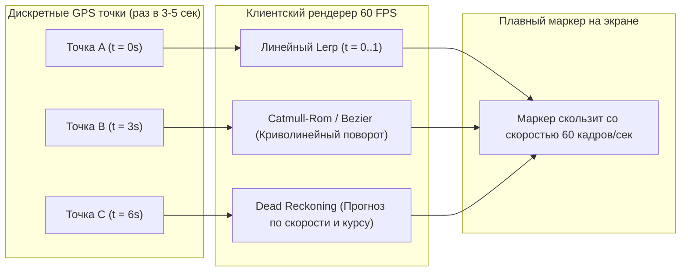
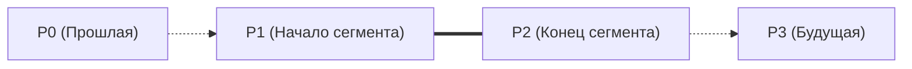
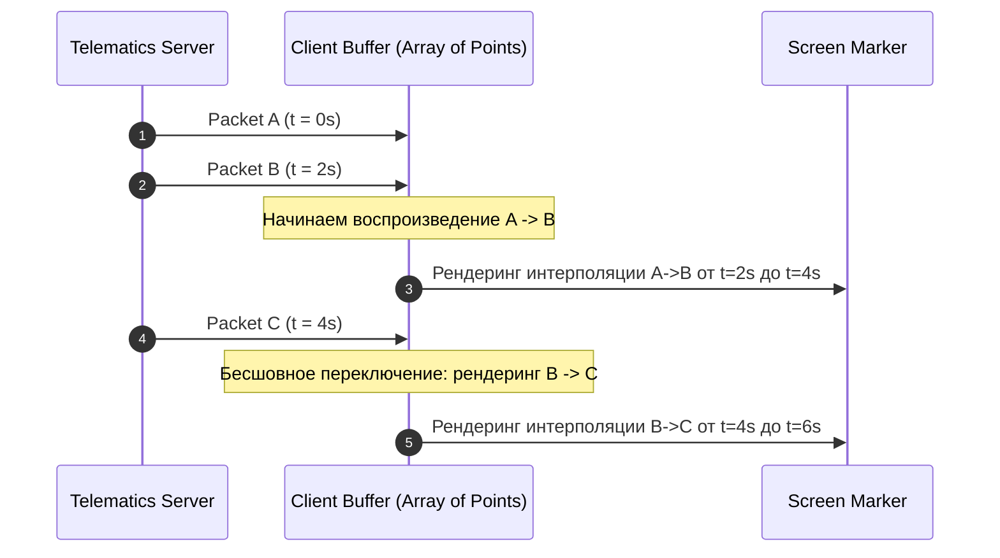

# Dead Reckoning и интерполяция на клиенте (Linear, Spline, Lerp)

> [!info] Навигация
> Родительский раздел: [[GPS & Tracking MOC]]

## Почему реальные координаты дискретны

Физические GPS-трекеры и смартфоны не передают координаты непрерывно. Из соображений экономии батареи, трафика SIM-карт и загрузки радиоэфира пакеты отправляются дискретными порциями с интервалом от $1\text{ секунды}$ (высокая точность) до $10-30\text{ секунд}$ (стандартный телематический трекинг грузовиков).

Если перемещать маркер на карте мгновенно при получении каждого пакета, машина будет совершать неестественные телепортации. Задача клиентского фронтенда — сгладить это дискретное движение, вычислив плавную непрерывную траекторию с помощью **интерполяции**, а при временном пропадании связи (в тоннелях или при сетевых потерях) — продолжить расчет движения с помощью **Dead Reckoning (счисления пути)**.



---

## 1. Линейная интерполяция (Linear Interpolation / Lerp)

Самый базовый и надежный алгоритм. Для двух координат $P_0(\text{lng}_0, \text{lat}_0)$ и $P_1(\text{lng}_1, \text{lat}_1)$ и коэффициента прогресса $t \in [0, 1]$:

$$P(t) = P_0 + (P_1 - P_0) \cdot t$$

### Расчет фактора прогресса времени $t$:
$$t = \frac{T_{\text{now}} - T_{\text{start}}}{T_{\text{target}} - T_{\text{start}}}$$

```typescript
export interface LngLat {
  lng: number;
  lat: number;
}

export function lerpCoord(p0: LngLat, p1: LngLat, t: number): LngLat {
  const clampedT = Math.max(0, Math.min(1, t));
  return {
    lng: p0.lng + (p1.lng - p0.lng) * clampedT,
    lat: p0.lat + (p1.lat - p0.lat) * clampedT
  };
}
```

> [!important] Искажения на больших дистанциях (Great Circle)
> Для перемещений в пределах города прямолинейный `lerp` в координатах WGS-84 дает пренебрежимо малую погрешность ($<0.01\%$). Однако для авиаперелетов или скоростных поездов между континентами линейная интерполяция широты и долготы дает сильное искажение. В этих случаях необходимо использовать **Slerp** (сферическую интерполяцию по дуге большого круга / ортодромии).

---

## 2. Сплайновая интерполяция (Catmull-Rom и кубический Эрмит)

При линейной интерполяции в точках изменения направления машина поворачивает с резким угловым изломом (бесконечное центростремительное ускорение). Чтобы движение выглядело реалистичным, как у настоящего автомобиля, проходящего поворот по плавной дуге, применяется **сплайн Кэтмулла — Рома (Catmull-Rom Spline)**.

Сплайн Кэтмулла — Рома проходит ровно через заданные контрольные точки $P_1$ и $P_2$, используя предыдущую точку $P_0$ и следующую $P_3$ для автоматического расчета касательных векторов.



### Формула сплайна:
$$P(t) = 0.5 \cdot \left( (2 P_1) + (-P_0 + P_2) \cdot t + (2P_0 - 5P_1 + 4P_2 - P_3) \cdot t^2 + (-P_0 + 3P_1 - 3P_2 + P_3) \cdot t^3 \right)$$

### TypeScript реализация:

```typescript
export function catmullRomCoord(
  p0: LngLat,
  p1: LngLat,
  p2: LngLat,
  p3: LngLat,
  t: number
): LngLat {
  const clampedT = Math.max(0, Math.min(1, t));
  const t2 = clampedT * clampedT;
  const t3 = t2 * clampedT;

  const interpolate = (v0: number, v1: number, v2: number, v3: number): number => {
    return 0.5 * (
      (2 * v1) +
      (-v0 + v2) * clampedT +
      (2 * v0 - 5 * v1 + 4 * v2 - v3) * t2 +
      (-v0 + 3 * v1 - 3 * v2 + v3) * t3
    );
  };

  return {
    lng: interpolate(p0.lng, p1.lng, p2.lng, p3.lng),
    lat: interpolate(p0.lat, p1.lat, p2.lat, p3.lat)
  };
}
```

---

## 3. Счисление пути (Dead Reckoning) при потере связи

Что делать, если машина въехала в Лефортовский тоннель или подземный паркинг, и очередной пакет от GPS-трекера не пришел вовремя?
Если интерполяция просто остановит маркер, пользователь подумает, что такси встало в пробку.

**Dead Reckoning** рассчитывает предполагаемое положение объекта вперед по времени, основываясь на последней достоверной скорости $V$ (м/с) и курсе $\theta$ (азимут в радианах):

$$d = V \cdot \Delta t$$
$$\Delta \text{lat} = \frac{d \cdot \cos(\theta)}{R_{\text{Earth}}}$$
$$\Delta \text{lng} = \frac{d \cdot \sin(\theta)}{R_{\text{Earth}} \cdot \cos(\text{lat})}$$

где $R_{\text{Earth}} \approx 6\,371\,000\text{ метров}$.

```typescript
const EARTH_RADIUS_METERS = 6371008.8;

export function deadReckonPosition(
  lastPos: LngLat,
  speedMps: number,
  bearingDeg: number,
  deltaTimeSec: number
): LngLat {
  const distance = speedMps * deltaTimeSec;
  const bearingRad = (bearingDeg * Math.PI) / 180;
  const latRad = (lastPos.lat * Math.PI) / 180;

  // Смещение по широте в радианах
  const deltaLat = (distance * Math.cos(bearingRad)) / EARTH_RADIUS_METERS;
  
  // Смещение по долготе с учетом сужения параллелей
  const deltaLng = (distance * Math.sin(bearingRad)) / (EARTH_RADIUS_METERS * Math.cos(latRad));

  return {
    lng: lastPos.lng + (deltaLng * 180) / Math.PI,
    lat: lastPos.lat + (deltaLat * 180) / Math.PI
  };
}
```

---

## Паттерн интерполяционного буфера задержки (Interpolation Buffer Delay)

Главный парадокс интерполяции: чтобы интерполировать между точкой $A$ и точкой $B$, точка $B$ **уже должна быть известна** клиенту. Следовательно, клиент всегда показывает перемещение объекта с небольшим искусственным отставанием во времени (обычно равным одному периоду отправки пакетов, например $2-3\text{ секунды}$).



> [!tip] Как минимизировать задержку
> Если задержка в $2\text{ секунды}$ неприемлема (критически важный Live-трекинг), вместо чистой интерполяции используют **экстраполяцию** с динамической коррекцией ошибки (Kalman Filter / Projective Blend): маркер всегда проецируется вперед по Dead Reckoning, а при получении истинной координаты плавно подтягивается к ней за $300-500\text{ мс}$.
