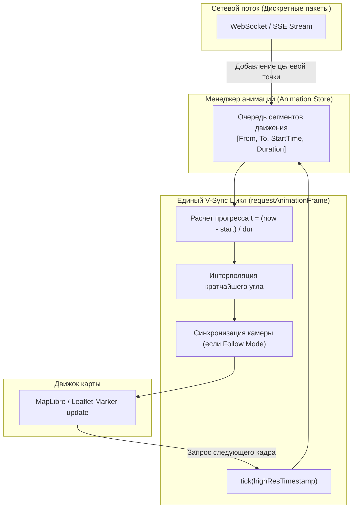

# Пайплайн requestAnimationFrame для непрерывного движения маркеров

> [!info] Навигация
> Родительский раздел: [[GPS & Tracking MOC]]

## Почему CSS Transitions и setInterval ломают трекинг

Когда разработчик пытается анимировать маркер автомобиля с помощью CSS Transitions (`transition: transform 3s linear`) или `setInterval(fn, 16)`, он неизбежно сталкивается с тремя дефектами продакшна:
1. **Прерывание анимаций (Stuttering & Jitter):** Если новый пакет координат пришел через $2.4\text{ секунды}$ вместо ожидаемых $3.0$, CSS-переход резко обрывается в текущей точке и стартует заново с другой скоростью. Машина «дергается».
2. **Рассинхронизация таймеров:** `setInterval` не синхронизирован с частотой развертки монитора (V-Sync) и накапливает дрейф таймера при загрузке CPU, вызывая микрофризы.
3. **Фоновые вкладки:** `setInterval` продолжает работать в фоне и тратить батарею ноутбука, тогда как браузер замедляет таймеры до 1 раза в секунду.

Единственный профессиональный способ добиться кинематографической плавности (60 FPS / 120 FPS) — построение **централизованного RAF-пайплайна (requestAnimationFrame Loop)**.



---

## Архитектура непрерывного интерполятора

Каждый движущийся объект описывается структурой анимационного перехода:
- Начальное положение $P_{\text{from}}$ и курс $\theta_{\text{from}}$
- Конечное положение $P_{\text{to}}$ и курс $\theta_{\text{to}}$
- Точное время начала перехода $T_{\text{start}}$ (`performance.now()`)
- Расчетная длительность перехода $D$ (мс)

Если новый пакет приходит раньше, чем закончился предыдущий отрезок, текущая интерполированная координата **мгновенно становится новой точкой старта**, гарантируя отсутствие рывков скорости (C0-непрерывность).

---

## Полная промышленная реализация (TypeScript + MapLibre GL JS)

```typescript
import maplibregl from 'maplibre-gl';
import { lerpCoord, LngLat } from './DeadReckoning';
import { lerpAngle } from './BearingSmoothing';

export interface VehicleTargetState {
  id: string;
  coords: [number, number]; // [lng, lat]
  bearing: number;
  serverTimestamp: number;
}

interface ActiveVehicleAnimation {
  id: string;
  startLngLat: LngLat;
  targetLngLat: LngLat;
  startBearing: number;
  targetBearing: number;
  startTime: number;
  durationMs: number;
  currentLngLat: LngLat;
  currentBearing: number;
}

export class MarkerAnimationPipeline {
  private animations = new Map<string, ActiveVehicleAnimation>();
  private markers = new Map<string, maplibregl.Marker>();
  private rafId: number | null = null;
  private isRunning = false;

  constructor(private readonly map: maplibregl.Map) {}

  /**
   * Добавление или обновление целевой точки автомобиля
   */
  public pushVehicleTarget(target: VehicleTargetState): void {
    const now = performance.now();
    const existing = this.animations.get(target.id);

    if (!existing) {
      // Первый пакет: создаем DOM-маркер и инициализируем состояние
      const el = this.createVehicleElement();
      const marker = new maplibregl.Marker({ element: el, rotationAlignment: 'map' })
        .setLngLat(target.coords)
        .setRotation(target.bearing)
        .addTo(this.map);

      this.markers.set(target.id, marker);

      this.animations.set(target.id, {
        id: target.id,
        startLngLat: { lng: target.coords[0], lat: target.coords[1] },
        targetLngLat: { lng: target.coords[0], lat: target.coords[1] },
        startBearing: target.bearing,
        targetBearing: target.bearing,
        startTime: now,
        durationMs: 0,
        currentLngLat: { lng: target.coords[0], lat: target.coords[1] },
        currentBearing: target.bearing
      });
      return;
    }

    // Бесшовный перехват текущей позиции в момент прибытия нового пакета
    existing.startLngLat = { ...existing.currentLngLat };
    existing.startBearing = existing.currentBearing;
    existing.targetLngLat = { lng: target.coords[0], lat: target.coords[1] };
    existing.targetBearing = target.bearing;
    existing.startTime = now;

    // Адаптивная длительность: интервал между пакетами сервера (обычно 2-4 секунды)
    // Ограничиваем разумными пределами (1000 - 5000 мс)
    existing.durationMs = 2500;

    if (!this.isRunning) {
      this.start();
    }
  }

  private createVehicleElement(): HTMLElement {
    const el = document.createElement('div');
    el.className = 'smooth-vehicle-marker';
    el.style.width = '32px';
    el.style.height = '32px';
    el.style.backgroundImage = 'url("/assets/car-icon.svg")';
    el.style.backgroundSize = 'contain';
    el.style.backgroundRepeat = 'no-repeat';
    el.style.willChange = 'transform';
    return el;
  }

  public start(): void {
    if (this.isRunning) return;
    this.isRunning = true;

    const tick = (now: number) => {
      this.updateFrame(now);
      if (this.isRunning) {
        this.rafId = requestAnimationFrame(tick);
      }
    };

    this.rafId = requestAnimationFrame(tick);
  }

  private updateFrame(now: number): void {
    for (const [id, anim] of this.animations.entries()) {
      if (anim.durationMs <= 0) continue;

      const elapsed = now - anim.startTime;
      const progress = Math.min(1.0, elapsed / anim.durationMs);

      // Интерполяция координат и угла по кратчайшей дуге
      anim.currentLngLat = lerpCoord(anim.startLngLat, anim.targetLngLat, progress);
      anim.currentBearing = lerpAngle(anim.startBearing, anim.targetBearing, progress);

      // Обновление физического маркера карты
      const marker = this.markers.get(id);
      if (marker) {
        marker.setLngLat([anim.currentLngLat.lng, anim.currentLngLat.lat]);
        marker.setRotation(anim.currentBearing);
      }
    }
  }

  public stop(): void {
    this.isRunning = false;
    if (this.rafId !== null) {
      cancelAnimationFrame(this.rafId);
      this.rafId = null;
    }
  }

  public removeVehicle(id: string): void {
    this.markers.get(id)?.remove();
    this.markers.delete(id);
    this.animations.delete(id);
  }
}
```

---

## Оптимизация нагрузки на CPU

1. **`will-change: transform`:** Подсказывает браузеру вынести DOM-элемент маркера на отдельный GPU-слой (Compositor Layer), избегая повторного Paint-цикла.
2. **Засыпание цикла при простое:** Если все объекты завершили интерполяцию ($progress = 1.0$), `requestAnimationFrame` останавливается, чтобы не греть процессор ноутбука или смартфона в моменты покоя.
3. **Синхронизация времени через `performance.now()`:** В отличие от `Date.now()`, метод `performance.now()` гарантирует субмиллисекундную монотонную точность без скачков системного времени (NTP-коррекции).

> [!tip] Масштабирование на сотни маркеров
> Если количество одновременно анимируемых маркеров превышает $100-200$, откажитесь от DOM-маркеров (`maplibregl.Marker`) в пользу прямого обновления источника данных GeoJSON (`map.getSource('cars').setData(fc)`) или кастомного WebGL-слоя на базе Deck.gl.
