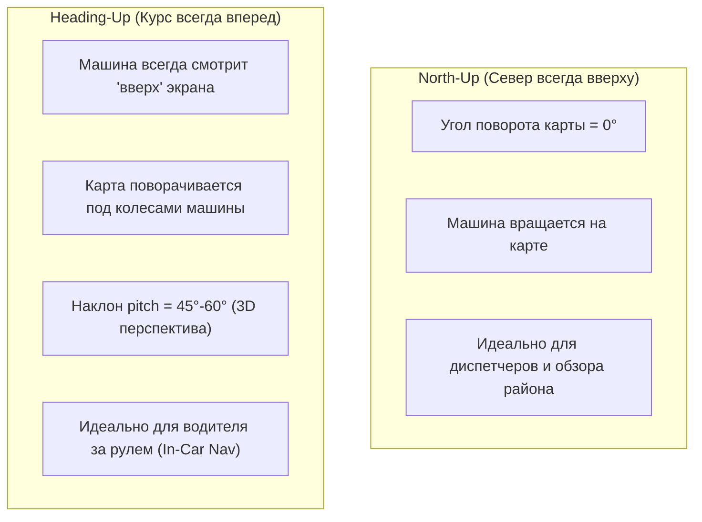
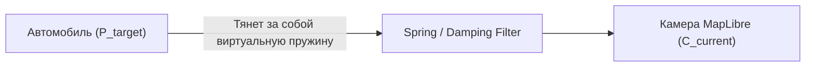

# Режимы слежения камеры (Follow mode, Heading-up vs North-up, Smooth lerping)

> [!info] Навигация
> Родительский раздел: [[GPS & Tracking MOC]]

## Проблема поведения камеры в навигаторах

В приложениях реального времени (Яндекс Навигатор, Uber, Waze, трекинг судов) пользователь не должен вручную перемещать карту, чтобы удержать движущийся объект в поле зрения. Камера должна интеллектуально сопровождать транспортное средство.

Однако жесткая привязка координат центра экрана к координатам автомобиля (`map.setCenter(carPos)`) на каждый кадр делает интерфейс невыносимо дерганым: мелкие вибрации GPS-приемника передаются на всю карту, вызывая морскую болезнь и дискомфорт пользователя.

---

## Режимы ориентации: North-Up vs Heading-Up



### Сравнительная таблица режимов:

| Параметр | North-Up (Фиксированный Север) | Heading-Up (По курсу движения) |
| :--- | :--- | :--- |
| **Ориентация карты (Bearing)** | Строго $0^\circ$ (Север вверху) | Равна текущему курсу автомобиля ($\theta_{\text{car}}$) |
| **Угол наклона (Pitch)** | $0^\circ$ (Ортографический вид строго сверху) | $45^\circ - 65^\circ$ (3D-перспектива) |
| **Смещение центра (Anchor)** | Центр экрана $(0.5, 0.5)$ | Смещен вниз $(0.5, 0.75)$ для обзора дороги впереди |
| **Нагрузка на GPU** | Минимальная (тайлы не вращаются) | Высокая (непрерывный пересчет растрирования и матриц) |
| **Поведение при стоянии** | Карта неподвижна | Курс фиксируется, вращение запрещено |

---

## Плавное преследование камеры (Camera Smooth Lerp)

Чтобы слежение за автомобилем выглядело органичным и сглаженным, применяется кинематический фильтр **критического затухания (Exponential Damping / Critically Damped Spring)**.
Вместо мгновенного прыжка в точку объекта камера догоняет его с фактором релаксации:

$$C_{\text{new}} = C_{\text{current}} + (P_{\text{target}} - C_{\text{current}}) \cdot \left(1 - e^{-\lambda \cdot \Delta t}\right)$$

где:
- $C$ — координаты центра камеры карты,
- $P_{\text{target}}$ — целевая координата автомобиля,
- $\lambda$ — коэффициент жесткости пружины (от 3.0 до 8.0),
- $\Delta t$ — время между кадрами в секундах.



---

## TypeScript реализация: Профессиональный Camera Follow Controller

```typescript
import maplibregl from 'maplibre-gl';
import { getShortestAngleDelta } from './BearingSmoothing';

export type CameraFollowMode = 'DISABLED' | 'NORTH_UP' | 'HEADING_UP';

export interface CameraControllerOptions {
  dampingFactor?: number; // Коэффициент сглаживания (default: 4.5)
  pitchInHeadingUp?: number; // Угол наклона в режиме Heading-up (default: 55)
  bottomOffsetRatio?: number; // Смещение машинки вниз экрана (default: 0.25)
}

export class CameraFollowController {
  private mode: CameraFollowMode = 'DISABLED';
  private targetCoords: [number, number] | null = null;
  private targetBearing: number = 0;
  private isUserInteracting = false;
  private rafId: number | null = null;

  private readonly damping: number;
  private readonly pitchHeadingUp: number;

  constructor(
    private readonly map: maplibregl.Map,
    opts: CameraControllerOptions = {}
  ) {
    this.damping = opts.dampingFactor ?? 4.5;
    this.pitchHeadingUp = opts.pitchInHeadingUp ?? 55;

    this.bindMapEvents();
  }

  // Прикосновение пользователя к экрану временно отключает автоматическое слежение
  private bindMapEvents(): void {
    const disableFollow = () => {
      if (this.mode !== 'DISABLED') {
        this.setMode('DISABLED');
        console.info('[Camera] Пользователь перехватил управление, Follow Mode отключен');
      }
    };

    this.map.on('dragstart', disableFollow);
    this.map.on('rotatestart', disableFollow);
    this.map.on('pitchstart', disableFollow);
  }

  public setMode(newMode: CameraFollowMode): void {
    this.mode = newMode;
    if (newMode === 'DISABLED') {
      this.stopLoop();
    } else {
      if (newMode === 'NORTH_UP') {
        this.map.easeTo({ bearing: 0, pitch: 0, duration: 600 });
      }
      this.startLoop();
    }
  }

  public updateVehicleState(coords: [number, number], bearing: number): void {
    this.targetCoords = coords;
    this.targetBearing = bearing;
  }

  private startLoop(): void {
    if (this.rafId !== null) return;
    let lastTime = performance.now();

    const frame = (now: number) => {
      const dt = Math.min((now - lastTime) / 1000, 0.1); // Clamp dt для стабильности
      lastTime = now;

      this.step(dt);
      if (this.mode !== 'DISABLED') {
        this.rafId = requestAnimationFrame(frame);
      }
    };

    this.rafId = requestAnimationFrame(frame);
  }

  private stopLoop(): void {
    if (this.rafId !== null) {
      cancelAnimationFrame(this.rafId);
      this.rafId = null;
    }
  }

  private step(dt: number): void {
    if (!this.targetCoords || this.mode === 'DISABLED') return;

    const currentCenter = this.map.getCenter();
    const currentBearing = this.map.getBearing();

    // Расчет коэффициента затухания
    const factor = 1 - Math.exp(-this.damping * dt);

    // Плавная интерполяция координат
    const newLng = currentCenter.lng + (this.targetCoords[0] - currentCenter.lng) * factor;
    const newLat = currentCenter.lat + (this.targetCoords[1] - currentCenter.lat) * factor;

    if (this.mode === 'NORTH_UP') {
      this.map.jumpTo({
        center: [newLng, newLat]
      });
    } else if (this.mode === 'HEADING_UP') {
      // Плавная интерполяция угла вращения карты
      const angleDelta = getShortestAngleDelta(currentBearing, this.targetBearing);
      const newBearing = currentBearing + angleDelta * factor;

      this.map.jumpTo({
        center: [newLng, newLat],
        bearing: newBearing,
        pitch: this.pitchHeadingUp
      });
    }
  }

  public destroy(): void {
    this.stopLoop();
  }
}
```

---

## Смещение фокуса (Camera Lookahead & Anchor Offset)

В режиме навигации за рулем водитель смотрит вперед, а не назад. Если автомобиль находится строго в центре экрана, верхняя половина дисплея показывает дорогу вперед на $500\text{ метров}$, а нижняя половина бесполезно показывает уже пройденную трассу.

Для компенсации этого эффекта в MapLibre настраивают смещение камеры (Padding / Center Offset):

```typescript
// Смещение фокусного центра камеры вниз на 150 пикселей от центра экрана
map.setPadding({
  top: 0,
  bottom: 250, // Освобождает обзор вперед по ходу движения
  left: 0,
  right: 0
});
```

> [!tip] Предотвращение джиттера при малых скоростях
> В режиме `HEADING_UP` обязательно блокируйте обновление `targetBearing` карты, если скорость автомобиля опускается ниже $5\text{ км/ч}$. Иначе малейшие GPS-шумы стоящего на светофоре автомобиля вызовут хаотическое кручение всей карты города.
