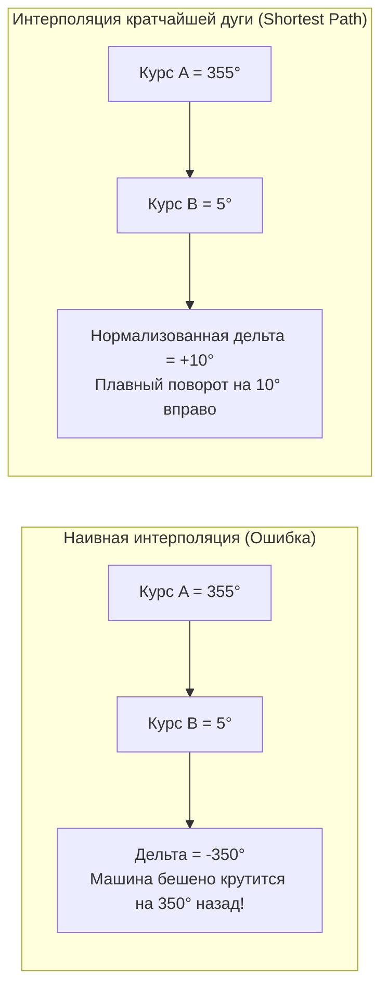

# Сглаживание курсора и угла поворота (Bearing) без переворотов через 360 градусов

> [!info] Навигация
> Родительский раздел: [[GPS & Tracking MOC]]

## Проблема «вертолетного винта» (The 360° Wrap-around Problem)

В навигации и картографии азимут (курс, heading, bearing) измеряется в градусах от $0^\circ$ до $360^\circ$ по часовой стрелке от истинного Севера:
- $0^\circ$ / $360^\circ$ — Север
- $90^\circ$ — Восток
- $180^\circ$ — Юг
- $270^\circ$ — Запад

Представьте автомобиль, который едет строго на север ($355^\circ$) и плавно поворачивает чуть правее ($5^\circ$). 
Если наивный разработчик применит обычную линейную интерполяцию угла:

$$\theta(t) = \theta_0 + (\theta_1 - \theta_0) \cdot t$$
$$\Delta \theta = 5^\circ - 355^\circ = -350^\circ$$

Вместо короткого поворота вправо на $+10^\circ$ стрелка или 3D-модель машинки на экране совершит безумный оборот почти на полный круг против часовой стрелки ($-350^\circ$). Этот дефект называют эффектом «вертолетного винта».



---

## Математика кратчайшей дуги (Shortest Angular Distance)

Чтобы найти минимальную угловую разность между двумя углами в диапазоне $[-180^\circ, +180^\circ]$, используется формула модульного смещения:

$$\Delta \theta = ((\theta_1 - \theta_0 + 540^\circ) \pmod{360^\circ}) - 180^\circ$$

### Доказательство работы формулы:
1. Пусть $\theta_0 = 355^\circ$, $\theta_1 = 5^\circ$.
2. $\theta_1 - \theta_0 = -350^\circ$.
3. $-350 + 540 = 190^\circ$.
4. $190 \pmod{360} = 190^\circ$.
5. $190 - 180 = +10^\circ$.
Результат строго равен $+10^\circ$ (поворот на 10 градусов по часовой стрелке).

---

## TypeScript реализация: Плавный интерполятор угла

```typescript
/**
 * Вычисляет кратчайшую угловую разность между двумя углами в градусах.
 * Возвращает значение в диапазоне [-180, +180].
 */
export function getShortestAngleDelta(fromDeg: number, toDeg: number): number {
  return ((((toDeg - fromDeg + 540) % 360) + 360) % 360) - 180;
}

/**
 * Интерполирует угол от `fromDeg` к `toDeg` по кратчайшей траектории.
 * @param fromDeg Исходный угол в градусах [0..360]
 * @param toDeg Целевой угол в градусах [0..360]
 * @param t Фактор интерполяции [0..1]
 * @returns Нормализованный угол в диапазоне [0..360)
 */
export function lerpAngle(fromDeg: number, toDeg: number, t: number): number {
  const delta = getShortestAngleDelta(fromDeg, toDeg);
  const interpolated = fromDeg + delta * Math.max(0, Math.min(1, t));
  // Нормализация результата в диапазон [0..360)
  return ((interpolated % 360) + 360) % 360;
}
```

---

## Вычисление Bearing по двум координатам (Forward Azimuth)

Часто трекеры не присылают угол курса в пакете или присылают нули, если машина двигалась слишком медленно. В таких ситуациях фронтенд должен самостоятельно вычислить курс движения между двумя гео-точками по формуле **сферической тригонометрии (Great Circle Bearing)**:

$$\theta = \operatorname{atan2}\left(\sin(\Delta\lambda)\cos(\phi_2), \; \cos(\phi_1)\sin(\phi_2) - \sin(\phi_1)\cos(\phi_2)\cos(\Delta\lambda)\right)$$

где $\phi_1, \phi_2$ — широты в радианах, $\Delta\lambda$ — разность долгот $(\lambda_2 - \lambda_1)$ в радианах.

```typescript
export function calculateBearing(
  startLng: number,
  startLat: number,
  endLng: number,
  endLat: number
): number {
  const toRad = Math.PI / 180;
  const toDeg = 180 / Math.PI;

  const lat1 = startLat * toRad;
  const lat2 = endLat * toRad;
  const dLng = (endLng - startLng) * toRad;

  const y = Math.sin(dLng) * Math.cos(lat2);
  const x =
    Math.cos(lat1) * Math.sin(lat2) -
    Math.sin(lat1) * Math.cos(lat2) * Math.cos(dLng);

  const radians = Math.atan2(y, x);
  const degrees = radians * toDeg;

  // Приведение к диапазону 0..360
  return (degrees + 360) % 360;
}
```

---

## Фильтрация «дребезга» стоящей машины (Deadband & Low-Pass Filter)

Когда автомобиль стоит на светофоре, из-за естественного GPS-шума (multipath, погрешность псевдодальностей) вычисленные координаты хаотично колеблются в радиусе $1-3\text{ метров}$.
Если в этот момент рассчитывать курс по формуле `calculateBearing`, маркер машины начнет судорожно крутиться во все стороны, как стрелка компаса в аномальной зоне.

### Решение: Порог минимальной скорости (Deadband) + Экспоненциальный фильтр

```typescript
export class RobustBearingSmoother {
  private currentBearing: number = 0;
  private readonly minSpeedThresholdKmh: number;
  private readonly smoothingFactor: number; // 0..1 (чем меньше, тем плавнее)

  constructor(initialBearing: number = 0, minSpeedThresholdKmh: number = 3.0, smoothingFactor: number = 0.15) {
    this.currentBearing = initialBearing;
    this.minSpeedThresholdKmh = minSpeedThresholdKmh;
    this.smoothingFactor = smoothingFactor;
  }

  /**
   * Обновление угла с защитой от стоячего шума и сглаживанием
   */
  public update(targetBearing: number, speedKmh: number): number {
    // Если машина стоит или двигается медленнее порога шума (3 км/ч), курс замораживается
    if (speedKmh < this.minSpeedThresholdKmh) {
      return this.currentBearing;
    }

    // Экспоненциальное сглаживание по кратчайшей дуге
    const delta = getShortestAngleDelta(this.currentBearing, targetBearing);
    this.currentBearing = ((this.currentBearing + delta * this.smoothingFactor) % 360 + 360) % 360;

    return this.currentBearing;
  }

  public getBearing(): number {
    return this.currentBearing;
  }
}
```

---

## Применение в MapLibre GL JS

При повороте маркера на холсте MapLibre необходимо вращать слой символов через свойство `icon-rotate`:

```typescript
map.setLayoutProperty('vehicle-layer', 'icon-rotate', smoothedBearing);
```

Либо для DOM-маркеров (`maplibregl.Marker`):
```typescript
markerElement.style.transform = `rotate(${smoothedBearing}deg)`;
```

> [!tip] Производительность
> Для DOM-маркеров свойство `transform: rotate(...)` выполняется аппаратным компоновщиком GPU (Compositor Thread) и не вызывает пересчета Layout/Reflow страницы.
