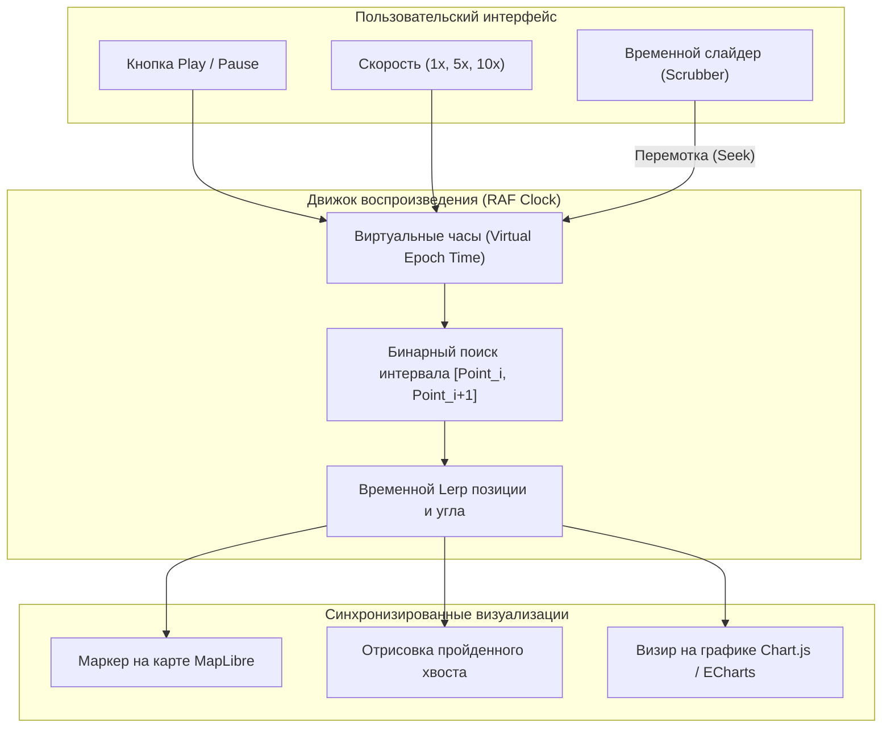

# Воспроизведение трека (Playback Controller со слайдером и перемоткой)

> [!info] Навигация
> Родительский раздел: [[GPS & Tracking MOC]]

## Анатомия плеера исторических треков (History Player)

В диспетчерских сервисах и аналитических платформах одной из самых частых задач является ретроспективный разбор рейса:
- Анализ инцидентов (превышение скорости, съезд с маршрута, слив топлива).
- Просмотр перемещения курьера клиентом за прошедшие сутки.
- Разбор тренировки спортсмена в Strava/Garmin Connect.

Для этого создается компонент **Track Playback Controller**, состоящий из:
1. Временной шкалы со слайдером (`<input type="range">` или кастомный Canvas-таймлайн).
2. Кнопок управления: Play / Pause / Fast Forward ($1\times, 2\times, 5\times, 10\times, 60\times$).
3. Прогрессивного «растущего» следа пройденного пути.
4. Синхронизированного графика телеметрии (скорость, высота, уровень топлива) с вертикальным визиром времени.



---

## Архитектура виртуальных часов и бинарного поиска

В историческом треке точки распределены неравномерно по времени (на стоянках интервалы могут составлять часы, на трассе — секунды). 
Поэтому нельзя просто двигаться по индексам массива `points[index++]`. Движок воспроизведения должен оперировать **виртуальным временем (Virtual Timestamp)**.

### Алгоритм поиска текущего положения:
1. Текущее виртуальное время:
   $$T_{\text{virtual}} = T_{\text{start}} + \Delta t_{\text{real}} \times \text{PlaybackSpeed}$$
2. С помощью **бинарного поиска ($O(\log N)$)** в отсортированном массиве меток времени находим пару соседних точек $P_k$ и $P_{k+1}$, таких что:
   $$t_k \le T_{\text{virtual}} \le t_{k+1}$$
3. Вычисляем локальный временной прогресс:
   $$\alpha = \frac{T_{\text{virtual}} - t_k}{t_{k+1} - t_k}$$
4. Интерполируем координату и угол:
   $$P_{\text{current}} = \operatorname{lerp}(P_k, P_{k+1}, \alpha)$$
   $$\theta_{\text{current}} = \operatorname{lerpAngle}(\theta_k, \theta_{k+1}, \alpha)$$

---

## Продакшн-код: TrackPlaybackEngine на TypeScript

```typescript
import { lerpCoord, LngLat } from '../08 Frontend — Анимация и интерполяция движения/Dead Reckoning и интерполяция на клиенте (Linear, Spline, Lerp)';
import { lerpAngle } from '../08 Frontend — Анимация и интерполяция движения/Сглаживание курсора и угла поворота (Bearing) без переворотов через 360 градусов';

export interface PlaybackPoint {
  timestamp: number; // UNIX ms
  lng: number;
  lat: number;
  bearing: number;
  speedKmh: number;
  altitudeMeters?: number;
}

export interface PlaybackState {
  currentTimestamp: number;
  progress01: number; // 0.0 .. 1.0
  coords: [number, number];
  bearing: number;
  speedKmh: number;
  currentIndex: number;
  isPlaying: boolean;
}

export class TrackPlaybackEngine {
  private points: PlaybackPoint[] = [];
  private startTime: number = 0;
  private endTime: number = 0;

  private currentVirtualTime: number = 0;
  private playbackMultiplier: number = 1.0;
  private isPlaying: boolean = false;
  private lastRafTime: number = 0;
  private rafId: number | null = null;

  constructor(private readonly onUpdate: (state: PlaybackState) => void) {}

  public loadTrack(points: PlaybackPoint[]): void {
    if (points.length < 2) {
      throw new Error('Для воспроизведения требуется минимум 2 точки');
    }
    // Гарантируем сортировку по возрастанию времени
    this.points = [...points].sort((a, b) => a.timestamp - b.timestamp);
    this.startTime = this.points[0].timestamp;
    this.endTime = this.points[this.points.length - 1].timestamp;
    this.seek(this.startTime);
  }

  public play(): void {
    if (this.isPlaying) return;
    if (this.currentVirtualTime >= this.endTime) {
      this.currentVirtualTime = this.startTime;
    }
    this.isPlaying = true;
    this.lastRafTime = performance.now();
    this.startLoop();
  }

  public pause(): void {
    this.isPlaying = false;
    if (this.rafId !== null) {
      cancelAnimationFrame(this.rafId);
      this.rafId = null;
    }
    this.emitState();
  }

  public setSpeed(multiplier: number): void {
    this.playbackMultiplier = multiplier;
  }

  public seek(targetTimestamp: number): void {
    this.currentVirtualTime = Math.max(this.startTime, Math.min(this.endTime, targetTimestamp));
    this.emitState();
  }

  public seekProgress(progress01: number): void {
    const clamped = Math.max(0, Math.min(1, progress01));
    const targetTime = this.startTime + (this.endTime - this.startTime) * clamped;
    this.seek(targetTime);
  }

  private startLoop(): void {
    const tick = (now: number) => {
      if (!this.isPlaying) return;

      const deltaRealMs = now - this.lastRafTime;
      this.lastRafTime = now;

      // Продвигаем виртуальное время с учетом множителя скорости
      this.currentVirtualTime += deltaRealMs * this.playbackMultiplier;

      if (this.currentVirtualTime >= this.endTime) {
        this.currentVirtualTime = this.endTime;
        this.pause();
        return;
      }

      this.emitState();
      this.rafId = requestAnimationFrame(tick);
    };

    this.rafId = requestAnimationFrame(tick);
  }

  // Быстрый бинарный поиск отрезка времени O(log N)
  private findSegmentIndex(time: number): number {
    let low = 0;
    let high = this.points.length - 2;

    while (low <= high) {
      const mid = (low + high) >> 1;
      if (this.points[mid].timestamp <= time && time <= this.points[mid + 1].timestamp) {
        return mid;
      }
      if (this.points[mid].timestamp < time) {
        low = mid + 1;
      } else {
        high = mid - 1;
      }
    }
    return Math.max(0, Math.min(this.points.length - 2, low));
  }

  private emitState(): void {
    const idx = this.findSegmentIndex(this.currentVirtualTime);
    const p1 = this.points[idx];
    const p2 = this.points[idx + 1];

    const timeSpan = p2.timestamp - p1.timestamp;
    const alpha = timeSpan > 0 ? (this.currentVirtualTime - p1.timestamp) / timeSpan : 0;

    const interpolatedPos = lerpCoord(
      { lng: p1.lng, lat: p1.lat },
      { lng: p2.lng, lat: p2.lat },
      alpha
    );
    const interpolatedBearing = lerpAngle(p1.bearing, p2.bearing, alpha);
    const interpolatedSpeed = p1.speedKmh + (p2.speedKmh - p1.speedKmh) * alpha;

    const totalDuration = this.endTime - this.startTime;
    const progress01 = totalDuration > 0 ? (this.currentVirtualTime - this.startTime) / totalDuration : 0;

    this.onUpdate({
      currentTimestamp: this.currentVirtualTime,
      progress01,
      coords: [interpolatedPos.lng, interpolatedPos.lat],
      bearing: interpolatedBearing,
      speedKmh: interpolatedSpeed,
      currentIndex: idx,
      isPlaying: this.isPlaying
    });
  }

  public destroy(): void {
    this.pause();
    this.points = [];
  }
}
```

---

## Синхронизация с UI (Vue 3 / React Integration)

Плеер легко привязывается к реактивному компоненту управления:

```vue
<template>
  <div class="playback-panel">
    <button @click="togglePlay">{{ isPlaying ? 'Pause' : 'Play' }}</button>
    <select v-model="speed" @change="onSpeedChange">
      <option :value="1">1x</option>
      <option :value="5">5x</option>
      <option :value="20">20x</option>
      <option :value="60">60x</option>
    </select>
    
    <!-- Таймлайн слайдер -->
    <input
      type="range"
      min="0"
      max="1"
      step="0.001"
      :value="progress"
      @input="onSliderInput"
    />
    
    <span class="telemetry-badge">{{ currentSpeed.toFixed(1) }} км/ч</span>
  </div>
</template>

<script setup lang="ts">
import { ref } from 'vue';
import { TrackPlaybackEngine } from './TrackPlaybackEngine';

const progress = ref(0);
const isPlaying = ref(false);
const currentSpeed = ref(0);
const speed = ref(5);

const engine = new TrackPlaybackEngine((state) => {
  progress.value = state.progress01;
  isPlaying.value = state.isPlaying;
  currentSpeed.value = state.speedKmh;
  
  // Обновляем маркер автомобиля на карте
  carMarker.setLngLat(state.coords).setRotation(state.bearing);
});

function togglePlay() {
  if (isPlaying.value) engine.pause();
  else engine.play();
}

function onSliderInput(e: Event) {
  const val = Number((e.target as HTMLInputElement).value);
  engine.seekProgress(val);
}

function onSpeedChange() {
  engine.setSpeed(speed.value);
}
</script>
```

> [!tip] Плавный скраббинг без лагов
> При быстром перемещении пользователем ползунка слайдера (Scrubbing) вызов метода `seekProgress()` должен вызывать немедленный синхронный пересчет позиции маркера без ожидания следующего тика таймера. Это дает пользователю мгновенную тактильную отдачу (Zero Latency Scrubbing).
